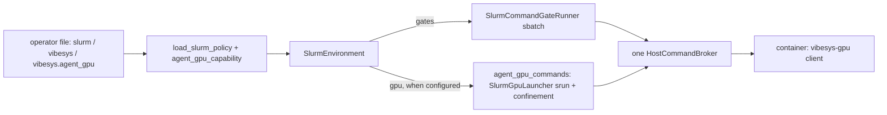

## Problem

Part of #1650 (one `slurm` run environment, `slurm-gpu` deleted, no duplicated setup). Today the agent can run its own GPU commands as Slurm jobs (`vibesys-gpu`) only in the separate `slurm-gpu` environment, which has its own config file, its own config model, its own broker composition, and its own prompt template. This PR makes the capability an optional part of the `slurm` environment so that deleting `slurm-gpu` later removes only a thin wrapper.

Stacked on #1650 step 1 (`SlurmLocalTransport`, branch `claude/slurm-implementation-unify-718d24`).

## Solution

The operator adds a `[vibesys.agent_gpu]` table to the same file as `[slurm]` and `[vibesys]`, with `[slurm.transport] kind = "local"`. `SlurmEnvironment` then:

- starts its one gate broker with the `gpu` operation as well as gates, so `vibesys-gpu --gpus N --time MIN -- CMD` works in the container (blocking `srun`, host-sandbox confinement, limits checked on the host);
- writes a single client launcher named `vibesys-gpu` (it also serves `--gate`; without the capability it stays `vibesys-gate`) and sets `VIBESYS_GPU` and `CUDA_VISIBLE_DEVICES=""` in the container;
- keeps gates on `SlurmCommandGateRunner` (sbatch) regardless;
- derives the run's profiler from the capability: with it the agent profiles through `vibesys-gpu` (default `nsys`, any profiler allowed, local profiler preflight, no remote capture plan or profiler server mounts); without it the remote ROCprof capture is unchanged;
- renders one prompt template, `slurm/prompt_notes.j2`, with a conditional GPU block. `slurm_gpu/prompt_notes.j2` and `SlurmGpuEnvironmentFacts` are deleted; `slurm-gpu` now emits `SlurmEnvironmentFacts`.

`agent_gpu` with an ssh or connector transport is rejected at prepare time with `SlurmPolicyError` naming `vibesys.agent_gpu` and the transport kind. Unknown keys and limit violations are rejected by the policy loader, naming the key path (`vibesys.agent_gpu.max_gpus`).

`gate_gpus` and `gate_time_minutes` are not accepted in `[vibesys.agent_gpu]`: the slurm environment sizes gate jobs by sbatch arguments and the evaluation plan, so only the `slurm-gpu` wrapper needs them.

`slurm-gpu` stays working as a wrapper: `SlurmGpuConfig(AgentGpuConfig)` adds only the two gate fields; its broker uses the same `agent_gpu_commands()`, `agent_gpu_env()`, `bridged_agent_paths()` and prompt template.

`RunEnvironment`'s profiler-related members are now declared read-only properties in the Protocol (attributes still satisfy it), because `SlurmEnvironment` derives them from its operator file.

### Design

Alternatives (+ good, o neutral, - poor):

| Design | Guarantees | Where facts live | Cost per new capability | Trusted surface | Migration cost |
|---|---|---|---|---|---|
| (a) `[vibesys.agent_gpu]`, model owned by vs_sandbox, read by the existing policy loader; reuse the blocking `srun` launcher in the one broker (chosen) | + unknown keys and limits rejected at load with key path; local transport enforced | + one file, one loader, one model | + one optional policy field and one optional `GpuCommands` | + same broker, token, confinement | + slurm-gpu becomes a wrapper; deletion removes only it |
| (b) GPU jobs through the vs_slurm sbatch stack with log streaming | + one submission path, works over ssh | o job state in vs_slurm | - needs a streaming/attach protocol in vs_slurm | o | - rewrites launcher, cancel and output semantics |
| (c) separate capability object composed at the CLI entrypoint | o | - split between entrypoint and environment | - a CLI flag and environment seam per capability | - broker composition leaks to the entrypoint | - resume must restore the capability separately |

Choice (a), with one override of the provisional pick: the TOML shape is `[vibesys.agent_gpu]`, not a top-level `[agent_gpu]`. `[vibesys]` is already the operator file's VibeSys policy table, and `load_slurm_policy` already rejects unknown keys inside it, so no document-shape change is needed (a top-level table would have been rejected by the policy document model). `vs_slurm` stays credential-neutral and does not learn about agent commands.

Mechanism reuse (one implementation each):

| Piece | The one implementation | slurm-gpu now |
|---|---|---|
| Config model, limits, request validation | `vs_sandbox.slurm_gpu.AgentGpuConfig.request` | `SlurmGpuConfig(AgentGpuConfig)` adds only `gate_gpus`, `gate_time_minutes` |
| Config parsing | `SlurmExecutionPolicy.agent_gpu` via `load_slurm_policy` | still its own `[slurm_gpu]` loader (dies with the wrapper) |
| Transport rule | `agent_gpu_capability(config, policy)` | n/a (always local) |
| Broker GPU operation, confinement, fail-closed check | `vs_runtime._agent_gpu_commands.agent_gpu_commands` | same function |
| Container env, launcher name | `agent_gpu_env`, `AGENT_GPU_LAUNCHER` | same |
| Agent paths and gate commands | `_host_command_bridge.bridged_agent_paths` | same |
| Prompt facts and template | `SlurmEnvironmentFacts.agent_gpu`, `slurm/prompt_notes.j2` | same (old template and facts class deleted) |
| Gate runner | `SlurmCommandGateRunner` in slurm | `SrunGateRunner` stays only in the wrapper |

- Owner: `vs_sandbox` owns the agent-command policy and limits model (`slurm_gpu.py`, `slurm_policy.py`); `vs_runtime` owns the environment composition; `vibesys.run.environment` owns the prompt rendering.
- Interface: new public `vs_sandbox.api.slurm.AgentGpuConfig` and `agent_gpu_capability`; `SlurmEnvironmentFacts.agent_gpu`; `SlurmEnvironment.validate_profile`. Removed: `SlurmGpuEnvironmentFacts`.
- Direction: unchanged. No new `tach.toml` edge (`vs_sandbox` already imports `vs_slurm.api`; `vs_runtime` already imports `vs_sandbox`).
- Drift: `parallel_candidate_blocker` is kept when the capability is on (never exercised with one GPU broker per candidate), as in slurm-gpu today; it goes away with the later unification item. `src/vibesys/run/host.py` still branches on `env_kind == "slurm"`; with the capability on, the evaluation plan has no profile command, so no `profile-capture` lifecycle is declared, which is correct, and no host.py change is needed.

### Architecture

## Verification

### Correctness properties

- The container gets `vibesys-gpu`, `VIBESYS_GPU` and `CUDA_VISIBLE_DEVICES=""` exactly when `[vibesys.agent_gpu]` is configured; otherwise it gets `vibesys-gate` only.
- A GPU request above the operator's `max_gpus` or `max_time_minutes` never reaches `srun`.
- Gates run through the sbatch wrapper whether or not the capability is on (no `srun` call for a gate).
- Any key outside the model, including `gate_gpus` and `gate_time_minutes`, and any non-positive limit is rejected naming `vibesys.agent_gpu.<key>`; a default time above the limit is rejected naming the table.
- `agent_gpu` with ssh or connector transport is rejected naming the table and the transport.
- Profiler: `nsys`/any/local preflight with the capability, `rocprof`/remote capture without, decided from the operator file and not from the environment name.

### Testing

See the comment/handoff for exact commands and results.
