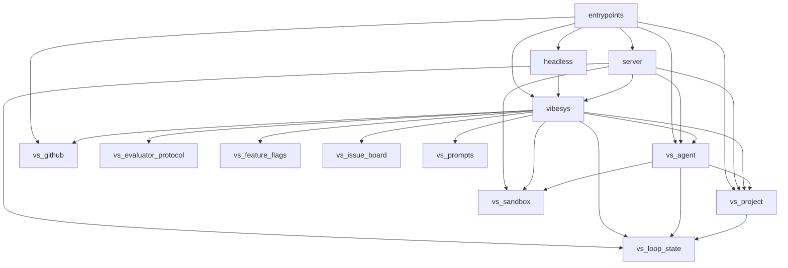

# Architecture: Python module graph

[`tach.toml`](https://github.com/uw-syfi/vibesys/blob/main/tach.toml) freezes
the Python module graph, and CI runs `uv run tach check`. An import between
modules that is not a declared `depends_on` edge fails the check. Modules cover
`src/` (`entrypoints`, `server.*`, `vibesys.*`) and every `libs/*/src`.

The graphs below are generated from `tach.toml` by `tach show --mermaid`. CI
fails when they are stale. To refresh after editing `tach.toml`:

```bash
uv run python scripts/check_tach_graph.py --write
```

Views: a package-level overview, the `vibesys` core modules, and the full
module graph. The graph is acyclic and `tach.toml` forbids cycles.

`vibesys.orchestration` owns the internal contract, runner, runtime, and generic
run projections. Concrete implementations live under sibling `vibesys.loops`
packages; `vibesys.loops.registry` alone registers them. Tach prevents sibling
policy imports. Orchestration-specific logic, including agent configuration and
resume policy, belongs in `vibesys`, not `vs_project`. `vs_project` owns generic
project layout and persistence operations.

The internal custom-policy execution contract and example are in
[orchestration-runtime.md](orchestration-runtime.md).

[//]: # (tach-graph:start)
## Architecture overview

Submodules such as `vibesys.agents` and `server.api` are collapsed into their top-level package.



## Core layers

Edges among the `vibesys` core modules. The graph is acyclic; `tach.toml` forbids cycles.

```mermaid
graph TD
    vibesys.api --> vibesys
    vibesys.api --> vibesys.api.contracts
    vibesys.api --> vibesys.api.run_request
    vibesys.api --> vibesys.domains
    vibesys.api --> vibesys.evaluators
    vibesys.api --> vibesys.loops.agent.projection
    vibesys.api --> vibesys.loops.agent.read_state
    vibesys.api --> vibesys.loops.agent.readmodel
    vibesys.api --> vibesys.loops.evolve
    vibesys.api --> vibesys.loops.legacy_request
    vibesys.api --> vibesys.loops.registry
    vibesys.api --> vibesys.orchestration
    vibesys.api --> vibesys.orchestration._common
    vibesys.api --> vibesys.orchestration.contracts
    vibesys.api --> vibesys.orchestration.manifest_compat
    vibesys.api --> vibesys.orchestration.runner
    vibesys.api --> vibesys.render
    vibesys.api --> vibesys.run
    vibesys.api --> vibesys.runtime
    vibesys.api --> vibesys.sandbox
    vibesys.api.agent --> vibesys.api
    vibesys.api.agent --> vibesys.loops.agent
    vibesys.api.agent --> vibesys.loops.agent.projection
    vibesys.api.contracts --> vibesys
    vibesys.api.contracts --> vibesys.loops
    vibesys.api.contracts --> vibesys.loops.legacy_request
    vibesys.api.contracts --> vibesys.orchestration.environment
    vibesys.api.contracts --> vibesys.orchestration.request
    vibesys.api.contracts --> vibesys.orchestration.view
    vibesys.api.run_request --> vibesys.orchestration.request
    vibesys.backends --> vibesys
    vibesys.context --> vibesys
    vibesys.context --> vibesys.backends
    vibesys.context --> vibesys.domains
    vibesys.context --> vibesys.evaluators
    vibesys.context --> vibesys.orchestration
    vibesys.context --> vibesys.render
    vibesys.context --> vibesys.run
    vibesys.context --> vibesys.sandbox
    vibesys.domains --> vibesys
    vibesys.domains --> vibesys.prompts
    vibesys.evaluators --> vibesys
    vibesys.loops --> vibesys
    vibesys.loops --> vibesys.evaluators
    vibesys.loops --> vibesys.render
    vibesys.loops --> vibesys.run
    vibesys.loops.agent --> vibesys
    vibesys.loops.agent --> vibesys.domains
    vibesys.loops.agent --> vibesys.evaluators
    vibesys.loops.agent --> vibesys.loops
    vibesys.loops.agent --> vibesys.orchestration
    vibesys.loops.agent --> vibesys.prompts
    vibesys.loops.agent --> vibesys.render
    vibesys.loops.agent --> vibesys.run
    vibesys.loops.agent --> vibesys.sandbox
    vibesys.loops.agent.entrypoint --> vibesys.loops.agent.entrypoint_common
    vibesys.loops.agent.entrypoint --> vibesys.loops.legacy_bridge
    vibesys.loops.agent.entrypoint --> vibesys.orchestration.request
    vibesys.loops.agent.entrypoint --> vibesys.runtime
    vibesys.loops.agent.entrypoint_common --> vibesys.loops.agent
    vibesys.loops.agent.entrypoint_common --> vibesys.loops.agent.loop
    vibesys.loops.agent.entrypoint_common --> vibesys.loops.agent.read_state
    vibesys.loops.agent.entrypoint_common --> vibesys.loops.agent.readmodel
    vibesys.loops.agent.entrypoint_common --> vibesys.loops.legacy_bridge
    vibesys.loops.agent.entrypoint_common --> vibesys.loops.legacy_request
    vibesys.loops.agent.entrypoint_common --> vibesys.orchestration
    vibesys.loops.agent.entrypoint_common --> vibesys.orchestration._common
    vibesys.loops.agent.entrypoint_common --> vibesys.orchestration.contracts
    vibesys.loops.agent.entrypoint_common --> vibesys.orchestration.request
    vibesys.loops.agent.entrypoint_common --> vibesys.orchestration.view
    vibesys.loops.agent.entrypoint_common --> vibesys.runtime
    vibesys.loops.agent.loop --> vibesys
    vibesys.loops.agent.loop --> vibesys.context
    vibesys.loops.agent.loop --> vibesys.domains
    vibesys.loops.agent.loop --> vibesys.evaluators
    vibesys.loops.agent.loop --> vibesys.loops
    vibesys.loops.agent.loop --> vibesys.loops.agent
    vibesys.loops.agent.loop --> vibesys.loops.agent.policy_flow
    vibesys.loops.agent.loop --> vibesys.loops.agent.policy_local
    vibesys.loops.agent.loop --> vibesys.loops.agent.policy_scheduler
    vibesys.loops.agent.loop --> vibesys.render
    vibesys.loops.agent.loop --> vibesys.run
    vibesys.loops.agent.loop --> vibesys.sandbox
    vibesys.loops.agent.policy_flow --> vibesys
    vibesys.loops.agent.policy_flow --> vibesys.evaluators
    vibesys.loops.agent.policy_flow --> vibesys.loops.agent
    vibesys.loops.agent.policy_flow --> vibesys.loops.agent.policy_multi
    vibesys.loops.agent.policy_flow --> vibesys.loops.agent.policy_profile
    vibesys.loops.agent.policy_flow --> vibesys.loops.agent.policy_single
    vibesys.loops.agent.policy_local --> vibesys
    vibesys.loops.agent.policy_local --> vibesys.domains
    vibesys.loops.agent.policy_local --> vibesys.evaluators
    vibesys.loops.agent.policy_local --> vibesys.loops
    vibesys.loops.agent.policy_local --> vibesys.loops.agent
    vibesys.loops.agent.policy_local --> vibesys.loops.agent.policy_scheduler
    vibesys.loops.agent.policy_local --> vibesys.render
    vibesys.loops.agent.policy_local --> vibesys.run
    vibesys.loops.agent.policy_multi --> vibesys
    vibesys.loops.agent.policy_multi --> vibesys.loops.agent
    vibesys.loops.agent.policy_profile --> vibesys.evaluators
    vibesys.loops.agent.policy_profile --> vibesys.loops.agent
    vibesys.loops.agent.policy_scheduler --> vibesys
    vibesys.loops.agent.policy_scheduler --> vibesys.loops.agent
    vibesys.loops.agent.policy_scheduler --> vibesys.loops.agent.policy_profile
    vibesys.loops.agent.policy_single --> vibesys
    vibesys.loops.agent.policy_single --> vibesys.loops.agent
    vibesys.loops.agent.profile_entrypoint --> vibesys.loops.agent.entrypoint_common
    vibesys.loops.agent.profile_entrypoint --> vibesys.loops.legacy_bridge
    vibesys.loops.agent.profile_entrypoint --> vibesys.orchestration.request
    vibesys.loops.agent.profile_entrypoint --> vibesys.runtime
    vibesys.loops.agent.projection --> vibesys
    vibesys.loops.agent.projection --> vibesys.orchestration.view
    vibesys.loops.agent.read_state --> vibesys.loops
    vibesys.loops.agent.read_state --> vibesys.loops.agent
    vibesys.loops.agent.read_state --> vibesys.run
    vibesys.loops.agent.readmodel --> vibesys
    vibesys.loops.agent.readmodel --> vibesys.loops.agent
    vibesys.loops.agent.readmodel --> vibesys.loops.agent.projection
    vibesys.loops.agent.readmodel --> vibesys.loops.legacy_request
    vibesys.loops.agent.readmodel --> vibesys.orchestration.view
    vibesys.loops.evolve --> vibesys
    vibesys.loops.evolve --> vibesys.context
    vibesys.loops.evolve --> vibesys.domains
    vibesys.loops.evolve --> vibesys.evaluators
    vibesys.loops.evolve --> vibesys.loops
    vibesys.loops.evolve --> vibesys.orchestration
    vibesys.loops.evolve --> vibesys.prompts
    vibesys.loops.evolve --> vibesys.render
    vibesys.loops.evolve --> vibesys.run
    vibesys.loops.evolve --> vibesys.sandbox
    vibesys.loops.evolve.entrypoint --> vibesys.loops.evolve
    vibesys.loops.evolve.entrypoint --> vibesys.loops.legacy_bridge
    vibesys.loops.evolve.entrypoint --> vibesys.orchestration
    vibesys.loops.evolve.entrypoint --> vibesys.orchestration._common
    vibesys.loops.evolve.entrypoint --> vibesys.orchestration.contracts
    vibesys.loops.evolve.entrypoint --> vibesys.orchestration.request
    vibesys.loops.evolve.entrypoint --> vibesys.runtime
    vibesys.loops.legacy_bridge --> vibesys
    vibesys.loops.legacy_bridge --> vibesys.loops
    vibesys.loops.legacy_bridge --> vibesys.loops.legacy_request
    vibesys.loops.legacy_bridge --> vibesys.orchestration.contracts
    vibesys.loops.legacy_bridge --> vibesys.orchestration.request
    vibesys.loops.legacy_bridge --> vibesys.orchestration.view
    vibesys.loops.legacy_bridge --> vibesys.run
    vibesys.loops.legacy_bridge --> vibesys.runtime
    vibesys.loops.legacy_request --> vibesys
    vibesys.loops.legacy_request --> vibesys.evaluators
    vibesys.loops.legacy_request --> vibesys.loops
    vibesys.loops.legacy_request --> vibesys.loops.evolve
    vibesys.loops.legacy_request --> vibesys.orchestration.request
    vibesys.loops.legacy_request --> vibesys.sandbox
    vibesys.loops.plain --> vibesys
    vibesys.loops.plain --> vibesys.context
    vibesys.loops.plain --> vibesys.domains
    vibesys.loops.plain --> vibesys.evaluators
    vibesys.loops.plain --> vibesys.orchestration
    vibesys.loops.plain --> vibesys.prompts
    vibesys.loops.plain --> vibesys.render
    vibesys.loops.plain --> vibesys.run
    vibesys.loops.plain --> vibesys.sandbox
    vibesys.loops.plain.entrypoint --> vibesys.loops.legacy_bridge
    vibesys.loops.plain.entrypoint --> vibesys.loops.plain
    vibesys.loops.plain.entrypoint --> vibesys.orchestration
    vibesys.loops.plain.entrypoint --> vibesys.orchestration._common
    vibesys.loops.plain.entrypoint --> vibesys.orchestration.contracts
    vibesys.loops.plain.entrypoint --> vibesys.orchestration.request
    vibesys.loops.plain.entrypoint --> vibesys.runtime
    vibesys.loops.registry --> vibesys.loops.agent.entrypoint
    vibesys.loops.registry --> vibesys.loops.agent.profile_entrypoint
    vibesys.loops.registry --> vibesys.loops.evolve.entrypoint
    vibesys.loops.registry --> vibesys.loops.legacy_request
    vibesys.loops.registry --> vibesys.loops.plain.entrypoint
    vibesys.loops.registry --> vibesys.orchestration
    vibesys.loops.registry --> vibesys.orchestration.contracts
    vibesys.orchestration --> vibesys.orchestration.resume
    vibesys.orchestration._common --> vibesys.orchestration.request
    vibesys.orchestration.contracts --> vibesys.orchestration
    vibesys.orchestration.contracts --> vibesys.orchestration.request
    vibesys.orchestration.contracts --> vibesys.orchestration.view
    vibesys.orchestration.contracts --> vibesys.runtime
    vibesys.orchestration.environment --> vibesys
    vibesys.orchestration.request --> vibesys
    vibesys.orchestration.request --> vibesys.evaluators
    vibesys.orchestration.request --> vibesys.sandbox
    vibesys.orchestration.runner --> vibesys.orchestration.contracts
    vibesys.orchestration.runner --> vibesys.orchestration.environment
    vibesys.orchestration.runner --> vibesys.orchestration.request
    vibesys.orchestration.runner --> vibesys.orchestration.runtime
    vibesys.orchestration.runner --> vibesys.run
    vibesys.orchestration.runtime --> vibesys
    vibesys.orchestration.runtime --> vibesys.context
    vibesys.orchestration.runtime --> vibesys.orchestration._common
    vibesys.orchestration.runtime --> vibesys.orchestration.environment
    vibesys.orchestration.runtime --> vibesys.orchestration.request
    vibesys.orchestration.runtime --> vibesys.render
    vibesys.orchestration.runtime --> vibesys.run
    vibesys.orchestration.runtime --> vibesys.runtime
    vibesys.prompts --> vibesys
    vibesys.render --> vibesys
    vibesys.run --> vibesys
    vibesys.run --> vibesys.backends
    vibesys.run --> vibesys.evaluators
    vibesys.run --> vibesys.render
    vibesys.run --> vibesys.sandbox
    vibesys.sandbox --> vibesys
    vibesys.sandbox --> vibesys.backends
    vibesys.sandbox --> vibesys.domains
    vibesys.sandbox --> vibesys.evaluators
    vibesys.sandbox --> vibesys.prompts
    vibesys.sandbox --> vibesys.skypilot
```



## Full module graph

```mermaid
graph TD
    entrypoints --> headless
    entrypoints --> server.runtime
    entrypoints --> server.settings
    entrypoints --> vibesys.api
    entrypoints --> vs_agent
    entrypoints --> vs_github
    entrypoints --> vs_project
    headless --> vibesys.api
    server --> vs_agent
    server --> vs_project
    server.api --> server.chat
    server.api --> server.controller
    server.api --> server.diagnostics
    server.api --> server.events
    server.api --> server.execution
    server.api --> server.integration
    server.api --> server.journal
    server.api --> server.run_lifecycle
    server.api --> server.settings
    server.api --> vibesys.api
    server.api --> vibesys.api.agent
    server.api --> vs_loop_state
    server.api --> vs_project
    server.chat --> server
    server.chat --> server.controller
    server.chat --> server.events
    server.chat --> server.execution
    server.chat --> server.journal
    server.chat --> server.run_lifecycle
    server.chat --> vibesys.api
    server.chat --> vs_agent
    server.chat --> vs_project
    server.chat --> vs_sandbox
    server.controller --> server.diagnostics
    server.controller --> server.events
    server.controller --> server.execution
    server.controller --> server.journal
    server.controller --> server.run_lifecycle
    server.controller --> vibesys.api
    server.controller --> vs_project
    server.events --> server.diagnostics
    server.events --> server.event_index
    server.events --> server.run_lifecycle
    server.events --> vs_agent
    server.execution --> server.diagnostics
    server.execution --> server.events
    server.execution --> server.journal
    server.execution --> vibesys.api
    server.integration --> server
    server.integration --> server.chat
    server.integration --> server.controller
    server.integration --> server.diagnostics
    server.integration --> server.events
    server.integration --> server.execution
    server.integration --> server.journal
    server.integration --> server.read_model
    server.integration --> server.run_lifecycle
    server.integration --> vibesys.api
    server.integration --> vs_agent
    server.integration --> vs_project
    server.journal --> server.diagnostics
    server.journal --> server.events
    server.read_model --> server.controller
    server.read_model --> server.events
    server.runtime --> server.api
    server.runtime --> server.chat
    server.runtime --> server.controller
    server.runtime --> server.diagnostics
    server.runtime --> server.events
    server.runtime --> server.execution
    server.runtime --> server.integration
    server.runtime --> server.journal
    server.runtime --> server.read_model
    server.runtime --> server.settings
    server.runtime --> server.transport
    server.runtime --> vibesys.api
    server.settings --> vibesys.api
    server.tool_payloads --> vs_agent
    server.transport --> server.api
    server.transport --> vs_project
    vibesys --> vs_agent
    vibesys --> vs_feature_flags
    vibesys --> vs_loop_state
    vibesys.api --> vibesys
    vibesys.api --> vibesys.api.contracts
    vibesys.api --> vibesys.api.run_request
    vibesys.api --> vibesys.domains
    vibesys.api --> vibesys.evaluators
    vibesys.api --> vibesys.loops.agent.projection
    vibesys.api --> vibesys.loops.agent.read_state
    vibesys.api --> vibesys.loops.agent.readmodel
    vibesys.api --> vibesys.loops.evolve
    vibesys.api --> vibesys.loops.legacy_request
    vibesys.api --> vibesys.loops.registry
    vibesys.api --> vibesys.orchestration
    vibesys.api --> vibesys.orchestration._common
    vibesys.api --> vibesys.orchestration.contracts
    vibesys.api --> vibesys.orchestration.manifest_compat
    vibesys.api --> vibesys.orchestration.runner
    vibesys.api --> vibesys.render
    vibesys.api --> vibesys.run
    vibesys.api --> vibesys.runtime
    vibesys.api --> vibesys.sandbox
    vibesys.api --> vs_agent
    vibesys.api --> vs_project
    vibesys.api --> vs_sandbox
    vibesys.api.agent --> vibesys.api
    vibesys.api.agent --> vibesys.loops.agent
    vibesys.api.agent --> vibesys.loops.agent.projection
    vibesys.api.contracts --> vibesys
    vibesys.api.contracts --> vibesys.loops
    vibesys.api.contracts --> vibesys.loops.legacy_request
    vibesys.api.contracts --> vibesys.orchestration.environment
    vibesys.api.contracts --> vibesys.orchestration.request
    vibesys.api.contracts --> vibesys.orchestration.view
    vibesys.api.contracts --> vs_agent
    vibesys.api.contracts --> vs_project
    vibesys.api.contracts --> vs_sandbox
    vibesys.api.run_request --> vibesys.orchestration.request
    vibesys.backends --> vibesys
    vibesys.backends --> vs_sandbox
    vibesys.context --> vibesys
    vibesys.context --> vibesys.backends
    vibesys.context --> vibesys.domains
    vibesys.context --> vibesys.evaluators
    vibesys.context --> vibesys.orchestration
    vibesys.context --> vibesys.render
    vibesys.context --> vibesys.run
    vibesys.context --> vibesys.sandbox
    vibesys.context --> vs_agent
    vibesys.context --> vs_project
    vibesys.context --> vs_sandbox
    vibesys.domains --> vibesys
    vibesys.domains --> vibesys.prompts
    vibesys.evaluators --> vibesys
    vibesys.evaluators --> vs_project
    vibesys.evaluators --> vs_sandbox
    vibesys.loops --> vibesys
    vibesys.loops --> vibesys.evaluators
    vibesys.loops --> vibesys.render
    vibesys.loops --> vibesys.run
    vibesys.loops --> vs_agent
    vibesys.loops --> vs_evaluator_protocol
    vibesys.loops --> vs_loop_state
    vibesys.loops --> vs_sandbox
    vibesys.loops.agent --> vibesys
    vibesys.loops.agent --> vibesys.domains
    vibesys.loops.agent --> vibesys.evaluators
    vibesys.loops.agent --> vibesys.loops
    vibesys.loops.agent --> vibesys.orchestration
    vibesys.loops.agent --> vibesys.prompts
    vibesys.loops.agent --> vibesys.render
    vibesys.loops.agent --> vibesys.run
    vibesys.loops.agent --> vibesys.sandbox
    vibesys.loops.agent --> vs_agent
    vibesys.loops.agent --> vs_loop_state
    vibesys.loops.agent --> vs_project
    vibesys.loops.agent.entrypoint --> vibesys.loops.agent.entrypoint_common
    vibesys.loops.agent.entrypoint --> vibesys.loops.legacy_bridge
    vibesys.loops.agent.entrypoint --> vibesys.orchestration.request
    vibesys.loops.agent.entrypoint --> vibesys.runtime
    vibesys.loops.agent.entrypoint_common --> vibesys.loops.agent
    vibesys.loops.agent.entrypoint_common --> vibesys.loops.agent.loop
    vibesys.loops.agent.entrypoint_common --> vibesys.loops.agent.read_state
    vibesys.loops.agent.entrypoint_common --> vibesys.loops.agent.readmodel
    vibesys.loops.agent.entrypoint_common --> vibesys.loops.legacy_bridge
    vibesys.loops.agent.entrypoint_common --> vibesys.loops.legacy_request
    vibesys.loops.agent.entrypoint_common --> vibesys.orchestration
    vibesys.loops.agent.entrypoint_common --> vibesys.orchestration._common
    vibesys.loops.agent.entrypoint_common --> vibesys.orchestration.contracts
    vibesys.loops.agent.entrypoint_common --> vibesys.orchestration.request
    vibesys.loops.agent.entrypoint_common --> vibesys.orchestration.view
    vibesys.loops.agent.entrypoint_common --> vibesys.runtime
    vibesys.loops.agent.entrypoint_common --> vs_project
    vibesys.loops.agent.loop --> vibesys
    vibesys.loops.agent.loop --> vibesys.context
    vibesys.loops.agent.loop --> vibesys.domains
    vibesys.loops.agent.loop --> vibesys.evaluators
    vibesys.loops.agent.loop --> vibesys.loops
    vibesys.loops.agent.loop --> vibesys.loops.agent
    vibesys.loops.agent.loop --> vibesys.loops.agent.policy_flow
    vibesys.loops.agent.loop --> vibesys.loops.agent.policy_local
    vibesys.loops.agent.loop --> vibesys.loops.agent.policy_scheduler
    vibesys.loops.agent.loop --> vibesys.render
    vibesys.loops.agent.loop --> vibesys.run
    vibesys.loops.agent.loop --> vibesys.sandbox
    vibesys.loops.agent.loop --> vs_agent
    vibesys.loops.agent.loop --> vs_loop_state
    vibesys.loops.agent.policy_flow --> vibesys
    vibesys.loops.agent.policy_flow --> vibesys.evaluators
    vibesys.loops.agent.policy_flow --> vibesys.loops.agent
    vibesys.loops.agent.policy_flow --> vibesys.loops.agent.policy_multi
    vibesys.loops.agent.policy_flow --> vibesys.loops.agent.policy_profile
    vibesys.loops.agent.policy_flow --> vibesys.loops.agent.policy_single
    vibesys.loops.agent.policy_local --> vibesys
    vibesys.loops.agent.policy_local --> vibesys.domains
    vibesys.loops.agent.policy_local --> vibesys.evaluators
    vibesys.loops.agent.policy_local --> vibesys.loops
    vibesys.loops.agent.policy_local --> vibesys.loops.agent
    vibesys.loops.agent.policy_local --> vibesys.loops.agent.policy_scheduler
    vibesys.loops.agent.policy_local --> vibesys.render
    vibesys.loops.agent.policy_local --> vibesys.run
    vibesys.loops.agent.policy_multi --> vibesys
    vibesys.loops.agent.policy_multi --> vibesys.loops.agent
    vibesys.loops.agent.policy_profile --> vibesys.evaluators
    vibesys.loops.agent.policy_profile --> vibesys.loops.agent
    vibesys.loops.agent.policy_scheduler --> vibesys
    vibesys.loops.agent.policy_scheduler --> vibesys.loops.agent
    vibesys.loops.agent.policy_scheduler --> vibesys.loops.agent.policy_profile
    vibesys.loops.agent.policy_scheduler --> vs_loop_state
    vibesys.loops.agent.policy_single --> vibesys
    vibesys.loops.agent.policy_single --> vibesys.loops.agent
    vibesys.loops.agent.policy_single --> vs_loop_state
    vibesys.loops.agent.profile_entrypoint --> vibesys.loops.agent.entrypoint_common
    vibesys.loops.agent.profile_entrypoint --> vibesys.loops.legacy_bridge
    vibesys.loops.agent.profile_entrypoint --> vibesys.orchestration.request
    vibesys.loops.agent.profile_entrypoint --> vibesys.runtime
    vibesys.loops.agent.projection --> vibesys
    vibesys.loops.agent.projection --> vibesys.orchestration.view
    vibesys.loops.agent.read_state --> vibesys.loops
    vibesys.loops.agent.read_state --> vibesys.loops.agent
    vibesys.loops.agent.read_state --> vibesys.run
    vibesys.loops.agent.read_state --> vs_project
    vibesys.loops.agent.readmodel --> vibesys
    vibesys.loops.agent.readmodel --> vibesys.loops.agent
    vibesys.loops.agent.readmodel --> vibesys.loops.agent.projection
    vibesys.loops.agent.readmodel --> vibesys.loops.legacy_request
    vibesys.loops.agent.readmodel --> vibesys.orchestration.view
    vibesys.loops.agent.readmodel --> vs_loop_state
    vibesys.loops.evolve --> vibesys
    vibesys.loops.evolve --> vibesys.context
    vibesys.loops.evolve --> vibesys.domains
    vibesys.loops.evolve --> vibesys.evaluators
    vibesys.loops.evolve --> vibesys.loops
    vibesys.loops.evolve --> vibesys.orchestration
    vibesys.loops.evolve --> vibesys.prompts
    vibesys.loops.evolve --> vibesys.render
    vibesys.loops.evolve --> vibesys.run
    vibesys.loops.evolve --> vibesys.sandbox
    vibesys.loops.evolve --> vs_agent
    vibesys.loops.evolve --> vs_loop_state
    vibesys.loops.evolve --> vs_project
    vibesys.loops.evolve.entrypoint --> vibesys.loops.evolve
    vibesys.loops.evolve.entrypoint --> vibesys.loops.legacy_bridge
    vibesys.loops.evolve.entrypoint --> vibesys.orchestration
    vibesys.loops.evolve.entrypoint --> vibesys.orchestration._common
    vibesys.loops.evolve.entrypoint --> vibesys.orchestration.contracts
    vibesys.loops.evolve.entrypoint --> vibesys.orchestration.request
    vibesys.loops.evolve.entrypoint --> vibesys.runtime
    vibesys.loops.evolve.entrypoint --> vs_project
    vibesys.loops.legacy_bridge --> vibesys
    vibesys.loops.legacy_bridge --> vibesys.loops
    vibesys.loops.legacy_bridge --> vibesys.loops.legacy_request
    vibesys.loops.legacy_bridge --> vibesys.orchestration.contracts
    vibesys.loops.legacy_bridge --> vibesys.orchestration.request
    vibesys.loops.legacy_bridge --> vibesys.orchestration.view
    vibesys.loops.legacy_bridge --> vibesys.run
    vibesys.loops.legacy_bridge --> vibesys.runtime
    vibesys.loops.legacy_bridge --> vs_project
    vibesys.loops.legacy_request --> vibesys
    vibesys.loops.legacy_request --> vibesys.evaluators
    vibesys.loops.legacy_request --> vibesys.loops
    vibesys.loops.legacy_request --> vibesys.loops.evolve
    vibesys.loops.legacy_request --> vibesys.orchestration.request
    vibesys.loops.legacy_request --> vibesys.sandbox
    vibesys.loops.legacy_request --> vs_project
    vibesys.loops.plain --> vibesys
    vibesys.loops.plain --> vibesys.context
    vibesys.loops.plain --> vibesys.domains
    vibesys.loops.plain --> vibesys.evaluators
    vibesys.loops.plain --> vibesys.orchestration
    vibesys.loops.plain --> vibesys.prompts
    vibesys.loops.plain --> vibesys.render
    vibesys.loops.plain --> vibesys.run
    vibesys.loops.plain --> vibesys.sandbox
    vibesys.loops.plain --> vs_agent
    vibesys.loops.plain --> vs_issue_board
    vibesys.loops.plain --> vs_loop_state
    vibesys.loops.plain --> vs_project
    vibesys.loops.plain.entrypoint --> vibesys.loops.legacy_bridge
    vibesys.loops.plain.entrypoint --> vibesys.loops.plain
    vibesys.loops.plain.entrypoint --> vibesys.orchestration
    vibesys.loops.plain.entrypoint --> vibesys.orchestration._common
    vibesys.loops.plain.entrypoint --> vibesys.orchestration.contracts
    vibesys.loops.plain.entrypoint --> vibesys.orchestration.request
    vibesys.loops.plain.entrypoint --> vibesys.runtime
    vibesys.loops.plain.entrypoint --> vs_project
    vibesys.loops.registry --> vibesys.loops.agent.entrypoint
    vibesys.loops.registry --> vibesys.loops.agent.profile_entrypoint
    vibesys.loops.registry --> vibesys.loops.evolve.entrypoint
    vibesys.loops.registry --> vibesys.loops.legacy_request
    vibesys.loops.registry --> vibesys.loops.plain.entrypoint
    vibesys.loops.registry --> vibesys.orchestration
    vibesys.loops.registry --> vibesys.orchestration.contracts
    vibesys.loops.registry --> vs_project
    vibesys.orchestration --> vibesys.orchestration.resume
    vibesys.orchestration._common --> vibesys.orchestration.request
    vibesys.orchestration.contracts --> vibesys.orchestration
    vibesys.orchestration.contracts --> vibesys.orchestration.request
    vibesys.orchestration.contracts --> vibesys.orchestration.view
    vibesys.orchestration.contracts --> vibesys.runtime
    vibesys.orchestration.contracts --> vs_project
    vibesys.orchestration.environment --> vibesys
    vibesys.orchestration.environment --> vs_agent
    vibesys.orchestration.environment --> vs_sandbox
    vibesys.orchestration.manifest_compat --> vs_project
    vibesys.orchestration.request --> vibesys
    vibesys.orchestration.request --> vibesys.evaluators
    vibesys.orchestration.request --> vibesys.sandbox
    vibesys.orchestration.request --> vs_project
    vibesys.orchestration.resume --> vs_project
    vibesys.orchestration.runner --> vibesys.orchestration.contracts
    vibesys.orchestration.runner --> vibesys.orchestration.environment
    vibesys.orchestration.runner --> vibesys.orchestration.request
    vibesys.orchestration.runner --> vibesys.orchestration.runtime
    vibesys.orchestration.runner --> vibesys.run
    vibesys.orchestration.runtime --> vibesys
    vibesys.orchestration.runtime --> vibesys.context
    vibesys.orchestration.runtime --> vibesys.orchestration._common
    vibesys.orchestration.runtime --> vibesys.orchestration.environment
    vibesys.orchestration.runtime --> vibesys.orchestration.request
    vibesys.orchestration.runtime --> vibesys.render
    vibesys.orchestration.runtime --> vibesys.run
    vibesys.orchestration.runtime --> vibesys.runtime
    vibesys.orchestration.runtime --> vs_agent
    vibesys.prompts --> vibesys
    vibesys.prompts --> vs_prompts
    vibesys.render --> vibesys
    vibesys.run --> vibesys
    vibesys.run --> vibesys.backends
    vibesys.run --> vibesys.evaluators
    vibesys.run --> vibesys.render
    vibesys.run --> vibesys.sandbox
    vibesys.run --> vs_agent
    vibesys.run --> vs_github
    vibesys.run --> vs_loop_state
    vibesys.run --> vs_project
    vibesys.run --> vs_sandbox
    vibesys.runtime --> vs_agent
    vibesys.runtime --> vs_sandbox
    vibesys.sandbox --> vibesys
    vibesys.sandbox --> vibesys.backends
    vibesys.sandbox --> vibesys.domains
    vibesys.sandbox --> vibesys.evaluators
    vibesys.sandbox --> vibesys.prompts
    vibesys.sandbox --> vibesys.skypilot
    vibesys.sandbox --> vs_agent
    vibesys.sandbox --> vs_project
    vibesys.sandbox --> vs_sandbox
    vibesys.skypilot --> vs_project
    vs_agent --> vs_loop_state
    vs_agent --> vs_project
    vs_agent --> vs_sandbox
    vs_project --> vs_loop_state
```
[//]: # (tach-graph:end)
