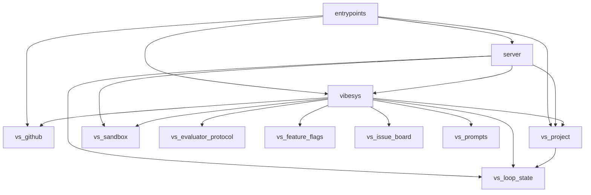
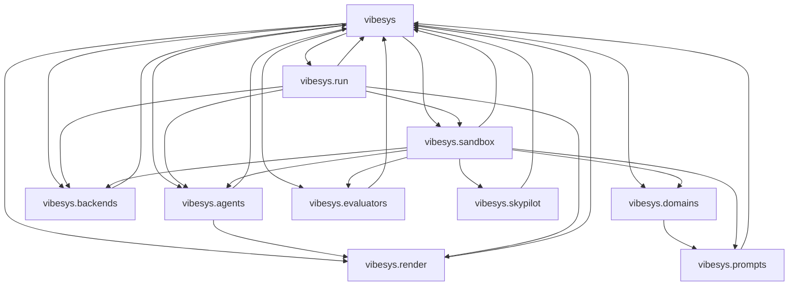

# Architecture: Python module graph

[`tach.toml`](https://github.com/uw-syfi/vibesys/blob/main/tach.toml) freezes
the Python module graph, and CI runs `uv run tach check`. An import between
modules that is not a declared `depends_on` edge fails the check. Modules cover
`src/` (`entrypoints`, `server.*`, `vibesys.*`) and every `libs/*/src`.

The graphs below are generated from `tach.toml` by `tach show --mermaid`. CI
fails when they are stale. To refresh after editing `tach.toml`:

```bash
uv run python scripts/check_tach_graph.py --write
```

Views: a package-level overview, the core strongly connected component (a
known cycle that `tach.toml` tolerates until it is broken), and the full module
graph.

[//]: # (tach-graph:start)
## Architecture overview

Submodules such as `vibesys.agents` and `server.api` are collapsed into their top-level package.



## Core cycle

Edges among the modules of the known strongly connected core.



## Full module graph

```mermaid
graph TD
    entrypoints --> server.runtime
    entrypoints --> server.settings
    entrypoints --> vibesys
    entrypoints --> vibesys.agents
    entrypoints --> vibesys.domains
    entrypoints --> vibesys.loops
    entrypoints --> vibesys.render
    entrypoints --> vibesys.run
    entrypoints --> vibesys.sandbox
    entrypoints --> vs_github
    entrypoints --> vs_project
    server.api --> server.chat
    server.api --> server.controller
    server.api --> server.diagnostics
    server.api --> server.events
    server.api --> server.execution
    server.api --> server.integration
    server.api --> server.journal
    server.api --> server.run_lifecycle
    server.api --> server.settings
    server.api --> vibesys
    server.api --> vibesys.loops
    server.api --> vibesys.run
    server.api --> vs_loop_state
    server.api --> vs_project
    server.chat --> server.controller
    server.chat --> server.events
    server.chat --> server.execution
    server.chat --> server.journal
    server.chat --> server.run_lifecycle
    server.chat --> vibesys.agents
    server.chat --> vibesys.domains
    server.chat --> vibesys.run
    server.chat --> vs_project
    server.chat --> vs_sandbox
    server.controller --> server.diagnostics
    server.controller --> server.events
    server.controller --> server.execution
    server.controller --> server.journal
    server.controller --> server.run_lifecycle
    server.controller --> vs_project
    server.events --> server.diagnostics
    server.events --> server.event_index
    server.events --> server.run_lifecycle
    server.execution --> server.diagnostics
    server.execution --> server.events
    server.execution --> server.journal
    server.integration --> server.chat
    server.integration --> server.controller
    server.integration --> server.diagnostics
    server.integration --> server.events
    server.integration --> server.execution
    server.integration --> server.journal
    server.integration --> server.read_model
    server.integration --> server.run_lifecycle
    server.integration --> vibesys
    server.integration --> vibesys.agents
    server.integration --> vibesys.render
    server.integration --> vibesys.run
    server.integration --> vs_project
    server.journal --> server.diagnostics
    server.journal --> server.events
    server.read_model --> server.events
    server.read_model --> server.integration
    server.runtime --> server.api
    server.runtime --> server.chat
    server.runtime --> server.controller
    server.runtime --> server.diagnostics
    server.runtime --> server.events
    server.runtime --> server.execution
    server.runtime --> server.integration
    server.runtime --> server.journal
    server.runtime --> server.read_model
    server.runtime --> server.settings
    server.runtime --> server.transport
    server.runtime --> vibesys
    server.settings --> vibesys
    server.tool_payloads --> server.events
    server.transport --> server.api
    server.transport --> vibesys
    vibesys --> vibesys.agents
    vibesys --> vibesys.backends
    vibesys --> vibesys.domains
    vibesys --> vibesys.evaluators
    vibesys --> vibesys.render
    vibesys --> vibesys.run
    vibesys --> vibesys.sandbox
    vibesys --> vs_feature_flags
    vibesys --> vs_project
    vibesys --> vs_sandbox
    vibesys.agents --> vibesys
    vibesys.agents --> vibesys.render
    vibesys.agents --> vs_project
    vibesys.agents --> vs_sandbox
    vibesys.backends --> vibesys
    vibesys.backends --> vs_sandbox
    vibesys.domains --> vibesys.prompts
    vibesys.evaluators --> vibesys
    vibesys.evaluators --> vs_sandbox
    vibesys.loops --> vibesys
    vibesys.loops --> vibesys.agents
    vibesys.loops --> vibesys.domains
    vibesys.loops --> vibesys.prompts
    vibesys.loops --> vibesys.render
    vibesys.loops --> vibesys.run
    vibesys.loops --> vibesys.sandbox
    vibesys.loops --> vs_evaluator_protocol
    vibesys.loops --> vs_issue_board
    vibesys.loops --> vs_loop_state
    vibesys.loops --> vs_project
    vibesys.loops --> vs_sandbox
    vibesys.prompts --> vibesys
    vibesys.prompts --> vs_prompts
    vibesys.render --> vibesys
    vibesys.run --> vibesys
    vibesys.run --> vibesys.agents
    vibesys.run --> vibesys.backends
    vibesys.run --> vibesys.render
    vibesys.run --> vibesys.sandbox
    vibesys.run --> vs_github
    vibesys.run --> vs_loop_state
    vibesys.run --> vs_project
    vibesys.run --> vs_sandbox
    vibesys.sandbox --> vibesys
    vibesys.sandbox --> vibesys.agents
    vibesys.sandbox --> vibesys.backends
    vibesys.sandbox --> vibesys.domains
    vibesys.sandbox --> vibesys.evaluators
    vibesys.sandbox --> vibesys.prompts
    vibesys.sandbox --> vibesys.skypilot
    vibesys.sandbox --> vs_project
    vibesys.sandbox --> vs_sandbox
    vibesys.skypilot --> vibesys
    vibesys.skypilot --> vs_project
    vs_project --> vs_loop_state
```


[//]: # (tach-graph:end)
