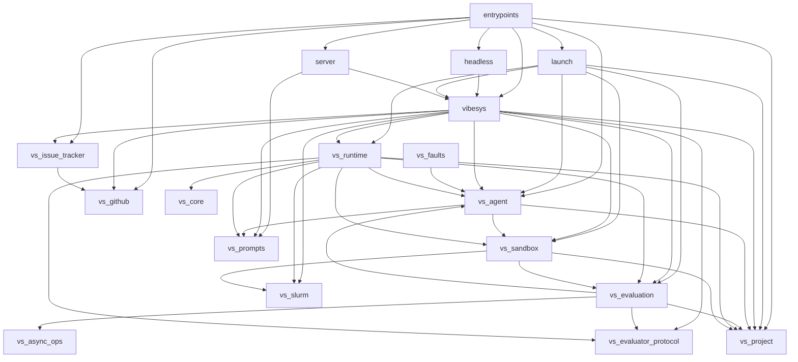

# Architecture: Python module graph

[`tach.toml`](https://github.com/uw-syfi/vibesys/blob/main/tach.toml) freezes
the Python module graph, and CI runs `uv run tach check`. An import between
modules that is not a declared `depends_on` edge fails the check. Modules cover
`src/` (`entrypoints`, `launch`, `headless`, `server.*`, `vibesys.*`) and every `libs/*/src`.

The graph below is generated from `tach.toml` by `tach show --mermaid`. CI
fails when it is stale. To refresh after editing `tach.toml`:

```bash
uv run python scripts/check_tach_graph.py --write
```

A package-level overview with submodules collapsed to their top-level package.
The graph is acyclic and `tach.toml` forbids cycles.

Every direct subfolder of `src/vibesys/orchestration/` is one orchestration
strategy: `dynamic`, `evolve`, `issue_queue`, `multi`, or `single`. Shared
policy and resources (`domains`, `hypothesis`, `profile_focus`, `steering`,
`prompts`, and `metrics`) live beside `orchestration` under `src/vibesys/` and
never import it. Domain templates live in their domain package; strategy
templates live in their strategy package. The shared `prompts` package owns
only shared rendering and templates. A strategy may exclusively own a run shell
when every source consumer of that shell belongs to the strategy. Shared run
composition and peer strategies cannot import such a shell. Its downward policy
interfaces and library dependencies remain declared in Tach. Top-level orchestration modules remain
shared policy helpers; they are not strategy packages.

`src/vibesys/` holds strategies, domain resources, prompts, and thin wiring.
The generic pure lifecycle lives in `vs_core`, published only through
`vs_core.api`: immutable state, events, requests, strategy contracts and projections.
The `vs_runtime` async shell calls strategy decisions and core transitions
separately, persists intent before I/O, and returns typed observations.
`vs_core` has no I/O-library dependencies. Infrastructure mechanisms belong in
`vs_runtime` and its libraries. Placement
test: "Would another product built on vs_runtime need this mechanism, with no
VibeSys policy in it? Then it belongs in a library, not src/vibesys."

Design stateful systems as a pure core that emits requests and a thin async
shell that calls I/O interfaces and returns typed outcomes as events. Each
owning library declares its interface in its `.api` and holds interchangeable
implementations inside it or in smaller libraries it depends on. The shell
imports the core and owning libraries; the core imports no I/O library. Follow
the software-design rule
[Functional core, interfaces and implementations](https://github.com/uw-syfi/vibesys/blob/main/.agents/skills/software-design/references/functional-core.md)
for durable intent, recovery, and tests.

`vibesys.orchestration` owns built-in orchestration policy. Explicit plugins,
including the issue queue, live under the singular
`vibesys.orchestration.<plugin>` namespace; `launch` assembles their built-in
catalog from individual registrations exposed by `vibesys.api.catalog`.
`vibesys.plugin_catalog` retains the explicit registry contract.
Agent roles, plan and reply schemas, prompts, and pure strategy decisions
live with their owning orchestration; generic lifecycle and recovery decisions
belong in the pure core. For example, the
hypothesis planner's skill-selection and title rules are public through
`vibesys.hypothesis`, not a top-level schema catch-all. Generic
run roles live in `vibesys.api`: `Runs` starts and resumes independent
`RunHandle` tasks, which publish semantic events, accept stop requests, and
return results. `launch.default_runs` selects VibeSys implementations;
`vs-runtime` owns the generic task and event-stream mechanism. Only
entrypoints, tests and scripts import `launch`. Headless receives one started
handle; the server receives `Runs`. The transitional `vibesys.api.session`
contract retains queries, readiness and auxiliary-agent access;
workspace, persistence, and sandbox mechanisms live in the runtime libraries.
The `vibesys.api` package root is policy-neutral. Applications opt into a
built-in policy through a named facade such as `vibesys.api.hypothesis` or
`vibesys.api.evolve`; the generic facade does not re-export those contracts.
Tach records each dependency. `vs_project` owns generic project layout and
persistence operations. Hypothesis-search history and its serialization belong
to `vibesys.hypothesis`; they are policy contracts, not generic lifecycle types.
The v5 manifest separates policy-specific descriptor options from the generic
`execution` record. The latter is derived from `RunRequest` and resolved host
settings, including the concrete profiler. Resume checks it before setup.
Trusted evaluator execution and package mechanics live in the runtime and
sandbox libraries. Orchestration owns gate cadence and result interpretation.

The internal custom-policy execution contract and example are in
[orchestration-runtime.md](orchestration-runtime.md).

[//]: # (tach-graph:start)
## Architecture overview

Submodules such as `vibesys.orchestration` and `server.api` are collapsed into their top-level package.


```mermaid
graph TD
    entrypoints --> headless
    entrypoints --> launch
    entrypoints --> server
    entrypoints --> vibesys
    entrypoints --> vs_agent
    entrypoints --> vs_github
    entrypoints --> vs_issue_tracker
    entrypoints --> vs_project
    headless --> vibesys
    launch --> vibesys
    launch --> vs_agent
    launch --> vs_evaluation
    launch --> vs_project
    launch --> vs_runtime
    launch --> vs_sandbox
    server --> vibesys
    server --> vs_prompts
    vibesys --> vs_agent
    vibesys --> vs_evaluation
    vibesys --> vs_evaluator_protocol
    vibesys --> vs_github
    vibesys --> vs_issue_tracker
    vibesys --> vs_project
    vibesys --> vs_prompts
    vibesys --> vs_runtime
    vibesys --> vs_sandbox
    vibesys --> vs_slurm
    vs_agent --> vs_project
    vs_agent --> vs_prompts
    vs_agent --> vs_sandbox
    vs_evaluation --> vs_agent
    vs_evaluation --> vs_async_ops
    vs_evaluation --> vs_evaluator_protocol
    vs_evaluation --> vs_project
    vs_faults --> vs_agent
    vs_issue_tracker --> vs_github
    vs_runtime --> vs_agent
    vs_runtime --> vs_core
    vs_runtime --> vs_evaluation
    vs_runtime --> vs_evaluator_protocol
    vs_runtime --> vs_project
    vs_runtime --> vs_prompts
    vs_runtime --> vs_sandbox
    vs_runtime --> vs_slurm
    vs_sandbox --> vs_evaluation
    vs_sandbox --> vs_project
    vs_sandbox --> vs_slurm
```
[//]: # (tach-graph:end)
