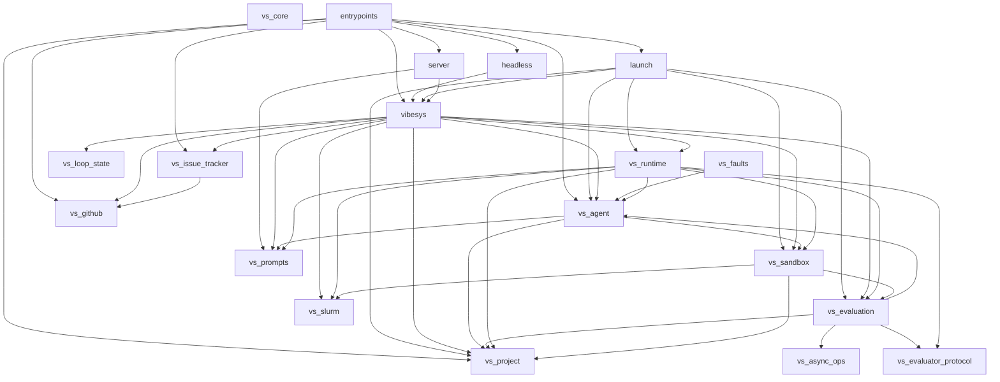

# Architecture: Python module graph

[`tach.toml`](https://github.com/uw-syfi/vibesys/blob/main/tach.toml) freezes
the Python module graph, and CI runs `uv run tach check`. An import between
modules that is not a declared `depends_on` edge fails the check. Modules cover
`src/` (`entrypoints`, `launch`, `headless`, `server.*`, `vibesys.*`) and every `libs/*/src`.

The graphs below are generated from `tach.toml` by `tach show --mermaid`. CI
fails when they are stale. To refresh after editing `tach.toml`:

```bash
uv run python scripts/check_tach_graph.py --write
```

Views: a package-level overview, the `vibesys` core modules, and the full
module graph. The graph is acyclic and `tach.toml` forbids cycles.

Every direct subfolder of `src/vibesys/orchestration/` is one orchestration
strategy: `dynamic`, `evolve`, `issue_queue`, `multi`, or `single`. Shared
policy and resources (`domains`, `hypothesis`, `profile_focus`, `steering`,
`prompts`, and `metrics`) live beside `orchestration` under `src/vibesys/` and
never import it. Domain templates live in their domain package; strategy
templates live in their strategy package. The shared `prompts` package owns
only shared rendering and templates. Top-level orchestration modules remain
shared policy helpers; they are not strategy packages.

`src/vibesys/` holds strategies, domain resources, prompts, and thin wiring.
The generic pure lifecycle lives in `vs_core`, published only through
`vs_core.api`: immutable state, events, requests, strategy contracts and projections.
The `vs_runtime` async shell calls strategy decisions and core transitions
separately, persists intent before I/O, and returns typed observations.
`vs_core` has no I/O-library dependencies. Infrastructure mechanisms belong in
`vs_runtime` and its libraries. Placement
test: "Would another product built on vs_runtime need this mechanism, with no
VibeSys policy in it? Then it belongs in a library, not src/vibesys."

Design stateful systems as a pure core that emits requests and a thin async
shell that calls I/O interfaces and returns typed outcomes as events. Each
owning library declares its interface in its `.api` and holds interchangeable
implementations inside it or in smaller libraries it depends on. The shell
imports the core and owning libraries; the core imports no I/O library. Follow
the software-design rule
[Functional core, interfaces and implementations](https://github.com/uw-syfi/vibesys/blob/main/.agents/skills/software-design/references/functional-core.md)
for durable intent, recovery, and tests.

`vibesys.orchestration` owns built-in orchestration policy. Explicit plugins,
including the issue queue, live under the singular
`vibesys.orchestration.<plugin>` namespace; `launch` assembles their built-in
catalog from individual registrations exposed by `vibesys.api.catalog`.
`vibesys.plugin_catalog` retains the explicit registry contract.
Agent roles, plan and reply schemas, prompts, and pure strategy decisions
live with their owning orchestration; generic lifecycle and recovery decisions
belong in the pure core. For example, the
hypothesis planner's skill-selection and title rules are public through
`vibesys.hypothesis`, not a top-level schema catch-all. Generic
run roles live in `vibesys.api`: `Runs` starts and resumes independent
`RunHandle` tasks, which publish semantic events, accept stop requests, and
return results. `launch.default_runs` selects VibeSys implementations;
`vs-runtime` owns the generic task and event-stream mechanism. Only
entrypoints, tests and scripts import `launch`. Headless receives one started
handle; the server receives `Runs`. The transitional `vibesys.api.session`
contract retains queries, readiness and auxiliary-agent access;
workspace, persistence, and sandbox mechanisms live in the runtime libraries.
The `vibesys.api` package root is policy-neutral. Applications opt into a
built-in policy through a named facade such as `vibesys.api.hypothesis` or
`vibesys.api.evolve`; the generic facade does not re-export those contracts.
Tach records each dependency. `vs_project` owns generic project layout and
persistence operations.
The v5 manifest separates policy-specific descriptor options from the generic
`execution` record. The latter is derived from `RunRequest` and resolved host
settings, including the concrete profiler. Resume checks it before setup.
Trusted evaluator execution and package mechanics live in the runtime and
sandbox libraries. Orchestration owns gate cadence and result interpretation.

The internal custom-policy execution contract and example are in
[orchestration-runtime.md](orchestration-runtime.md).

[//]: # (tach-graph:start)
## Architecture overview

Submodules such as `vibesys.orchestration` and `server.api` are collapsed into their top-level package.


```mermaid
graph TD
    vs_core
    entrypoints --> headless
    entrypoints --> launch
    entrypoints --> server
    entrypoints --> vibesys
    entrypoints --> vs_agent
    entrypoints --> vs_github
    entrypoints --> vs_issue_tracker
    entrypoints --> vs_project
    headless --> vibesys
    launch --> vibesys
    launch --> vs_agent
    launch --> vs_evaluation
    launch --> vs_project
    launch --> vs_runtime
    launch --> vs_sandbox
    server --> vibesys
    server --> vs_prompts
    vibesys --> vs_agent
    vibesys --> vs_evaluation
    vibesys --> vs_github
    vibesys --> vs_issue_tracker
    vibesys --> vs_loop_state
    vibesys --> vs_project
    vibesys --> vs_prompts
    vibesys --> vs_runtime
    vibesys --> vs_sandbox
    vibesys --> vs_slurm
    vs_agent --> vs_project
    vs_agent --> vs_prompts
    vs_agent --> vs_sandbox
    vs_evaluation --> vs_agent
    vs_evaluation --> vs_async_ops
    vs_evaluation --> vs_evaluator_protocol
    vs_evaluation --> vs_project
    vs_faults --> vs_agent
    vs_issue_tracker --> vs_github
    vs_runtime --> vs_agent
    vs_runtime --> vs_evaluation
    vs_runtime --> vs_evaluator_protocol
    vs_runtime --> vs_project
    vs_runtime --> vs_prompts
    vs_runtime --> vs_sandbox
    vs_runtime --> vs_slurm
    vs_sandbox --> vs_evaluation
    vs_sandbox --> vs_project
    vs_sandbox --> vs_slurm
```

## Core layers

Edges among the `vibesys` core modules. The graph is acyclic; `tach.toml` forbids cycles.


```mermaid
graph TD
    vibesys.orchestration
    vibesys --> vibesys.errors
    vibesys --> vibesys.run.evaluation_backend
    vibesys.api --> vibesys
    vibesys.api --> vibesys.api.assembly
    vibesys.api --> vibesys.api.auxiliary
    vibesys.api --> vibesys.api.contracts
    vibesys.api --> vibesys.api.runs
    vibesys.api --> vibesys.api.session
    vibesys.api --> vibesys.api.store
    vibesys.api --> vibesys.inputs
    vibesys.api --> vibesys.orchestration.agent_options
    vibesys.api --> vibesys.orchestration.skill_selection
    vibesys.api --> vibesys.plugin_catalog
    vibesys.api --> vibesys.run
    vibesys.api --> vibesys.run.contracts
    vibesys.api --> vibesys.run.environment
    vibesys.api --> vibesys.run.host
    vibesys.api --> vibesys.run.profilers
    vibesys.api --> vibesys.run.skill_sources
    vibesys.api._session --> vibesys
    vibesys.api._session --> vibesys.api.assembly
    vibesys.api._session --> vibesys.api.auxiliary
    vibesys.api._session --> vibesys.api.contracts
    vibesys.api._session --> vibesys.api.store
    vibesys.api._session --> vibesys.orchestration.skill_selection
    vibesys.api._session --> vibesys.plugin_catalog
    vibesys.api._session --> vibesys.run
    vibesys.api._session --> vibesys.run.contracts
    vibesys.api._session --> vibesys.run.host
    vibesys.api._session --> vibesys.run.profilers
    vibesys.api._store --> vibesys.api.contracts
    vibesys.api._store --> vibesys.plugin_catalog
    vibesys.api.assembly --> vibesys.api.auxiliary
    vibesys.api.assembly --> vibesys.run
    vibesys.api.auxiliary --> vibesys.api.store
    vibesys.api.catalog --> vibesys.orchestration.dynamic
    vibesys.api.catalog --> vibesys.orchestration.evolve
    vibesys.api.catalog --> vibesys.orchestration.issue_queue
    vibesys.api.catalog --> vibesys.orchestration.multi
    vibesys.api.catalog --> vibesys.orchestration.single
    vibesys.api.contracts --> vibesys
    vibesys.api.contracts --> vibesys.errors
    vibesys.api.contracts --> vibesys.run.contracts
    vibesys.api.evolve --> vibesys.orchestration.evolve
    vibesys.api.hypothesis --> vibesys.hypothesis.readmodel
    vibesys.api.metrics --> vibesys.metrics
    vibesys.api.profilers --> vibesys.orchestration.profilers
    vibesys.api.profilers --> vibesys.run.contracts
    vibesys.api.runs --> vibesys.api.contracts
    vibesys.api.runs --> vibesys.api.session
    vibesys.api.session --> vibesys.api._session
    vibesys.api.session --> vibesys.api.assembly
    vibesys.api.session --> vibesys.api.auxiliary
    vibesys.api.session --> vibesys.api.contracts
    vibesys.api.session --> vibesys.plugin_catalog
    vibesys.api.session --> vibesys.run.contracts
    vibesys.api.store --> vibesys.api._store
    vibesys.api.store --> vibesys.plugin_catalog
    vibesys.api.testing --> vibesys.api._session
    vibesys.api.testing --> vibesys.api.assembly
    vibesys.api.testing --> vibesys.api.contracts
    vibesys.api.testing --> vibesys.api.session
    vibesys.api.testing --> vibesys.api.store
    vibesys.api.testing --> vibesys.plugin_catalog
    vibesys.api.testing --> vibesys.run.contracts
    vibesys.api.wiring --> vibesys
    vibesys.api.wiring --> vibesys.api._session
    vibesys.api.wiring --> vibesys.api.assembly
    vibesys.api.wiring --> vibesys.orchestration.skill_selection
    vibesys.api.wiring --> vibesys.run
    vibesys.domains --> vibesys
    vibesys.domains --> vibesys.prompts
    vibesys.hypothesis --> vibesys.metrics
    vibesys.hypothesis --> vibesys.profile_focus
    vibesys.hypothesis.readmodel --> vibesys.hypothesis
    vibesys.hypothesis.readmodel --> vibesys.run.contracts
    vibesys.inputs --> vibesys
    vibesys.orchestration.agent_options --> vibesys.inputs
    vibesys.orchestration.agent_options --> vibesys.metrics
    vibesys.orchestration.dynamic --> vibesys.hypothesis
    vibesys.orchestration.dynamic --> vibesys.hypothesis.readmodel
    vibesys.orchestration.dynamic --> vibesys.metrics
    vibesys.orchestration.dynamic --> vibesys.orchestration.agent_options
    vibesys.orchestration.dynamic --> vibesys.orchestration.dynamic.control
    vibesys.orchestration.dynamic --> vibesys.orchestration.dynamic.lifecycle
    vibesys.orchestration.dynamic --> vibesys.orchestration.resume
    vibesys.orchestration.dynamic --> vibesys.orchestration.structured_turn
    vibesys.orchestration.dynamic --> vibesys.plugin_registration
    vibesys.orchestration.dynamic --> vibesys.run.contracts
    vibesys.orchestration.dynamic --> vibesys.run.evaluation_backend
    vibesys.orchestration.evolve --> vibesys
    vibesys.orchestration.evolve --> vibesys.domains
    vibesys.orchestration.evolve --> vibesys.errors
    vibesys.orchestration.evolve --> vibesys.metrics
    vibesys.orchestration.evolve --> vibesys.orchestration.evolve.population
    vibesys.orchestration.evolve --> vibesys.orchestration.profilers
    vibesys.orchestration.evolve --> vibesys.orchestration.review
    vibesys.orchestration.evolve --> vibesys.orchestration.structured_turn
    vibesys.orchestration.evolve --> vibesys.plugin_registration
    vibesys.orchestration.evolve --> vibesys.prompts
    vibesys.orchestration.evolve --> vibesys.run.contracts
    vibesys.orchestration.evolve.population --> vibesys.metrics
    vibesys.orchestration.evolve.population --> vibesys.orchestration.profilers
    vibesys.orchestration.issue_queue --> vibesys.orchestration.resume
    vibesys.orchestration.issue_queue --> vibesys.orchestration.structured_turn
    vibesys.orchestration.issue_queue --> vibesys.plugin_registration
    vibesys.orchestration.issue_queue --> vibesys.run.contracts
    vibesys.orchestration.multi --> vibesys
    vibesys.orchestration.multi --> vibesys.domains
    vibesys.orchestration.multi --> vibesys.hypothesis
    vibesys.orchestration.multi --> vibesys.hypothesis.readmodel
    vibesys.orchestration.multi --> vibesys.inputs
    vibesys.orchestration.multi --> vibesys.metrics
    vibesys.orchestration.multi --> vibesys.orchestration.agent_options
    vibesys.orchestration.multi --> vibesys.orchestration.memory
    vibesys.orchestration.multi --> vibesys.orchestration.profilers
    vibesys.orchestration.multi --> vibesys.orchestration.progress
    vibesys.orchestration.multi --> vibesys.orchestration.resume
    vibesys.orchestration.multi --> vibesys.orchestration.review
    vibesys.orchestration.multi --> vibesys.orchestration.structured_turn
    vibesys.orchestration.multi --> vibesys.plugin_registration
    vibesys.orchestration.multi --> vibesys.profile_focus
    vibesys.orchestration.multi --> vibesys.prompts
    vibesys.orchestration.multi --> vibesys.run.contracts
    vibesys.orchestration.profiler_agent --> vibesys.orchestration.structured_turn
    vibesys.orchestration.profiler_agent --> vibesys.prompts
    vibesys.orchestration.profilers --> vibesys
    vibesys.orchestration.profilers --> vibesys.run.contracts
    vibesys.orchestration.resume --> vibesys.errors
    vibesys.orchestration.single --> vibesys
    vibesys.orchestration.single --> vibesys.domains
    vibesys.orchestration.single --> vibesys.hypothesis
    vibesys.orchestration.single --> vibesys.hypothesis.readmodel
    vibesys.orchestration.single --> vibesys.inputs
    vibesys.orchestration.single --> vibesys.metrics
    vibesys.orchestration.single --> vibesys.orchestration.agent_options
    vibesys.orchestration.single --> vibesys.orchestration.memory
    vibesys.orchestration.single --> vibesys.orchestration.profilers
    vibesys.orchestration.single --> vibesys.orchestration.progress
    vibesys.orchestration.single --> vibesys.orchestration.resume
    vibesys.orchestration.single --> vibesys.orchestration.review
    vibesys.orchestration.single --> vibesys.orchestration.structured_turn
    vibesys.orchestration.single --> vibesys.plugin_registration
    vibesys.orchestration.single --> vibesys.profile_focus
    vibesys.orchestration.single --> vibesys.prompts
    vibesys.orchestration.single --> vibesys.run.contracts
    vibesys.orchestration.skill_selection --> vibesys
    vibesys.orchestration.structured_turn --> vibesys.prompts
    vibesys.plugin_catalog --> vibesys.plugin_registration
    vibesys.plugin_registration --> vibesys.run.contracts
    vibesys.prompts --> vibesys
    vibesys.run --> vibesys
    vibesys.run --> vibesys.errors
    vibesys.run --> vibesys.inputs
    vibesys.run.contracts --> vibesys
    vibesys.run.contracts --> vibesys.inputs
    vibesys.run.environment --> vibesys.prompts
    vibesys.run.evaluation --> vibesys
    vibesys.run.evaluation --> vibesys.inputs
    vibesys.run.evaluation --> vibesys.run.contracts
    vibesys.run.host --> vibesys
    vibesys.run.host --> vibesys.orchestration.profiler_agent
    vibesys.run.host --> vibesys.orchestration.skill_selection
    vibesys.run.host --> vibesys.run
    vibesys.run.host --> vibesys.run.contracts
    vibesys.run.host --> vibesys.run.evaluation
    vibesys.run.host --> vibesys.run.evaluation_backend
    vibesys.run.host --> vibesys.run.resources
    vibesys.run.host --> vibesys.run.slurm_evaluation
    vibesys.run.host --> vibesys.steering
    vibesys.run.profilers --> vibesys
    vibesys.run.profilers --> vibesys.errors
    vibesys.run.profilers --> vibesys.orchestration.profilers
    vibesys.run.profilers --> vibesys.run.contracts
    vibesys.run.resources --> vibesys
    vibesys.run.resources --> vibesys.errors
    vibesys.run.resources --> vibesys.orchestration.profilers
    vibesys.run.resources --> vibesys.orchestration.skill_selection
    vibesys.run.resources --> vibesys.run
    vibesys.run.resources --> vibesys.run.contracts
    vibesys.run.resources --> vibesys.run.environment
    vibesys.run.resources --> vibesys.run.evaluation
    vibesys.run.resources --> vibesys.run.profilers
    vibesys.run.skill_sources --> vibesys
    vibesys.run.skill_sources --> vibesys.orchestration.skill_selection
    vibesys.run.slurm_evaluation --> vibesys.run.evaluation_backend
```

## Full module graph

```mermaid
graph TD
    vibesys.orchestration
    vs_async_ops
    vs_core
    entrypoints --> headless
    entrypoints --> launch
    entrypoints --> server.runtime
    entrypoints --> server.settings
    entrypoints --> vibesys.api
    entrypoints --> vibesys.api.evolve
    entrypoints --> vibesys.api.hypothesis
    entrypoints --> vibesys.api.metrics
    entrypoints --> vibesys.api.profilers
    entrypoints --> vs_agent
    entrypoints --> vs_github
    entrypoints --> vs_issue_tracker
    entrypoints --> vs_project
    headless --> vibesys.api
    launch --> vibesys.api
    launch --> vibesys.api.catalog
    launch --> vibesys.api.contracts
    launch --> vibesys.api.store
    launch --> vibesys.api.wiring
    launch --> vs_agent
    launch --> vs_evaluation.api
    launch --> vs_evaluation.api.tools
    launch --> vs_project
    launch --> vs_runtime
    launch --> vs_runtime.api.wiring
    launch --> vs_sandbox
    server --> vibesys.api
    server.api --> server.chat
    server.api --> server.controller
    server.api --> server.diagnostics
    server.api --> server.events
    server.api --> server.execution
    server.api --> server.integration
    server.api --> server.journal
    server.api --> server.run_lifecycle
    server.api --> server.settings
    server.api --> vibesys.api
    server.api --> vibesys.api.hypothesis
    server.chat --> server
    server.chat --> server.controller
    server.chat --> server.events
    server.chat --> server.execution
    server.chat --> server.journal
    server.chat --> server.run_lifecycle
    server.chat --> vibesys.api
    server.chat --> vs_prompts
    server.controller --> server.diagnostics
    server.controller --> server.events
    server.controller --> server.execution
    server.controller --> server.journal
    server.controller --> server.run_lifecycle
    server.controller --> vibesys.api
    server.events --> server.diagnostics
    server.events --> server.event_index
    server.events --> server.run_lifecycle
    server.events --> vibesys.api
    server.execution --> server.diagnostics
    server.execution --> server.events
    server.execution --> server.journal
    server.execution --> vibesys.api
    server.integration --> server
    server.integration --> server.chat
    server.integration --> server.controller
    server.integration --> server.diagnostics
    server.integration --> server.events
    server.integration --> server.execution
    server.integration --> server.journal
    server.integration --> server.read_model
    server.integration --> server.run_lifecycle
    server.integration --> vibesys.api
    server.journal --> server.diagnostics
    server.journal --> server.events
    server.read_model --> server.controller
    server.read_model --> server.events
    server.read_model --> vibesys.api
    server.runtime --> server.api
    server.runtime --> server.chat
    server.runtime --> server.controller
    server.runtime --> server.diagnostics
    server.runtime --> server.events
    server.runtime --> server.execution
    server.runtime --> server.integration
    server.runtime --> server.journal
    server.runtime --> server.read_model
    server.runtime --> server.settings
    server.runtime --> server.transport
    server.runtime --> vibesys.api
    server.settings --> vibesys.api
    server.tool_payloads --> vibesys.api
    server.transport --> server.api
    vibesys --> vibesys.errors
    vibesys --> vibesys.run.evaluation_backend
    vibesys --> vs_agent
    vibesys --> vs_evaluation.api
    vibesys --> vs_evaluation.api.tools
    vibesys --> vs_runtime
    vibesys --> vs_sandbox
    vibesys.api --> vibesys
    vibesys.api --> vibesys.api.assembly
    vibesys.api --> vibesys.api.auxiliary
    vibesys.api --> vibesys.api.contracts
    vibesys.api --> vibesys.api.runs
    vibesys.api --> vibesys.api.session
    vibesys.api --> vibesys.api.store
    vibesys.api --> vibesys.inputs
    vibesys.api --> vibesys.orchestration.agent_options
    vibesys.api --> vibesys.orchestration.skill_selection
    vibesys.api --> vibesys.plugin_catalog
    vibesys.api --> vibesys.run
    vibesys.api --> vibesys.run.contracts
    vibesys.api --> vibesys.run.environment
    vibesys.api --> vibesys.run.host
    vibesys.api --> vibesys.run.profilers
    vibesys.api --> vibesys.run.skill_sources
    vibesys.api --> vs_agent
    vibesys.api --> vs_project
    vibesys.api --> vs_runtime
    vibesys.api --> vs_sandbox
    vibesys.api._session --> vibesys
    vibesys.api._session --> vibesys.api.assembly
    vibesys.api._session --> vibesys.api.auxiliary
    vibesys.api._session --> vibesys.api.contracts
    vibesys.api._session --> vibesys.api.store
    vibesys.api._session --> vibesys.orchestration.skill_selection
    vibesys.api._session --> vibesys.plugin_catalog
    vibesys.api._session --> vibesys.run
    vibesys.api._session --> vibesys.run.contracts
    vibesys.api._session --> vibesys.run.host
    vibesys.api._session --> vibesys.run.profilers
    vibesys.api._session --> vs_agent
    vibesys.api._session --> vs_project
    vibesys.api._session --> vs_runtime
    vibesys.api._session --> vs_sandbox
    vibesys.api._store --> vibesys.api.contracts
    vibesys.api._store --> vibesys.plugin_catalog
    vibesys.api._store --> vs_project
    vibesys.api.assembly --> vibesys.api.auxiliary
    vibesys.api.assembly --> vibesys.run
    vibesys.api.assembly --> vs_agent
    vibesys.api.assembly --> vs_runtime
    vibesys.api.assembly --> vs_sandbox
    vibesys.api.auxiliary --> vibesys.api.store
    vibesys.api.catalog --> vibesys.orchestration.dynamic
    vibesys.api.catalog --> vibesys.orchestration.evolve
    vibesys.api.catalog --> vibesys.orchestration.issue_queue
    vibesys.api.catalog --> vibesys.orchestration.multi
    vibesys.api.catalog --> vibesys.orchestration.single
    vibesys.api.contracts --> vibesys
    vibesys.api.contracts --> vibesys.errors
    vibesys.api.contracts --> vibesys.run.contracts
    vibesys.api.contracts --> vs_agent
    vibesys.api.contracts --> vs_project
    vibesys.api.evolve --> vibesys.orchestration.evolve
    vibesys.api.hypothesis --> vibesys.hypothesis.readmodel
    vibesys.api.hypothesis --> vs_loop_state
    vibesys.api.metrics --> vibesys.metrics
    vibesys.api.profilers --> vibesys.orchestration.profilers
    vibesys.api.profilers --> vibesys.run.contracts
    vibesys.api.runs --> vibesys.api.contracts
    vibesys.api.runs --> vibesys.api.session
    vibesys.api.session --> vibesys.api._session
    vibesys.api.session --> vibesys.api.assembly
    vibesys.api.session --> vibesys.api.auxiliary
    vibesys.api.session --> vibesys.api.contracts
    vibesys.api.session --> vibesys.plugin_catalog
    vibesys.api.session --> vibesys.run.contracts
    vibesys.api.store --> vibesys.api._store
    vibesys.api.store --> vibesys.plugin_catalog
    vibesys.api.store --> vs_project
    vibesys.api.testing --> vibesys.api._session
    vibesys.api.testing --> vibesys.api.assembly
    vibesys.api.testing --> vibesys.api.contracts
    vibesys.api.testing --> vibesys.api.session
    vibesys.api.testing --> vibesys.api.store
    vibesys.api.testing --> vibesys.plugin_catalog
    vibesys.api.testing --> vibesys.run.contracts
    vibesys.api.testing --> vs_agent
    vibesys.api.testing --> vs_runtime
    vibesys.api.testing --> vs_sandbox
    vibesys.api.wiring --> vibesys
    vibesys.api.wiring --> vibesys.api._session
    vibesys.api.wiring --> vibesys.api.assembly
    vibesys.api.wiring --> vibesys.orchestration.skill_selection
    vibesys.api.wiring --> vibesys.run
    vibesys.domains --> vibesys
    vibesys.domains --> vibesys.prompts
    vibesys.hypothesis --> vibesys.metrics
    vibesys.hypothesis --> vibesys.profile_focus
    vibesys.hypothesis --> vs_loop_state
    vibesys.hypothesis --> vs_runtime
    vibesys.hypothesis.readmodel --> vibesys.hypothesis
    vibesys.hypothesis.readmodel --> vibesys.run.contracts
    vibesys.hypothesis.readmodel --> vs_loop_state
    vibesys.hypothesis.readmodel --> vs_runtime
    vibesys.inputs --> vibesys
    vibesys.inputs --> vs_project
    vibesys.inputs --> vs_prompts
    vibesys.inputs --> vs_runtime
    vibesys.metrics --> vs_loop_state
    vibesys.orchestration.agent_options --> vibesys.inputs
    vibesys.orchestration.agent_options --> vibesys.metrics
    vibesys.orchestration.dynamic --> vibesys.hypothesis
    vibesys.orchestration.dynamic --> vibesys.hypothesis.readmodel
    vibesys.orchestration.dynamic --> vibesys.metrics
    vibesys.orchestration.dynamic --> vibesys.orchestration.agent_options
    vibesys.orchestration.dynamic --> vibesys.orchestration.dynamic.control
    vibesys.orchestration.dynamic --> vibesys.orchestration.dynamic.lifecycle
    vibesys.orchestration.dynamic --> vibesys.orchestration.resume
    vibesys.orchestration.dynamic --> vibesys.orchestration.structured_turn
    vibesys.orchestration.dynamic --> vibesys.plugin_registration
    vibesys.orchestration.dynamic --> vibesys.run.contracts
    vibesys.orchestration.dynamic --> vibesys.run.evaluation_backend
    vibesys.orchestration.dynamic --> vs_evaluation.api
    vibesys.orchestration.dynamic --> vs_loop_state
    vibesys.orchestration.dynamic --> vs_prompts
    vibesys.orchestration.dynamic --> vs_runtime
    vibesys.orchestration.evolve --> vibesys
    vibesys.orchestration.evolve --> vibesys.domains
    vibesys.orchestration.evolve --> vibesys.errors
    vibesys.orchestration.evolve --> vibesys.metrics
    vibesys.orchestration.evolve --> vibesys.orchestration.evolve.population
    vibesys.orchestration.evolve --> vibesys.orchestration.profilers
    vibesys.orchestration.evolve --> vibesys.orchestration.review
    vibesys.orchestration.evolve --> vibesys.orchestration.structured_turn
    vibesys.orchestration.evolve --> vibesys.plugin_registration
    vibesys.orchestration.evolve --> vibesys.prompts
    vibesys.orchestration.evolve --> vibesys.run.contracts
    vibesys.orchestration.evolve --> vs_prompts
    vibesys.orchestration.evolve --> vs_runtime
    vibesys.orchestration.evolve.population --> vibesys.metrics
    vibesys.orchestration.evolve.population --> vibesys.orchestration.profilers
    vibesys.orchestration.issue_queue --> vibesys.orchestration.resume
    vibesys.orchestration.issue_queue --> vibesys.orchestration.structured_turn
    vibesys.orchestration.issue_queue --> vibesys.plugin_registration
    vibesys.orchestration.issue_queue --> vibesys.run.contracts
    vibesys.orchestration.issue_queue --> vs_issue_tracker
    vibesys.orchestration.issue_queue --> vs_prompts
    vibesys.orchestration.issue_queue --> vs_runtime
    vibesys.orchestration.multi --> vibesys
    vibesys.orchestration.multi --> vibesys.domains
    vibesys.orchestration.multi --> vibesys.hypothesis
    vibesys.orchestration.multi --> vibesys.hypothesis.readmodel
    vibesys.orchestration.multi --> vibesys.inputs
    vibesys.orchestration.multi --> vibesys.metrics
    vibesys.orchestration.multi --> vibesys.orchestration.agent_options
    vibesys.orchestration.multi --> vibesys.orchestration.memory
    vibesys.orchestration.multi --> vibesys.orchestration.profilers
    vibesys.orchestration.multi --> vibesys.orchestration.progress
    vibesys.orchestration.multi --> vibesys.orchestration.resume
    vibesys.orchestration.multi --> vibesys.orchestration.review
    vibesys.orchestration.multi --> vibesys.orchestration.structured_turn
    vibesys.orchestration.multi --> vibesys.plugin_registration
    vibesys.orchestration.multi --> vibesys.profile_focus
    vibesys.orchestration.multi --> vibesys.prompts
    vibesys.orchestration.multi --> vibesys.run.contracts
    vibesys.orchestration.multi --> vs_loop_state
    vibesys.orchestration.multi --> vs_prompts
    vibesys.orchestration.multi --> vs_runtime
    vibesys.orchestration.profiler_agent --> vibesys.orchestration.structured_turn
    vibesys.orchestration.profiler_agent --> vibesys.prompts
    vibesys.orchestration.profiler_agent --> vs_evaluation.api
    vibesys.orchestration.profiler_agent --> vs_runtime
    vibesys.orchestration.profilers --> vibesys
    vibesys.orchestration.profilers --> vibesys.run.contracts
    vibesys.orchestration.progress --> vs_prompts
    vibesys.orchestration.resume --> vibesys.errors
    vibesys.orchestration.resume --> vs_project
    vibesys.orchestration.resume --> vs_runtime
    vibesys.orchestration.single --> vibesys
    vibesys.orchestration.single --> vibesys.domains
    vibesys.orchestration.single --> vibesys.hypothesis
    vibesys.orchestration.single --> vibesys.hypothesis.readmodel
    vibesys.orchestration.single --> vibesys.inputs
    vibesys.orchestration.single --> vibesys.metrics
    vibesys.orchestration.single --> vibesys.orchestration.agent_options
    vibesys.orchestration.single --> vibesys.orchestration.memory
    vibesys.orchestration.single --> vibesys.orchestration.profilers
    vibesys.orchestration.single --> vibesys.orchestration.progress
    vibesys.orchestration.single --> vibesys.orchestration.resume
    vibesys.orchestration.single --> vibesys.orchestration.review
    vibesys.orchestration.single --> vibesys.orchestration.structured_turn
    vibesys.orchestration.single --> vibesys.plugin_registration
    vibesys.orchestration.single --> vibesys.profile_focus
    vibesys.orchestration.single --> vibesys.prompts
    vibesys.orchestration.single --> vibesys.run.contracts
    vibesys.orchestration.single --> vs_loop_state
    vibesys.orchestration.single --> vs_prompts
    vibesys.orchestration.single --> vs_runtime
    vibesys.orchestration.skill_selection --> vibesys
    vibesys.orchestration.skill_selection --> vs_agent
    vibesys.orchestration.structured_turn --> vibesys.prompts
    vibesys.orchestration.structured_turn --> vs_runtime
    vibesys.plugin_catalog --> vibesys.plugin_registration
    vibesys.plugin_catalog --> vs_project
    vibesys.plugin_catalog --> vs_runtime
    vibesys.plugin_registration --> vibesys.run.contracts
    vibesys.plugin_registration --> vs_project
    vibesys.plugin_registration --> vs_runtime
    vibesys.prompts --> vibesys
    vibesys.prompts --> vs_prompts
    vibesys.run --> vibesys
    vibesys.run --> vibesys.errors
    vibesys.run --> vibesys.inputs
    vibesys.run --> vs_agent
    vibesys.run --> vs_github
    vibesys.run --> vs_project
    vibesys.run --> vs_runtime
    vibesys.run --> vs_sandbox
    vibesys.run.contracts --> vibesys
    vibesys.run.contracts --> vibesys.inputs
    vibesys.run.contracts --> vs_project
    vibesys.run.contracts --> vs_runtime
    vibesys.run.environment --> vibesys.prompts
    vibesys.run.environment --> vs_runtime
    vibesys.run.evaluation --> vibesys
    vibesys.run.evaluation --> vibesys.inputs
    vibesys.run.evaluation --> vibesys.run.contracts
    vibesys.run.evaluation --> vs_evaluation.api
    vibesys.run.evaluation --> vs_runtime
    vibesys.run.evaluation_backend --> vs_evaluation.api
    vibesys.run.evaluation_backend --> vs_project
    vibesys.run.evaluation_backend --> vs_prompts
    vibesys.run.evaluation_backend --> vs_runtime
    vibesys.run.host --> vibesys
    vibesys.run.host --> vibesys.orchestration.profiler_agent
    vibesys.run.host --> vibesys.orchestration.skill_selection
    vibesys.run.host --> vibesys.run
    vibesys.run.host --> vibesys.run.contracts
    vibesys.run.host --> vibesys.run.evaluation
    vibesys.run.host --> vibesys.run.evaluation_backend
    vibesys.run.host --> vibesys.run.resources
    vibesys.run.host --> vibesys.run.slurm_evaluation
    vibesys.run.host --> vibesys.steering
    vibesys.run.host --> vs_agent
    vibesys.run.host --> vs_evaluation.api
    vibesys.run.host --> vs_project
    vibesys.run.host --> vs_runtime
    vibesys.run.host --> vs_sandbox
    vibesys.run.host --> vs_slurm
    vibesys.run.profilers --> vibesys
    vibesys.run.profilers --> vibesys.errors
    vibesys.run.profilers --> vibesys.orchestration.profilers
    vibesys.run.profilers --> vibesys.run.contracts
    vibesys.run.profilers --> vs_agent
    vibesys.run.profilers --> vs_project
    vibesys.run.profilers --> vs_runtime
    vibesys.run.resources --> vibesys
    vibesys.run.resources --> vibesys.errors
    vibesys.run.resources --> vibesys.orchestration.profilers
    vibesys.run.resources --> vibesys.orchestration.skill_selection
    vibesys.run.resources --> vibesys.run
    vibesys.run.resources --> vibesys.run.contracts
    vibesys.run.resources --> vibesys.run.environment
    vibesys.run.resources --> vibesys.run.evaluation
    vibesys.run.resources --> vibesys.run.profilers
    vibesys.run.resources --> vs_agent
    vibesys.run.resources --> vs_project
    vibesys.run.resources --> vs_runtime
    vibesys.run.resources --> vs_sandbox
    vibesys.run.skill_sources --> vibesys
    vibesys.run.skill_sources --> vibesys.orchestration.skill_selection
    vibesys.run.skill_sources --> vs_runtime
    vibesys.run.slurm_evaluation --> vibesys.run.evaluation_backend
    vibesys.run.slurm_evaluation --> vs_evaluation.api
    vibesys.run.slurm_evaluation --> vs_project
    vibesys.run.slurm_evaluation --> vs_runtime
    vibesys.run.slurm_evaluation --> vs_sandbox
    vibesys.run.slurm_evaluation --> vs_slurm
    vibesys.steering --> vs_prompts
    vs_agent --> vs_project
    vs_agent --> vs_prompts
    vs_agent --> vs_sandbox
    vs_async_ops.api --> vs_async_ops.coordinator
    vs_async_ops.api --> vs_async_ops.models
    vs_async_ops.api --> vs_async_ops.ports
    vs_async_ops.api.testing --> vs_async_ops.testing
    vs_async_ops.coordinator --> vs_async_ops.models
    vs_async_ops.coordinator --> vs_async_ops.ports
    vs_async_ops.ports --> vs_async_ops.models
    vs_async_ops.testing --> vs_async_ops.models
    vs_evaluation.agent_evidence --> vs_evaluator_protocol
    vs_evaluation.agent_mcp --> vs_agent
    vs_evaluation.agent_mcp --> vs_evaluation.agent_models
    vs_evaluation.agent_mcp --> vs_evaluation.profiler_models
    vs_evaluation.agent_models --> vs_evaluation.agent_evidence
    vs_evaluation.agent_models --> vs_evaluation.models
    vs_evaluation.agent_models --> vs_evaluation.profiler_models
    vs_evaluation.agent_service --> vs_evaluation.agent_evidence
    vs_evaluation.agent_service --> vs_evaluation.agent_models
    vs_evaluation.agent_service --> vs_evaluation.models
    vs_evaluation.agent_service --> vs_evaluation.profiler_service
    vs_evaluation.agent_service --> vs_evaluation.repeated_failure
    vs_evaluation.agent_service --> vs_evaluation.scope_state
    vs_evaluation.agent_service --> vs_evaluation.settlements
    vs_evaluation.agent_service --> vs_evaluation.state_namespace
    vs_evaluation.agent_service --> vs_project
    vs_evaluation.api --> vs_evaluation.agent_evidence
    vs_evaluation.api --> vs_evaluation.agent_models
    vs_evaluation.api --> vs_evaluation.agent_service
    vs_evaluation.api --> vs_evaluation.coordinator
    vs_evaluation.api --> vs_evaluation.failure_signature
    vs_evaluation.api --> vs_evaluation.filesystem_store
    vs_evaluation.api --> vs_evaluation.models
    vs_evaluation.api --> vs_evaluation.ports
    vs_evaluation.api --> vs_evaluation.profiler_models
    vs_evaluation.api --> vs_evaluation.profiler_service
    vs_evaluation.api --> vs_evaluation.repeated_failure
    vs_evaluation.api --> vs_evaluation.scope_state
    vs_evaluation.api --> vs_evaluation.settlements
    vs_evaluation.api --> vs_evaluation.state_namespace
    vs_evaluation.api.testing --> vs_evaluation.profiler_testing
    vs_evaluation.api.testing --> vs_evaluation.testing
    vs_evaluation.api.tools --> vs_evaluation.agent_mcp
    vs_evaluation.coordinator --> vs_evaluation.models
    vs_evaluation.coordinator --> vs_evaluation.ports
    vs_evaluation.filesystem_store --> vs_evaluation.coordinator
    vs_evaluation.filesystem_store --> vs_evaluation.models
    vs_evaluation.filesystem_store --> vs_project
    vs_evaluation.ports --> vs_evaluation.models
    vs_evaluation.profiler_models --> vs_evaluation.agent_evidence
    vs_evaluation.profiler_service --> vs_async_ops.api
    vs_evaluation.profiler_service --> vs_evaluation.agent_evidence
    vs_evaluation.profiler_service --> vs_evaluation.profiler_models
    vs_evaluation.profiler_service --> vs_evaluation.state_namespace
    vs_evaluation.profiler_testing --> vs_evaluation.profiler_models
    vs_evaluation.repeated_failure --> vs_evaluation.agent_evidence
    vs_evaluation.repeated_failure --> vs_evaluation.agent_models
    vs_evaluation.repeated_failure --> vs_evaluation.failure_signature
    vs_evaluation.repeated_failure --> vs_evaluation.models
    vs_evaluation.scope_state --> vs_evaluation.state_namespace
    vs_evaluation.settlements --> vs_evaluation.agent_evidence
    vs_evaluation.settlements --> vs_evaluation.agent_models
    vs_evaluation.settlements --> vs_evaluation.coordinator
    vs_evaluation.settlements --> vs_evaluation.models
    vs_evaluation.settlements --> vs_evaluation.scope_state
    vs_evaluation.settlements --> vs_evaluation.state_namespace
    vs_evaluation.testing --> vs_evaluation.agent_evidence
    vs_evaluation.testing --> vs_evaluation.agent_models
    vs_evaluation.testing --> vs_evaluation.coordinator
    vs_evaluation.testing --> vs_evaluation.models
    vs_evaluation.testing --> vs_evaluation.ports
    vs_evaluation.testing --> vs_evaluation.settlements
    vs_evaluation.testing --> vs_project
    vs_faults --> vs_agent
    vs_issue_tracker --> vs_github
    vs_runtime --> vs_agent
    vs_runtime --> vs_evaluation.api
    vs_runtime --> vs_evaluator_protocol
    vs_runtime --> vs_project
    vs_runtime --> vs_prompts
    vs_runtime --> vs_runtime._fake_agent_invocations
    vs_runtime --> vs_runtime._runs
    vs_runtime --> vs_sandbox
    vs_runtime --> vs_slurm
    vs_runtime._fake_agent_invocations --> vs_agent
    vs_runtime._fake_agent_invocations --> vs_project
    vs_runtime.api.wiring --> vs_runtime._runs
    vs_sandbox --> vs_evaluation
    vs_sandbox --> vs_evaluation.api
    vs_sandbox --> vs_project
    vs_sandbox --> vs_sandbox.slurm_wiring
    vs_sandbox --> vs_slurm
    vs_sandbox.slurm_wiring --> vs_slurm
    vs_sandbox.slurm_wiring --> vs_slurm.wiring
    vs_slurm.wiring --> vs_slurm
```
[//]: # (tach-graph:end)
