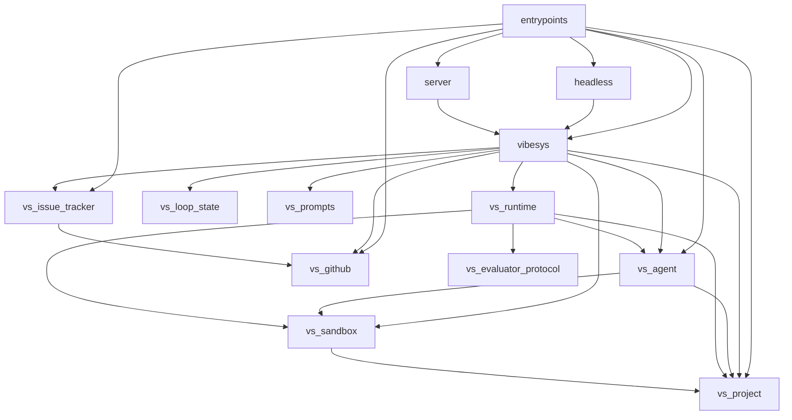

# Architecture: Python module graph

[`tach.toml`](https://github.com/uw-syfi/vibesys/blob/main/tach.toml) freezes
the Python module graph, and CI runs `uv run tach check`. An import between
modules that is not a declared `depends_on` edge fails the check. Modules cover
`src/` (`entrypoints`, `server.*`, `vibesys.*`) and every `libs/*/src`.

The graphs below are generated from `tach.toml` by `tach show --mermaid`. CI
fails when they are stale. To refresh after editing `tach.toml`:

```bash
uv run python scripts/check_tach_graph.py --write
```

Views: a package-level overview, the `vibesys` core modules, and the full
module graph. The graph is acyclic and `tach.toml` forbids cycles.

`vibesys.orchestration` owns built-in orchestration policy and the thin
product-side composition needed to run and project plugins. Explicit plugins,
including the issue queue, live under the singular
`vibesys.orchestration.<plugin>` namespace; `vibesys.plugin_catalog` registers
them. Agent roles, plan and reply schemas, prompts, state transitions, and
resume policy live with their owning orchestration. For example, the
hypothesis planner's skill-selection and title rules are public through
`vibesys.orchestration.hypothesis`, not a top-level schema catch-all. Generic
session, workspace, persistence, and sandbox mechanisms live in the runtime
libraries. Tach records each dependency. `vs_project` owns generic project
layout and persistence operations.
The v5 manifest separates policy-specific descriptor options from the generic
`execution` record. The latter is derived from `RunRequest` and resolved host
settings, including the concrete profiler. Resume checks it before setup.
Trusted evaluator execution and package mechanics live in the runtime and
sandbox libraries. Orchestration owns gate cadence and result interpretation.

The internal custom-policy execution contract and example are in
[orchestration-runtime.md](orchestration-runtime.md).

[//]: # (tach-graph:start)
## Architecture overview

Submodules such as `vibesys.agents` and `server.api` are collapsed into their top-level package.


```mermaid
graph TD
    entrypoints --> headless
    entrypoints --> server
    entrypoints --> vibesys
    entrypoints --> vs_agent
    entrypoints --> vs_github
    entrypoints --> vs_issue_tracker
    entrypoints --> vs_project
    headless --> vibesys
    server --> vibesys
    vibesys --> vs_agent
    vibesys --> vs_github
    vibesys --> vs_issue_tracker
    vibesys --> vs_loop_state
    vibesys --> vs_project
    vibesys --> vs_prompts
    vibesys --> vs_runtime
    vibesys --> vs_sandbox
    vs_agent --> vs_project
    vs_agent --> vs_sandbox
    vs_issue_tracker --> vs_github
    vs_runtime --> vs_agent
    vs_runtime --> vs_evaluator_protocol
    vs_runtime --> vs_project
    vs_runtime --> vs_sandbox
    vs_sandbox --> vs_project
```

## Core layers

Edges among the `vibesys` core modules. The graph is acyclic; `tach.toml` forbids cycles.


```mermaid
graph TD
    vibesys.api --> vibesys
    vibesys.api --> vibesys.api.agent
    vibesys.api --> vibesys.api.contracts
    vibesys.api --> vibesys.inputs
    vibesys.api --> vibesys.orchestration.agent_options
    vibesys.api --> vibesys.orchestration.evolve
    vibesys.api --> vibesys.orchestration.profilers
    vibesys.api --> vibesys.plugin_catalog
    vibesys.api --> vibesys.run
    vibesys.api --> vibesys.run.contracts
    vibesys.api --> vibesys.run.environment
    vibesys.api --> vibesys.run.host
    vibesys.api --> vibesys.run.skills
    vibesys.api.agent --> vibesys.orchestration.agent_options
    vibesys.api.agent --> vibesys.orchestration.hypothesis.readmodel
    vibesys.api.agent --> vibesys.plugin_catalog
    vibesys.api.contracts --> vibesys
    vibesys.api.contracts --> vibesys.errors
    vibesys.api.contracts --> vibesys.orchestration.metrics
    vibesys.api.contracts --> vibesys.run.contracts
    vibesys.context --> vibesys
    vibesys.context --> vibesys.errors
    vibesys.context --> vibesys.inputs
    vibesys.context --> vibesys.orchestration.profilers
    vibesys.context --> vibesys.run
    vibesys.context --> vibesys.run.contracts
    vibesys.context --> vibesys.run.environment
    vibesys.context --> vibesys.run.skills
    vibesys.inputs --> vibesys
    vibesys.orchestration.agent_options --> vibesys.inputs
    vibesys.orchestration.agent_options --> vibesys.orchestration.metrics
    vibesys.orchestration.domains --> vibesys
    vibesys.orchestration.domains --> vibesys.orchestration.prompts
    vibesys.orchestration.evolve --> vibesys
    vibesys.orchestration.evolve --> vibesys.errors
    vibesys.orchestration.evolve --> vibesys.orchestration.domains
    vibesys.orchestration.evolve --> vibesys.orchestration.evolve.population
    vibesys.orchestration.evolve --> vibesys.orchestration.metrics
    vibesys.orchestration.evolve --> vibesys.orchestration.profilers
    vibesys.orchestration.evolve --> vibesys.orchestration.prompts
    vibesys.orchestration.evolve --> vibesys.orchestration.review
    vibesys.orchestration.evolve.population --> vibesys.orchestration.metrics
    vibesys.orchestration.evolve.population --> vibesys.orchestration.profilers
    vibesys.orchestration.hypothesis --> vibesys.orchestration.metrics
    vibesys.orchestration.hypothesis --> vibesys.orchestration.profile_focus
    vibesys.orchestration.hypothesis.readmodel --> vibesys.orchestration.hypothesis
    vibesys.orchestration.hypothesis.readmodel --> vibesys.run.contracts
    vibesys.orchestration.issue_queue --> vibesys.orchestration.resume
    vibesys.orchestration.multi --> vibesys
    vibesys.orchestration.multi --> vibesys.errors
    vibesys.orchestration.multi --> vibesys.inputs
    vibesys.orchestration.multi --> vibesys.orchestration.agent_options
    vibesys.orchestration.multi --> vibesys.orchestration.domains
    vibesys.orchestration.multi --> vibesys.orchestration.hypothesis
    vibesys.orchestration.multi --> vibesys.orchestration.hypothesis.readmodel
    vibesys.orchestration.multi --> vibesys.orchestration.memory
    vibesys.orchestration.multi --> vibesys.orchestration.metrics
    vibesys.orchestration.multi --> vibesys.orchestration.profile_focus
    vibesys.orchestration.multi --> vibesys.orchestration.profilers
    vibesys.orchestration.multi --> vibesys.orchestration.prompts
    vibesys.orchestration.multi --> vibesys.orchestration.resume
    vibesys.orchestration.multi --> vibesys.orchestration.review
    vibesys.orchestration.profilers --> vibesys
    vibesys.orchestration.prompts --> vibesys
    vibesys.orchestration.resume --> vibesys.errors
    vibesys.orchestration.single --> vibesys
    vibesys.orchestration.single --> vibesys.errors
    vibesys.orchestration.single --> vibesys.inputs
    vibesys.orchestration.single --> vibesys.orchestration.agent_options
    vibesys.orchestration.single --> vibesys.orchestration.domains
    vibesys.orchestration.single --> vibesys.orchestration.hypothesis
    vibesys.orchestration.single --> vibesys.orchestration.hypothesis.readmodel
    vibesys.orchestration.single --> vibesys.orchestration.memory
    vibesys.orchestration.single --> vibesys.orchestration.metrics
    vibesys.orchestration.single --> vibesys.orchestration.profile_focus
    vibesys.orchestration.single --> vibesys.orchestration.profilers
    vibesys.orchestration.single --> vibesys.orchestration.prompts
    vibesys.orchestration.single --> vibesys.orchestration.resume
    vibesys.orchestration.single --> vibesys.orchestration.review
    vibesys.plugin_catalog --> vibesys.orchestration.evolve
    vibesys.plugin_catalog --> vibesys.orchestration.issue_queue
    vibesys.plugin_catalog --> vibesys.orchestration.multi
    vibesys.plugin_catalog --> vibesys.orchestration.single
    vibesys.plugin_catalog --> vibesys.run.contracts
    vibesys.run --> vibesys
    vibesys.run --> vibesys.inputs
    vibesys.run.contracts --> vibesys
    vibesys.run.contracts --> vibesys.inputs
    vibesys.run.contracts --> vibesys.orchestration.profilers
    vibesys.run.environment --> vibesys.orchestration.prompts
    vibesys.run.evaluation --> vibesys
    vibesys.run.evaluation --> vibesys.run.contracts
    vibesys.run.host --> vibesys
    vibesys.run.host --> vibesys.context
    vibesys.run.host --> vibesys.orchestration.steering
    vibesys.run.host --> vibesys.run
    vibesys.run.host --> vibesys.run.contracts
    vibesys.run.host --> vibesys.run.evaluation
    vibesys.run.host --> vibesys.run.skills
    vibesys.run.skills --> vibesys
```

## Full module graph


```mermaid
graph TD
    entrypoints --> headless
    entrypoints --> server.settings
    entrypoints --> vibesys.api
    entrypoints --> vibesys.api.agent
    entrypoints --> vs_agent
    entrypoints --> vs_github
    entrypoints --> vs_issue_tracker
    entrypoints --> vs_project
    headless --> vibesys.api
    server --> vibesys.api
    server.api --> server.chat
    server.api --> server.controller
    server.api --> server.diagnostics
    server.api --> server.events
    server.api --> server.execution
    server.api --> server.integration
    server.api --> server.journal
    server.api --> server.run_lifecycle
    server.api --> server.settings
    server.api --> vibesys.api
    server.chat --> server
    server.chat --> server.controller
    server.chat --> server.events
    server.chat --> server.execution
    server.chat --> server.journal
    server.chat --> server.run_lifecycle
    server.chat --> vibesys.api
    server.controller --> server.diagnostics
    server.controller --> server.events
    server.controller --> server.execution
    server.controller --> server.journal
    server.controller --> server.run_lifecycle
    server.controller --> vibesys.api
    server.events --> server.diagnostics
    server.events --> server.event_index
    server.events --> server.run_lifecycle
    server.events --> vibesys.api
    server.execution --> server.diagnostics
    server.execution --> server.events
    server.execution --> server.journal
    server.execution --> vibesys.api
    server.integration --> server
    server.integration --> server.chat
    server.integration --> server.controller
    server.integration --> server.diagnostics
    server.integration --> server.events
    server.integration --> server.execution
    server.integration --> server.journal
    server.integration --> server.read_model
    server.integration --> server.run_lifecycle
    server.integration --> vibesys.api
    server.journal --> server.diagnostics
    server.journal --> server.events
    server.read_model --> server.controller
    server.read_model --> server.events
    server.read_model --> vibesys.api
    server.runtime --> server.api
    server.runtime --> server.chat
    server.runtime --> server.controller
    server.runtime --> server.diagnostics
    server.runtime --> server.events
    server.runtime --> server.execution
    server.runtime --> server.integration
    server.runtime --> server.journal
    server.runtime --> server.read_model
    server.runtime --> server.settings
    server.runtime --> server.transport
    server.runtime --> vibesys.api
    server.settings --> vibesys.api
    server.tool_payloads --> vibesys.api
    server.transport --> server.api
    vibesys --> vs_agent
    vibesys --> vs_runtime
    vibesys --> vs_sandbox
    vibesys.api --> vibesys
    vibesys.api --> vibesys.api.agent
    vibesys.api --> vibesys.api.contracts
    vibesys.api --> vibesys.inputs
    vibesys.api --> vibesys.orchestration.agent_options
    vibesys.api --> vibesys.orchestration.evolve
    vibesys.api --> vibesys.orchestration.profilers
    vibesys.api --> vibesys.plugin_catalog
    vibesys.api --> vibesys.run
    vibesys.api --> vibesys.run.contracts
    vibesys.api --> vibesys.run.environment
    vibesys.api --> vibesys.run.host
    vibesys.api --> vibesys.run.skills
    vibesys.api --> vs_agent
    vibesys.api --> vs_project
    vibesys.api --> vs_runtime
    vibesys.api --> vs_sandbox
    vibesys.api.agent --> vibesys.orchestration.agent_options
    vibesys.api.agent --> vibesys.orchestration.hypothesis.readmodel
    vibesys.api.agent --> vibesys.plugin_catalog
    vibesys.api.agent --> vs_loop_state
    vibesys.api.agent --> vs_project
    vibesys.api.contracts --> vibesys
    vibesys.api.contracts --> vibesys.errors
    vibesys.api.contracts --> vibesys.orchestration.metrics
    vibesys.api.contracts --> vibesys.run.contracts
    vibesys.api.contracts --> vs_agent
    vibesys.api.contracts --> vs_loop_state
    vibesys.api.contracts --> vs_project
    vibesys.context --> vibesys
    vibesys.context --> vibesys.errors
    vibesys.context --> vibesys.inputs
    vibesys.context --> vibesys.orchestration.profilers
    vibesys.context --> vibesys.run
    vibesys.context --> vibesys.run.contracts
    vibesys.context --> vibesys.run.environment
    vibesys.context --> vibesys.run.skills
    vibesys.context --> vs_agent
    vibesys.context --> vs_project
    vibesys.context --> vs_runtime
    vibesys.context --> vs_sandbox
    vibesys.inputs --> vibesys
    vibesys.inputs --> vs_project
    vibesys.inputs --> vs_runtime
    vibesys.orchestration.agent_options --> vibesys.inputs
    vibesys.orchestration.agent_options --> vibesys.orchestration.metrics
    vibesys.orchestration.domains --> vibesys
    vibesys.orchestration.domains --> vibesys.orchestration.prompts
    vibesys.orchestration.evolve --> vibesys
    vibesys.orchestration.evolve --> vibesys.errors
    vibesys.orchestration.evolve --> vibesys.orchestration.domains
    vibesys.orchestration.evolve --> vibesys.orchestration.evolve.population
    vibesys.orchestration.evolve --> vibesys.orchestration.metrics
    vibesys.orchestration.evolve --> vibesys.orchestration.profilers
    vibesys.orchestration.evolve --> vibesys.orchestration.prompts
    vibesys.orchestration.evolve --> vibesys.orchestration.review
    vibesys.orchestration.evolve --> vs_prompts
    vibesys.orchestration.evolve --> vs_runtime
    vibesys.orchestration.evolve.population --> vibesys.orchestration.metrics
    vibesys.orchestration.evolve.population --> vibesys.orchestration.profilers
    vibesys.orchestration.hypothesis --> vibesys.orchestration.metrics
    vibesys.orchestration.hypothesis --> vibesys.orchestration.profile_focus
    vibesys.orchestration.hypothesis --> vs_loop_state
    vibesys.orchestration.hypothesis.readmodel --> vibesys.orchestration.hypothesis
    vibesys.orchestration.hypothesis.readmodel --> vibesys.run.contracts
    vibesys.orchestration.hypothesis.readmodel --> vs_loop_state
    vibesys.orchestration.hypothesis.readmodel --> vs_runtime
    vibesys.orchestration.issue_queue --> vibesys.orchestration.resume
    vibesys.orchestration.issue_queue --> vs_issue_tracker
    vibesys.orchestration.issue_queue --> vs_runtime
    vibesys.orchestration.metrics --> vs_loop_state
    vibesys.orchestration.multi --> vibesys
    vibesys.orchestration.multi --> vibesys.errors
    vibesys.orchestration.multi --> vibesys.inputs
    vibesys.orchestration.multi --> vibesys.orchestration.agent_options
    vibesys.orchestration.multi --> vibesys.orchestration.domains
    vibesys.orchestration.multi --> vibesys.orchestration.hypothesis
    vibesys.orchestration.multi --> vibesys.orchestration.hypothesis.readmodel
    vibesys.orchestration.multi --> vibesys.orchestration.memory
    vibesys.orchestration.multi --> vibesys.orchestration.metrics
    vibesys.orchestration.multi --> vibesys.orchestration.profile_focus
    vibesys.orchestration.multi --> vibesys.orchestration.profilers
    vibesys.orchestration.multi --> vibesys.orchestration.prompts
    vibesys.orchestration.multi --> vibesys.orchestration.resume
    vibesys.orchestration.multi --> vibesys.orchestration.review
    vibesys.orchestration.multi --> vs_loop_state
    vibesys.orchestration.multi --> vs_prompts
    vibesys.orchestration.multi --> vs_runtime
    vibesys.orchestration.profilers --> vibesys
    vibesys.orchestration.prompts --> vibesys
    vibesys.orchestration.prompts --> vs_prompts
    vibesys.orchestration.resume --> vibesys.errors
    vibesys.orchestration.resume --> vs_project
    vibesys.orchestration.resume --> vs_runtime
    vibesys.orchestration.single --> vibesys
    vibesys.orchestration.single --> vibesys.errors
    vibesys.orchestration.single --> vibesys.inputs
    vibesys.orchestration.single --> vibesys.orchestration.agent_options
    vibesys.orchestration.single --> vibesys.orchestration.domains
    vibesys.orchestration.single --> vibesys.orchestration.hypothesis
    vibesys.orchestration.single --> vibesys.orchestration.hypothesis.readmodel
    vibesys.orchestration.single --> vibesys.orchestration.memory
    vibesys.orchestration.single --> vibesys.orchestration.metrics
    vibesys.orchestration.single --> vibesys.orchestration.profile_focus
    vibesys.orchestration.single --> vibesys.orchestration.profilers
    vibesys.orchestration.single --> vibesys.orchestration.prompts
    vibesys.orchestration.single --> vibesys.orchestration.resume
    vibesys.orchestration.single --> vibesys.orchestration.review
    vibesys.orchestration.single --> vs_loop_state
    vibesys.orchestration.single --> vs_prompts
    vibesys.orchestration.single --> vs_runtime
    vibesys.plugin_catalog --> vibesys.orchestration.evolve
    vibesys.plugin_catalog --> vibesys.orchestration.issue_queue
    vibesys.plugin_catalog --> vibesys.orchestration.multi
    vibesys.plugin_catalog --> vibesys.orchestration.single
    vibesys.plugin_catalog --> vibesys.run.contracts
    vibesys.plugin_catalog --> vs_project
    vibesys.plugin_catalog --> vs_runtime
    vibesys.run --> vibesys
    vibesys.run --> vibesys.inputs
    vibesys.run --> vs_agent
    vibesys.run --> vs_github
    vibesys.run --> vs_project
    vibesys.run --> vs_runtime
    vibesys.run --> vs_sandbox
    vibesys.run.contracts --> vibesys
    vibesys.run.contracts --> vibesys.inputs
    vibesys.run.contracts --> vibesys.orchestration.profilers
    vibesys.run.contracts --> vs_project
    vibesys.run.contracts --> vs_runtime
    vibesys.run.environment --> vibesys.orchestration.prompts
    vibesys.run.environment --> vs_runtime
    vibesys.run.evaluation --> vibesys
    vibesys.run.evaluation --> vibesys.run.contracts
    vibesys.run.evaluation --> vs_runtime
    vibesys.run.host --> vibesys
    vibesys.run.host --> vibesys.context
    vibesys.run.host --> vibesys.orchestration.steering
    vibesys.run.host --> vibesys.run
    vibesys.run.host --> vibesys.run.contracts
    vibesys.run.host --> vibesys.run.evaluation
    vibesys.run.host --> vibesys.run.skills
    vibesys.run.host --> vs_agent
    vibesys.run.host --> vs_runtime
    vibesys.run.host --> vs_sandbox
    vibesys.run.skills --> vibesys
    vibesys.run.skills --> vs_agent
    vibesys.run.skills --> vs_runtime
    vs_agent --> vs_project
    vs_agent --> vs_sandbox
    vs_issue_tracker --> vs_github
    vs_runtime --> vs_agent
    vs_runtime --> vs_evaluator_protocol
    vs_runtime --> vs_project
    vs_runtime --> vs_sandbox
    vs_sandbox --> vs_project
```
[//]: # (tach-graph:end)
