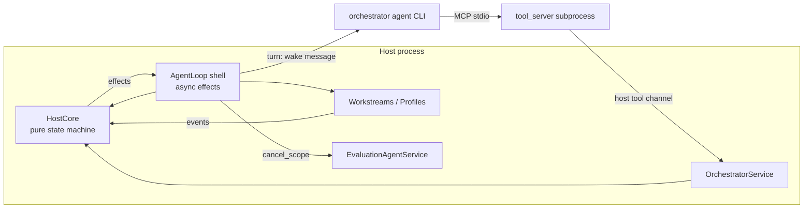

# Dynamic orchestrator as a long-lived agent (design)

Status: design for review. No code in `src/` or `libs/` implements it yet.

The dynamic orchestration (`src/vibesys/orchestration/dynamic/`) runs up to
`max_in_flight` workstreams in parallel. A workstream is one slot's unit of
work: an implement workstream (implementer turns, then judge and trusted
evaluation) or a profile workstream. Today the planner role
`dynamic-orchestrator` is a one-shot structured-output call made only when a
slot frees (`_fill_slots` waits on `asyncio.wait(FIRST_COMPLETED)`). Nothing
inspects or redirects in-flight work, and the budget counts dispatches.

This document turns that role into one long-lived agent that plans, monitors,
steers and re-plans through tools, while the host enforces hard limits.

## Decision

1. **One agent, one session line.** The `dynamic-orchestrator` role becomes a
   resumable session (`member_id` set, so the provider conversation survives a
   restart). Each wake-up is one turn. Implementer, judge and profiler stay
   workers. Bounded analysis goes to a host-run subagent that returns a summary.
2. **Tools, not a reply schema, carry decisions.** The orchestrator acts
   through an MCP tool server: read-only inspection tools plus action tools.
   Every action is validated by a host service that returns a typed result or
   a typed refusal. A turn ends with a short structured `TurnReport`.
3. **The host keeps authority.** Workers, acceptance (judge and trusted
   evaluation), hard limits, adoption, stop and resume stay in the host. The
   orchestrator cannot declare a candidate good, exceed a limit, name an
   unknown id, or submit after a stop.
4. **Event-driven deterministic core.** `_fill_slots` is replaced by a
   synchronous `HostCore` state machine (events and actions in, effects out)
   and a thin async shell that executes effects. The current one-shot planner
   is re-expressed as a second driver over the same core, so both modes share
   one loop and one test harness.
5. **Budget is slot-time.** The run is bounded by slot-minutes of worker
   occupancy, metered per workstream. Cancel and park stop the meter; a start
   reserves its expected duration, and settle releases the unused reservation.
   Each start charges at least 2 slot-minutes, which bounds the number of
   workstreams without a dispatch count.
6. **A ready queue removes refill latency.** `start_workstream` with no free
   slot queues the plan. When a slot frees, the host starts the queue head at
   once (revalidating it) and wakes the orchestrator to inform it, so a slot
   no longer idles about 50 s per planner call.
7. **Steers are delivered between worker turns.** A steer is a durable note
   rendered into the worker's next turn. `interrupt=true` asks the host to end
   the current implementer turn at once, keep its worktree, and start the next
   turn in the same provider session with the note.
8. **Large results move by file.** A tool result is capped at 4 KiB. Detail
   goes to an immutable, content-addressed host file, and the agent gets a
   summary plus path, size and SHA-256. Wake messages point at files only
   through a proof-of-write receipt (the `ProgressEntry` pattern).
9. **Behind an option.** `DynamicOptions.orchestrator.mode` is `"planner"`
   (today, the default) or `"agent"`. State moves to schema version 7 with an
   optional `agent` sub-state, so every version-6 run resumes unchanged.

## Components and placement

| Component | Owns | Package |
|---|---|---|
| Role, prompts, `TurnReport`, tool semantics, `OrchestratorService` (typed, rechecks every call), `HostCore` | Orchestration policy | `vibesys.orchestration.dynamic` (new modules `control/`, `agent_loop.py`) |
| Tool server: `ToolSpec`s and argument models, a thin adapter over the service client | Agent-facing contract | `vibesys.orchestration.dynamic.tool_server` (own module, imports only its models and `vs_agent.api`) |
| Host tool channel: token-authenticated Unix socket, `ok`/`error` envelope, 1 MiB frame, per-call deadline | Transport mechanism shared with the evaluation service | `vs_agent` (extracted from `vs_evaluation.agent_service`) |
| Wake scheduler with an injected clock; session rotation with a briefing; per-session activity digest | Generic agent-session mechanics | `vs_runtime` |
| Slot meter: leases with heartbeats in an append-only ledger | Generic metering | `vs_runtime` |
| Immutable artifact store with write receipts | Generic file mechanism | `vs_runtime`, laid out through `vs_project.Project` |
| Per-scope job release (`cancel_scope(scope_id)`) | The single resource owner for cluster jobs | `vs_evaluation` `EvaluationAgentService` |
| Role-to-tool grants | One policy table (TOOLGRANT) combined with executor capability | Composition (`src/vibesys/composition.py` today) |

Dependencies point one way: entrypoints → `vibesys.api*` →
`vibesys.orchestration.dynamic` → `vs_runtime.api`, `vs_agent.api`,
`vs_prompts`. The dynamic package needs one new `tach.toml` edge to `vs_agent`
for `ToolSpec`. The `vibesys.api*` surface does not change: the new options are
fields of the existing plugin options model, which entrypoints pass through
as data.



## Tool surface

All tools return the envelope `ToolReply = Ok[T] | Refused`. Read tools are
compact by default; `detail=true` writes the full view to an artifact file and
returns its `ArtifactRef`. No result exceeds 4 KiB of text.

| Tool | Read-only | Input | Ok result | Refusals | Source state |
|---|---|---|---|---|---|
| `run_overview` | yes | `{}` | `Overview`: clock, budget, slots, ready queue, capabilities, stop state, unread events | none | `DynamicState`, slot meter, capability set |
| `workstream_status` | yes | `{ids?: [AgentId], detail?: bool}` | `[WorkstreamView]`: phase, elapsed vs expected minutes, expected milestone vs latest observed stage and metric, pending steers | `unknown_id` | `DynamicWorkstream`, `DynamicProfile`, `Workstreams.live_evaluations`, `agent.expectations` |
| `workstream_history` | yes | `{id, detail?}` | timeline: phases, evaluations, steers, interrupts | `unknown_id` | state plus core event log |
| `evaluations` | yes | `{workstream_id?, since_seq?, detail?}` | per-evaluation stage outcomes, metric vs target, `partial_measurement`, accepted evidence ids | `unknown_id` | `EvaluationResult`, `VerifiedCandidate`, `agent_evaluations`, `trusted_operations` records |
| `cluster_state` | yes | `{detail?}` | queue estimate, this run's jobs by state and workstream | `unavailable` (executor has no queue view) | `evaluation_availability` snapshot, `scope_handles` |
| `agent_activity` | yes | `{workstream_id, limit?: 1..50}` | last N tool calls (name, 120-char argument digest, outcome, time) and progress notes | `unknown_id`, `no_live_turn` | `vs_runtime` activity digest fed by `AgentEventSink` |
| `start_workstream` | no | `StartRequest` | `Started{id, slot}` or `Queued{id, position}` | `id_reused`, `invalid_parent`, `capability_unavailable`, `budget_exhausted`, `duplicate`, `stopped`, `search_finished` | `DynamicState.workstreams/profiles`, `_ParentOptions` |
| `steer` | no | `{id, note, interrupt?: bool}` | `SteerQueued{delivery}` | `unknown_id`, `invalid_state`, `rate_limited`, `stopped` | `agent.steers` |
| `park` | no | `{id, reason}` | `Parked{slot_freed, minutes_charged}` | `unknown_id`, `invalid_state`, `stopped` | phase `PARKED` |
| `unpark` | no | `{id, priority?}` | `Queued{position}` | `unknown_id`, `invalid_state`, `budget_exhausted`, `stopped` | ready queue |
| `cancel` | no | `{id, reason}` | `Cancelled{slot_freed, jobs_released, minutes_charged}` | `unknown_id`, `invalid_state`, `stopped` | phase `CANCELLED`, `cancel_scope` |
| `reprioritize` | no | `{order: [AgentId]}` | `Queue{order}` | `unknown_id`, `invalid_state` (not queued) | ready queue |
| `schedule_check_in` | no | `{after_minutes: 2..30, reason}` | `CheckIn{at}` | `out_of_bounds`, `stopped` | `agent.next_check_in` |
| `reflect` | no | `{note, hypothesis_updates?}` | `Recorded{entry}` | `invalid_update`, `in_flight_update` | `agent.journal`, `HypothesisSearch` |
| `delegate_analysis` | no | `{question, artifacts: [sha256]}` | `AnalysisStarted{handle}`; result arrives as an event | `unknown_artifact`, `rate_limited`, `stopped` | analysis registry |
| `finish_search` | no | `{reason}` | `Finishing{in_flight}` | `stopped` | `agent.finished` |

Two rules from [boundaries](../../.agents/skills/software-design/references/boundaries.md)
shape the list:

- A kind the run cannot run is absent from the schema. `StartRequest` offers
  `kind: "profile"` only when the run can profile at session creation. A
  capability withdrawn mid-session is refused with `capability_unavailable`
  and rotates the session at the next wake, so the next schema omits it.
- Evaluation tools stay in the evaluation server. The orchestrator gets the
  read-only ones (`trusted_operations`, `evaluation_availability`,
  `accepted_evidence`) through the TOOLGRANT table. The `evaluations` tool
  above only joins those records to workstreams, which is dynamic-policy
  knowledge.

### Core types

```python
class Refusal(StrEnum):
    UNKNOWN_ID = "unknown_id"
    ID_REUSED = "id_reused"
    INVALID_PARENT = "invalid_parent"
    INVALID_STATE = "invalid_state"
    CAPABILITY_UNAVAILABLE = "capability_unavailable"
    BUDGET_EXHAUSTED = "budget_exhausted"
    DUPLICATE = "duplicate"
    RATE_LIMITED = "rate_limited"
    OUT_OF_BOUNDS = "out_of_bounds"
    INVALID_UPDATE = "invalid_update"
    IN_FLIGHT_UPDATE = "in_flight_update"
    UNKNOWN_ARTIFACT = "unknown_artifact"
    NO_LIVE_TURN = "no_live_turn"
    UNAVAILABLE = "unavailable"
    SEARCH_FINISHED = "search_finished"
    STOPPED = "stopped"


class Refused(BaseModel):
    model_config = ConfigDict(extra="forbid", frozen=True)
    ok: Literal[False] = False
    code: Refusal
    field: str | None  # e.g. "spec.parent_hypothesis_id"
    message: str  # rendered from a template; says what to do instead
    retryable: bool  # true only for rate_limited and budget waits


class Ok[T: BaseModel](BaseModel):
    model_config = ConfigDict(extra="forbid", frozen=True)
    ok: Literal[True] = True
    result: T


class Expectation(BaseModel):
    """What the orchestrator expects of a workstream; shown back against observations."""

    model_config = ConfigDict(extra="forbid", frozen=True)
    milestone: str  # e.g. "accuracy passes and benchmark >= 60 tok/s"
    expected_minutes: Annotated[float, Field(ge=2, le=240)]
    reason: str


class StartRequest(BaseModel):
    model_config = ConfigDict(extra="forbid")
    spec: PlannedWorkstream  # today's WorkstreamPlan | ProfilePlan union
    expectation: Expectation
    priority: Literal["now", "next", "later"] = "now"


class ArtifactRef(BaseModel):
    """Pointer to an immutable host-written file; minted only by the store."""

    model_config = ConfigDict(extra="forbid", frozen=True)
    path: str  # inside a root the orchestrator session can read
    bytes: int
    sha256: str
    summary: str


class TurnReport(BaseModel):
    """The structured reply that ends every orchestrator turn."""

    model_config = ConfigDict(extra="forbid")
    summary: str  # what it decided this turn and why
```

### Service and core

```python
class OrchestratorService:
    """Typed API behind the tool server. Rechecks every call against host state."""

    async def overview(self, grant: Grant) -> Ok[Overview] | Refused: ...
    async def workstream_status(self, grant: Grant, call: StatusCall) -> Ok[StatusView] | Refused: ...
    async def start(self, grant: Grant, call: StartRequest) -> Ok[Started | Queued] | Refused: ...
    async def steer(self, grant: Grant, call: SteerCall) -> Ok[SteerQueued] | Refused: ...
    async def park(self, grant: Grant, call: ParkCall) -> Ok[Parked] | Refused: ...
    async def cancel(self, grant: Grant, call: CancelCall) -> Ok[Cancelled] | Refused: ...
    # ... one method per tool; each takes the lock, calls HostCore, runs its effects,
    # commits, then replies. A refusal leaves state byte-identical.


class HostCore:
    """Deterministic loop core: no awaits, no I/O, injected time."""

    def __init__(self, limits: HostLimits, state: AgentLoopState) -> None: ...
    def on_event(self, event: HostEvent, now: Instant) -> tuple[Effect, ...]: ...
    def on_action(
        self, action: OrchestratorAction, now: Instant
    ) -> tuple[Ok[BaseModel] | Refused, tuple[Effect, ...]]: ...
    def next_deadline(self) -> Instant | None: ...  # check-in, fallback, or budget tick
    @property
    def state(self) -> AgentLoopState: ...


type HostEvent = (
    SlotFreed | WorkstreamSettled | EvaluationFinished | PartialMeasurement
    | CapabilityWithdrawn | AnalysisFinished | TurnEnded | StopRequested | Resumed | Tick
)
type Effect = (
    StartWorker | InterruptTurn | CancelWorker | ParkWorker | DeliverSteer
    | WakeOrchestrator | RotateSession | Commit | EndSearch
)
```

## Answers

### 1. Session lifecycle

- **Session.** The role gets `required_capabilities` `MCP_SERVERS` and
  `PROVIDER_SESSION_RESUME`, and is opened with
  `member_id=f"orchestrator-g{generation}"`. Each wake-up is one `turn` whose
  message is the rendered wake digest. The turn has a 5-minute deadline
  (`cli_timeout` for this role).
- **Bounded context.** Three mechanisms:
  - tool results are capped at 4 KiB, with detail in artifact files;
  - the wake digest lists only events since the last turn plus one status
    table, about 1.5k tokens;
  - the host rotates the session when the last turn's input exceeds 80k
    tokens, after a capability change, or when provider resume returns
    `False`. Rotation increments `generation` and opens a fresh session whose
    first message is a briefing: run overview, open expectations, and the
    last 20 journal entries, with the full journal as an artifact.
- **Memory is the journal, not the transcript.** Everything the orchestrator
  decides is persisted from its tool calls: expectations, steers, parks,
  cancels, reflections and `TurnReport.summary`. A rotated or resumed session
  rebuilds its view from that record, so losing the provider transcript costs
  one briefing turn (about 20k input tokens), not decisions.
- **Persisted** (`DynamicState.agent`, version 7): generation, turn count,
  journal, expectations per workstream, ready queue, pending and delivered
  steers, parked set, next check-in as run-elapsed seconds, token spend,
  `finished`. The slot meter's ledger is a separate append-only file.
- **Stop.** The host cancels a running orchestrator turn and starts no new
  one. Every mutating tool refuses with `stopped`. Workers stop by the
  existing stop semantics; cluster jobs are released through the evaluation
  service. The stop is recorded as an event, so the first wake after resume
  reports it.
- **Crash and resume.** Each mutating call commits before it replies, so an
  action is either durable or never acknowledged. On resume the host reopens
  the current generation (falling back to rotation), restarts recoverable
  workstreams as today, keeps parked ones parked, revalidates the queue, and
  wakes the orchestrator with a `Resumed` event listing what changed. Actions
  are idempotent by key (workstream id for start, `(id, sha256(note))` for
  steer), so an MCP retry after a lost reply returns the original result.

### 2. Tool surface

See [Tool surface](#tool-surface). Read-only: `run_overview`,
`workstream_status`, `workstream_history`, `evaluations`, `cluster_state`,
`agent_activity`. Everything else mutates and is refused after a stop. The
existing plan validation (`DynamicPlanError` and `_ParentOptions`) becomes the
validation behind `start_workstream`: each error class maps to one `Refusal`
code with the same field path.

### 3. Steer delivery

- A steer is appended to `agent.steers[id]` (at most 3 pending per
  workstream, 2,000 characters each; further steers are `rate_limited`).
- **Default delivery** is at the worker's next turn. When the host renders
  that turn (an implementer retry or continuation, or the judge's review),
  `implement.j2` and `review.j2` render a guarded "Notes from the
  orchestrator" section from the pending steers. The host marks them
  delivered with the turn's invocation id in the same commit that records the
  turn start.
- **Interrupt** (`interrupt=true`, implement workstreams only). An implementer
  turn can last 48 minutes, so the next turn may come too late. The host
  cancels the active provider turn through the runtime's session cancel, then
  snapshots and retains the worktree as a work-in-progress revision. It
  refunds the attempt through the existing `refund_interrupted` budget path
  (at most `max_retries_per_round` times) and starts the next turn in the same
  provider session. Evaluations the turn submitted keep running, and their
  results stay visible through `agent_evaluations`.
- **What the worker sees:**

  ```text
  Notes from the orchestrator (it watches all workstreams; these are guidance,
  your task and pass criteria are unchanged):
  - 15:58, after your benchmark read 41.0 tok/s of 79.7 required: <note>
  [Your previous turn was ended early to deliver this note. Your edits are kept
  at revision <rev>.]
  ```

- A steer never changes the task, pass criteria or acceptance. To change the
  task, the orchestrator cancels and starts a new workstream. A steer to a
  workstream that settles before delivery is dropped, and the drop is
  recorded as an event.

### 4. Budget unit

- **Unit: slot-minutes of worker occupancy** (`budget.slot_minutes`, required
  in agent mode). A slot is charged from `StartWorker` until it settles, is
  parked, or is cancelled. Idle slots are not charged.
- **Reservation.** A start reserves `min(expectation.expected_minutes,
  remaining)` and is refused with `budget_exhausted` when the remaining
  unreserved budget is under the 2-minute minimum charge. Settle replaces the
  reservation with the actual charge.
- **Refunds.** Cancel and park charge elapsed time only and release the rest
  of the reservation. A profile that ends `unsupported` is charged nothing
  (today's rule, kept). An interrupted turn is charged; its attempt count is
  refunded as today.
- **Cost bound.** Worker tokens scale with turn length (r13: about 241k input
  tokens per implementer-minute, 96% cache reads), so slot-minutes bound
  worker spend. The ceiling is `slot_minutes` × 241k input tokens, plus at
  most one minimum charge per in-flight slot of overrun at the last start. The
  orchestrator's own tokens have a separate cap (question 7). An optional
  `wall_minutes` bounds elapsed time.
- **Workstream count.** The minimum charge bounds the number of starts at
  `slot_minutes / 2`. That value replaces `max_rounds * max_in_flight` as the
  hypothesis search's round limit and the projected maximum round count in
  agent mode.
- **r15 under this rule.** The 7 no-edit dispatches cost only their real
  minutes, so budget remains and the second slot does not idle for 44.4
  slot-minutes. Cancelling `mi210_continuous_batching` after the second
  reading at 41.0 tok/s saves 13.8 slot-minutes.

### 5. Host loop

- `HostCore` replaces `_fill_slots`. Inputs:
  - `on_event`, from worker task completion, evaluation and partial
    measurement notifications, capability withdrawal, stop, and the timer;
  - `on_action`, from the service.
- `HostCore` returns effects. The async shell (`AgentLoop`) is the only code
  that awaits:
  - it starts worker tasks;
  - it cancels or interrupts them;
  - it runs orchestrator turns;
  - it commits state;
  - it sleeps until `next_deadline()` or the next event, on an injected
    `Clock`.
- **Wake rules** (host, fixed). The orchestrator is woken:
  - after events that arrived while no turn was running, coalesced, and at
    least 30 s after the previous turn ended;
  - at its scheduled check-in;
  - by the fallback, the one fixed rule: if work is in flight and a turn ends
    without scheduling a check-in, the host schedules one at 10 minutes.
- **End of search.** The search ends when one of these holds; the terminal
  status is then derived from the work done:
  - the slot budget is spent and nothing is in flight;
  - after `finish_search` drains in-flight work;
  - two consecutive wakes with nothing in flight or queued take no action
    (typed end reason `orchestrator_idle`).
- **Planner mode** is a driver over the same core. On a `SlotFreed` event
  with an empty queue, it runs today's `_plan` turn and issues `start`
  actions. The dispatch-count budget is kept for planner mode only. Both modes
  share event handling, recovery and the chaos harness.

### 6. Migration

- `DynamicOptions.orchestrator: OrchestratorOptions` with
  `mode: Literal["planner", "agent"] = "planner"`, plus the agent-mode limits
  (`slot_minutes`, `wall_minutes`, `token_budget`, check-in bounds). Agent mode
  without `slot_minutes` fails validation and names the key.
- `DynamicState` moves to `schema_version: 7`. It adds
  `agent: AgentLoopState | None = None` and the phases `PARKED` and
  `CANCELLED`. `_migrate_state` upgrades versions 1 to 6 with no data change
  (the field defaults to `None`), so every existing run resumes in planner
  mode. Golden fixtures of version-6 states land before the version bump.
- The mode is fixed per run. The resume policy refuses to switch mode with a
  typed error that names `orchestrator.mode`.
- The default flips to `"agent"` after live runs show parity. Planner mode is
  removed one release later (expand, migrate, contract); its states still
  load.

### 7. Token and latency cost

Estimates, to validate in step 5 (arithmetic in [Appendix C](#appendix-c-cost-arithmetic)):

| Quantity | Today's planner (r13) | Agent mode, typical |
|---|---|---|
| Per call or check-in | 145k input, 1.4k output, 47 s | 180k input (over 90% cache reads), 1 to 2k output, 25 to 50 s |
| Calls per 86-minute run | 11 | 25 to 35 |
| Per run | 1.6M input, 16k output | 4.5M to 6.3M input, 25k to 70k output |
| Relative to implementer input (28.2M in r13) | 6% | 16% to 22% |
| Slot idle per refill | about 50 s | under 1 s from the ready queue; a turn runs alongside workers |

Hard caps:

- tool results capped at 4 KiB;
- at most 12 tool calls per turn (further calls are refused with
  `rate_limited` and must end the turn);
- a 5-minute turn deadline;
- session rotation at 80k context tokens;
- a 30-second minimum gap between turns;
- the check-in bounds of 2 to 30 minutes;
- `token_budget` on orchestrator input tokens, default 12M per run. At 80%,
  the check-in floor rises to 15 minutes. At 100%, no further turns run, the
  queue drains, and the search ends with reason
  `orchestrator_budget_exhausted`.

### 8. Testing

- **Core properties.** A Hypothesis `RuleBasedStateMachine` drives `HostCore`
  with arbitrary interleavings of events and actions on a fake clock.
  Invariants after every step:
  - in-flight count ≤ `max_in_flight`;
  - charged plus reserved ≤ `slot_minutes`, plus one minimum charge per slot;
  - no `StartWorker` after `StopRequested` or `finish_search`;
  - a refusal returns no effects and leaves state unchanged;
  - every steer is delivered at most once, or dropped with a recorded reason;
  - every `CancelWorker` carries `release_jobs`;
  - the state round-trips through strict JSON (`DynamicState`, `strict=True`);
  - a core rebuilt from persisted state yields the same `next_deadline` and
    the same queue.
- **Tool server without agents**
  ([fault-injection](../../.agents/skills/testing/references/fault-injection.md#tool-servers-without-agents)).
  The `ToolSpec` handlers run against the real `OrchestratorService` over a
  `FakeRun`. Arguments are generated from each input schema, including:
  - unknown, reused and other-run ids;
  - 1 MiB notes;
  - check-ins outside 2 to 30 minutes;
  - profile starts after withdrawal;
  - duplicate calls (the `vs-faults` `duplicate` tool fault);
  - calls after stop.

  Properties: every reply parses as `ToolReply`, is at most 4 KiB, and is
  decided within the deadline on the injected clock; refused calls leave the
  state digest unchanged.
- **Chaos harness** (`vs-faults`, `tests/support/loop_invariants.py`).
  - A `GenerativeOrchestrator` responder answers each orchestrator wake by
    issuing a seeded random sequence of inspect and action calls through the
    service client, then a `TurnReport`.
  - It combines with `FaultPlan` agent, tool and cluster faults and SIGINT at
    any point.
  - The existing invariants must hold for every seed: `EVALUATION_AFTER_STOP`,
    `CLUSTER_JOB_LEFT`, `MISSING_PROMPT_PATH`, `EMPTY_COMPLETION`,
    `CAPABILITY_UNSERVED`, `STOP_OVERRAN` and `USAGE_UNRECORDED`.
  - New invariants: `SLOT_METER` (the ledger equals the sum of worker
    occupancy intervals), `QUEUE_IDLE` (no slot is free while the queue holds
    a valid plan) and `ARTIFACT_POINTER` (every artifact path in a wake message
    has a receipt and exists).
  - The harness branch `test/dynamic-loop-chaos` must land first. This design
    only adds a responder and invariants to it.
- **Regression tests for the evidence.** The r15 and r16 episodes become
  scripted scenarios (`ScriptedAgents`): a repeated 41 tok/s reading triggers
  a cancel that frees the slot; an `unsupported` profile refuses further
  profile starts at no budget cost.

### 9. Implementation steps

Each step merges independently and leaves planner mode the default.

| Step | Content | Test | Estimate |
|---|---|---|---|
| 1. State and meter | `DynamicState` v7 (`agent`, `PARKED`, `CANCELLED`), golden v6 fixtures, migration; `vs_runtime` slot meter and artifact store with receipts | Migration golden round-trip; meter property tests (crash between heartbeats charges up to the last heartbeat) | 1 day |
| 2. Deterministic core | `HostCore`, `AgentLoop` shell, planner mode re-expressed as a driver; `_fill_slots` removed | Stateful core properties; existing dynamic loop and golden tests pass unchanged | 2 days |
| 3. Worker control | Per-scope job release in `EvaluationAgentService`, park and cancel, the steer outbox and template sections, turn interrupt | Exit-at-any-point property: cancel or interrupt at each step releases jobs and keeps the worktree; prompt snapshots | 1.5 days |
| 4. Service and tool server | `OrchestratorService`, the `tool_server` module on `ToolSpec`, the host tool channel extracted into `vs_agent`, grants from the TOOLGRANT table | Agent-free generated calls and call sequences | 1.5 days (after TOOLGRANT) |
| 5. Agent mode | Long-lived session, wake digest and briefing templates, rotation, `delegate_analysis`, `orchestrator.mode="agent"` | `GenerativeOrchestrator` chaos seeds; r15 and r16 scenarios; Fake Slurm e2e smoke; one live run measuring section 7 | 2 days plus a live run |

Steps 3 and 4 can run in parallel after step 2.

## How the design addresses r14 to r18

| Evidence (stalls report and FINDINGS, runs r14 to r18) | Mechanism here |
|---|---|
| r15 lost 38% of slot time: 21.8 slot-min predictable waste, 44.4 slot-min idle after the dispatch budget | Slot-time budget; inspection plus cancel or steer |
| 0 of 38 in-flight workstreams saw a sibling's result | `EvaluationFinished` wakes the orchestrator; `steer` carries the result to siblings |
| 42.2, 41.0, 41.0 tok/s against 79.7 not stopped | The expectation's milestone is shown against observed readings; a cancel after the second reading saves 13.8 slot-min |
| 11 profile workstreams after the first `unsupported` | Host withdraws the capability (`capability_unavailable`, no charge); the next session's schema omits profiles |
| Planner refill about 50 s per call | The ready queue starts the next plan in under 1 s |
| r18 duplicate profile workstreams | `duplicate` refusal on the same target and question in flight or queued |
| Submissions after stop | Every mutating tool refuses after stop; the run is checked by `EVALUATION_AFTER_STOP` |

## Resolved questions

Decided by the orchestrator of the 2026-10-03 effort under the user's autonomy
grant; each can be revisited after the first agent-mode live run.

1. **Interrupting a turn: allowed, only with `interrupt=true`.** A steer that
   waits for a natural turn boundary can arrive up to about 48 minutes late,
   which is the waste this design removes. Appending notes to evaluation tool
   replies stays rejected.
2. **Analysis subagent: a host-run `dynamic-analyst` role.** Live runs use the
   Codex provider, so a Claude-only native subagent would not exist there, and
   it would not be metered.
3. **`slot_minutes` is required in agent mode.** Deriving it from `max_rounds`
   would be an implicit fallback for a budget the agent sees. A config in agent
   mode without it is rejected with an error naming the key.
4. **Mode switch on resume: refused,** with an error naming
   `orchestrator.mode`.
5. **Orchestrator token budget: 12M input tokens** until the first live run
   measures section 7's estimate; then set from that measurement.

## Appendix A: state additions

```python
class WorkstreamPhase(StrEnum):
    ...  # existing members
    PARKED = "parked"  # resumable: worktree retained, session kept, meter stopped
    CANCELLED = "cancelled"  # terminal: round recorded, jobs released


class SteerNote(BaseModel):
    model_config = ConfigDict(extra="forbid", frozen=True)
    note_sha256: str
    text: Annotated[str, Field(min_length=1, max_length=2000)]
    sent_at_s: float  # run-elapsed seconds
    interrupt: bool
    delivered_to: str | None = None  # agent invocation id, set at delivery
    dropped: Literal["workstream_settled"] | None = None


class JournalEntry(BaseModel):
    model_config = ConfigDict(extra="forbid", frozen=True)
    at_s: float
    turn: int
    kind: Literal["start", "steer", "park", "cancel", "reflect", "turn_report", "finish"]
    subject: AgentId | None
    text: str


class AgentLoopState(BaseModel):
    model_config = ConfigDict(extra="forbid")
    generation: Annotated[int, Field(ge=1)] = 1
    turns: Annotated[int, Field(ge=0)] = 0
    expectations: dict[AgentId, Expectation] = Field(default_factory=dict)
    queue: list[QueuedStart] = Field(default_factory=list)
    steers: dict[AgentId, list[SteerNote]] = Field(default_factory=dict)
    journal: list[JournalEntry] = Field(default_factory=list)  # last 200; older in an artifact
    next_check_in_s: float | None = None
    input_tokens: Annotated[int, Field(ge=0)] = 0
    output_tokens: Annotated[int, Field(ge=0)] = 0
    capabilities_withdrawn: list[Literal["profile"]] = Field(default_factory=list)
    finished: str | None = None
```

The slot meter's ledger (`orchestrator/slot-meter.jsonl`) holds `open`,
`heartbeat` (every 60 s) and `close` records per lease, written with fsync.
After a crash, an open lease is charged up to its last heartbeat. The ledger
is the single source of truth for slot-time; `run_overview` derives totals
from it.

## Appendix B: wake message and artifacts

A wake message is rendered by `orchestrator_wake.j2` from data:

- the reason (events, check-in, fallback, resumed, or briefing);
- the events since the last turn, one line each: for example
  `15:58 evaluation eval_9a1 for mi210_cb: benchmark failed, 41.0 of 79.7
  tok/s (partial), 2nd reading within 2%`;
- a status table with one row per slot and per queued plan;
- budget (slot-minutes charged, reserved and remaining), elapsed time and
  token spend;
- artifact pointers, each guarded on its `ArtifactReceipt`.

Artifacts live under the run's `.vibesys` layout (opened through
`vs_project.Project`). Each file is named by its SHA-256, written to a
temporary file and then renamed, and never rewritten. The root is granted
read-only to the orchestrator session through `HOST_PATH_GRANTS`, so the
agent's native file tools can read it. A `MISSING_PROMPT_PATH` invariant
checks that. An `ArtifactReceipt` can only be minted by
`ArtifactStore.write`, mirroring `ProgressEntry`, and
`tests/architecture/test_progress_pointers.py` is extended to guard
`artifact` pointers the same way.

## Appendix C: cost arithmetic

- Context per model step: about 8k tokens of system prompt and tool schemas,
  plus the session history. With rotation at 80k, the average context is
  about 45k tokens.
- Steps per check-in: 3 to 5 (read the wake, 1 to 3 tool calls, the final
  reply). Input per check-in is about 4 × 45k = 180k tokens. Output is 1 to
  2k tokens.
- Latency per step is 6 to 12 s, observed for planner calls with tool use, so
  a check-in takes 25 to 50 s. Workers do not wait on it.
- Wakes per 86-minute run: about 15 slot-freed or settle events and about 30
  evaluation events, coalesced by the 30 s gap, plus check-ins. That gives an
  estimate of 25 to 35 wakes, and an upper bound of 172 at the 30 s gap,
  which the token budget caps.
- Per run: 25 × 180k = 4.5M to 35 × 180k = 6.3M input tokens.
- Worst case per wake: 12 tool calls at 80k context is about 1.0M input
  tokens, bounded per run by `token_budget`.

## Appendix D: rejected alternatives

- **Rule-based watchdog.** It cannot weigh a slow but improving candidate
  against a fast flat one, and the user ruled it out.
- **Peer analyst agent.** It splits authority. A delegated analysis returns a
  summary, and only the orchestrator acts.
- **Budget in tokens.** The host learns token counts only after a turn, so a
  start could not be refused in advance. Slot-time is known at start and
  tracks worker cost (turn length drives tokens).
- **Budget in useful work (edits).** The host cannot verify it cheaply, an
  agent can game it, and a turn with no edit still costs money.
- **Keeping `_fill_slots` and adding a monitor task.** Two loops would mutate
  the same state with different validation. One core with two drivers keeps
  one set of invariants.
- **Mid-turn steers through evaluation tool replies.** They would reach the
  worker sooner, but they would put orchestrator text inside another
  server's replies and break the "between turns" decision.
