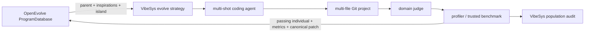

# OpenEvolve search-policy adapter

VibeSys can use the search policy from OpenEvolve 0.3.1 without copying its
implementation:

```bash
vibesys --outer-loop evolve \
  --search-policy openevolve \
  --runs-dir /work/vibesys-runs --local \
  --project examples/data-structures/repositories/queue-rs \
  --task spsc
```

The Python dependency is pinned to `openevolve==0.3.1`. The adapter imports
`DatabaseConfig`, `Program`, and `ProgramDatabase` directly from that package.
Refreshing the integration is an ordinary dependency update plus compatibility
tests; no vendored or submodule source needs to be synchronized.

## Ownership boundary



OpenEvolve owns:

- MAP-Elites cells using its built-in code complexity and diversity features;
- exploration/exploitation/weighted parent selection;
- inspiration sampling;
- bounded population and elite archive maintenance; and
- island assignment and migration.

VibeSys owns:

- bootstrap, generations, and candidate concurrency;
- the coding-agent mutation (including its multiple tool/LLM turns);
- domain/modality prompts and environment hooks;
- multi-file project checkout, edits, snapshots, and commits;
- correctness judging and trusted profiling; and
- the complete population audit (`PopulationState.individuals`), including
  failed candidates.

Only judge-passing candidates enter OpenEvolve. Failed candidates remain in the
VibeSys population so later bootstrap prompts can learn from their feedback,
but they cannot become parents.

The adapter holds OpenEvolve's database as data, not files: every selector
call reconstructs the upstream `ProgramDatabase` from
`OpenEvolveSelectorState.files`, an in-memory mapping from the relative path
the database would otherwise write to, to that file's JSON text, mutates it
exactly as the upstream algorithm does, and serializes it back into that
same field. `OpenEvolveSelectorState` (database configuration, active and
historically admitted program IDs, island lineage, primary fitness
definition, and isolated sampling RNG state) is checkpointed as part of the
strategy's ordinary `PopulationState`, alongside everything else `ctx.state`
persists; there is no separate directory on disk this module owns. A
resumed run automatically continues with OpenEvolve when that state is
present. Explicitly changing an OpenEvolve database setting or fitness
objective on resume is rejected because upstream island, MAP-Elites, and
archive structures are not safely rebuilt in place.

`files` always holds the *complete current* database rather than a growing
history of snapshots, so state size is bounded by the database's own size
limits (`population_size`/`archive_size`), not by how many times `admit` has
been called over a run's lifetime.

## Multi-file representation

OpenEvolve's `Program` contract has one `code` string. The adapter supplies a
canonical Git patch from the project's initial commit to the
candidate commit. This gives OpenEvolve meaningful complexity, edit-distance,
and duplicate signals across a multi-file candidate without flattening the
project into a fake source file. Program metadata stores the durable VibeSys
individual ID and commit. Migrated OpenEvolve programs retain that metadata, so
selection always resolves back to the correct VibeSys tree.

Framework state under `.vibesys/state/` is excluded from this patch. Profiler
counters, benchmark JSON, timestamps, and other runtime output therefore
cannot distort OpenEvolve's code-complexity and diversity features.

## Metrics and multi-objective runs

OpenEvolve 0.3.1 ranks programs by `combined_score`. For a scalar VibeSys run,
the adapter sets it to `perf_metric`. In Pareto mode it uses the signed primary
objective (negating minimize objectives) as OpenEvolve's scalar fitness while
preserving the full metric dictionary and Pareto frontier in VibeSys.

This means OpenEvolve's archive is not itself a Pareto archive. Use the final
VibeSys frontier for multi-objective reporting; use OpenEvolve for diversity,
islands, migration, and primary-objective search pressure.
