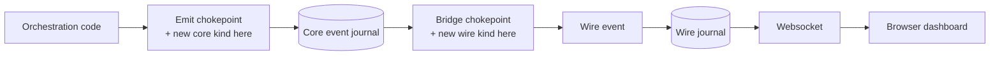
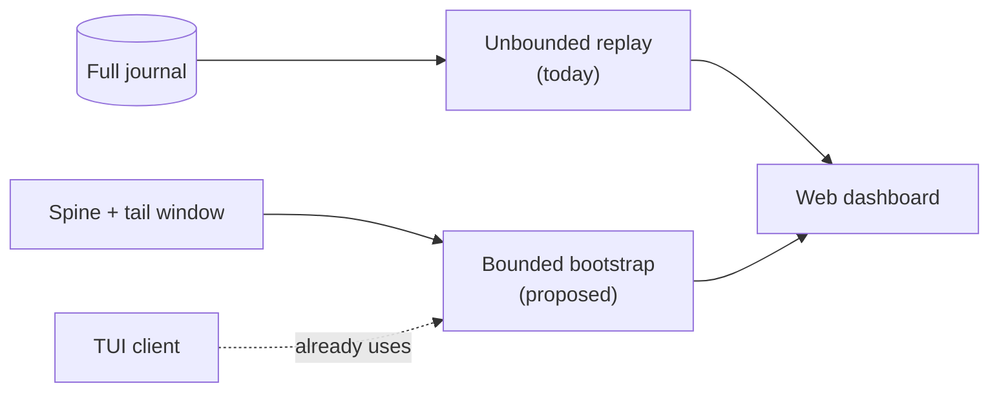
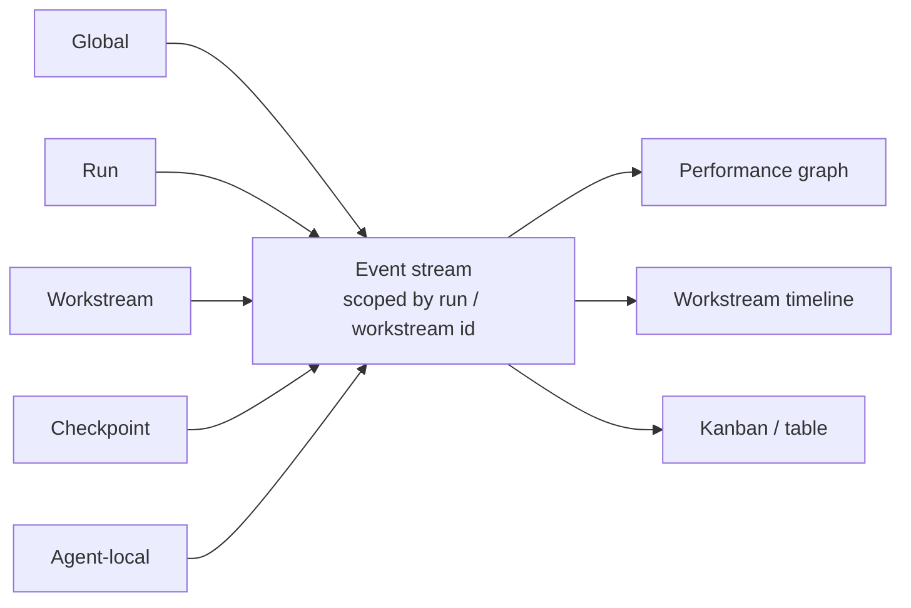

# Live campaign telemetry: streaming a long run into the web UI

Status: draft for discussion, with one real backend fix shipped as proof of
concept (see "Backend PoC"). Owner: web + orchestration. Companion to the
campaign dashboard in PR #1304 (`feat/web-trajectory-replay-fixtures`): this
branch forks directly from #1304's own tip (`git merge-base` against it is
exactly #1304's tip commit), so `CampaignDashboard.tsx`, `replay-scenario.ts`,
and the rest of that UI shell are inherited verbatim, not reimplemented from
its shape. What #1304 itself does not provide is any connection to a real
run: it replays one curated fixture of an already-finished run, entirely
offline, unmerged, localhost-only. Everything below is about feeding that
same dashboard from a live backend instead of a fixture; #1304's own code is
not otherwise touched. Citations below were rechecked against a fresh
`upstream/main` pass (commit `5ff739abc`, 2026-10-10); "Telemetry inventory,"
"The gap," and "Backend path" carry what that pass corrected or sharpened,
including two places the first draft cited a legacy, dead orchestration
engine instead of the live one (flagged inline).

## Problem

A VibeSys serving-system campaign is a long run: a portfolio of concurrent
workstreams, each a hypothesis with its own implement/review/profile/evaluate
lifecycle, producing hundreds of measurements over days. PR #1304 built one
performance graph with a running-best line, a draggable timer bar, a
workstream timeline, and a Kanban/table drill-down, all driven by one
hand-curated fixture of an already-finished run, replayed entirely offline.
This branch forks from, and inherits, that dashboard's code directly; what it
does not inherit is any connection to VibeSys itself; #1304 is unmerged,
localhost-only, and reads nothing from a real run. Closing that gap, live
telemetry in place of the fixture, is this doc's subject.

Today nothing gets that much telemetry from the backend to a browser while a
run is still going. This doc breaks that into four sub-problems:

1. **Inventory.** What telemetry does the backend already compute or emit,
   what of that already reaches the websocket, and what does not exist as
   measured data anywhere yet? Without this, any design is guessing.
2. **Packaging.** However this data gets to the browser, it cannot be one
   stream per metric. A run with a portfolio of workstreams, each polling
   tools, tokens, and profilers, produces telemetry at a rate and shape that
   do not fit "add a print statement, pipe it to the UI": that approach does
   not type-check, does not replay, does not survive a reconnect, and turns
   into an unmaintainable pile of ad hoc channels the moment a second kind of
   telemetry is added. The design needs one packaging answer that scales to
   telemetry not yet invented.
3. **Classification.** The dashboard, and future ones, need data at
   different altitudes: global run health, one workstream's progress, one
   checkpoint's result, one agent's activity. The design needs to say which
   altitude each kind of telemetry belongs to and why, so a new kind has an
   obvious home.
4. **Durability.** A campaign can run for a month or more. The design needs
   to say what happens to an hour-one browser tab still open at hour-700, and
   what happens to the on-disk history by then, rather than assuming a run
   this long away as out of scope.

This doc answers all four, with a proof-of-concept backend fix, not just a
proposal, wired into the same chokepoints the system already uses for every
other event it streams today.

## Goals and non-goals

Goals:

- One typed, append-only telemetry contract that carries everything the
  dashboard renders: objective/metrics, workstream lifecycle, measurements,
  agent roster, token spend, run status.
- A live fold on the client that grows a `CampaignRecord` as deltas arrive and
  follows the newest point with no delay, while keeping the scrubber free to
  look back.
- A runnable local prototype that streams the existing campaign over this
  contract so collaborators can see and critique the live behavior, the way
  #1304 let people see the layout.
- A complete account of what telemetry exists today, what already reaches the
  websocket, what does not, a packaging design that scales to telemetry not
  yet invented, and a resilience plan for runs lasting a month or more.
- One real backend change that proves the packaging design's extensibility
  claim against a genuine bug, not only on paper.

Non-goals (named here, deferred to "Backend path"):

- Emitting the *campaign-dashboard-specific* events (workstream lifecycle,
  token spend) from the real orchestrator. That still needs the projection
  work in "Backend path"; it is sketched, not built, here. The one event this
  PR does wire for real (async-operation lifecycle, see "Backend PoC") is
  general-purpose plumbing the campaign projection will also depend on, not
  the campaign projection itself.
- Running a real `dynamic` campaign locally. `orchestrate()`
  (`orchestration/dynamic/orchestration.py`) raises at startup unless
  `run.workspaces.supports_parallel_candidates`, since every workstream needs
  an isolated candidate workspace. On `upstream/main`, `372be9840` (#1556)
  later adds that support to the Docker run environment alongside Slurm and
  Modal; on this branch (forked before that commit landed), Docker's
  `RunEnvironmentView` does not set it, so Docker still cannot run `dynamic`
  locally here. The GPU-bound serving example this doc otherwise refers to
  needs real hardware (no local MI300A/B200) regardless, so the prototype
  below is replay-driven either way; see "Prototype".

## Background: what already exists

**A terminology note for readers arriving from the "no more outer/inner
loop" framing.** That framing names a direction, not yet a rename.
`--outer-loop` and `--inner-loop` are still the live CLI flags today
(`entrypoints/cli/args.py:73-90`; `docs/cli-flags.md:84` still headers its
section "Outer Loops"). `single-agent`/`multi-agent` are
`--inner-loop` values layered on top of an `--outer-loop` choice, one of 7
registered strategies (`single`, `multi`, `issue_queue`/`plain`, `evolve`,
`dynamic`, plus two profile-guided variants). "Orchestrator" is not a new
controller class, but it is not one shared id either: `single`'s and
`multi`'s `agents.py` both declare `DESIGNER = AgentRole(id="orchestrator",
...)`; `dynamic`'s declares `ORCHESTRATOR = AgentRole(id="dynamic-orchestrator",
...)`, a different id string despite the matching variable name; `evolve`
and `issue_queue` have no orchestrator-equivalent role in their roster at
all. None of this changes the design below (frames key off
`workstream_id`/`phase`, not off which outer-loop strategy produced them),
but it is worth knowing before reading backend code that still says "outer
loop."

**A second terminology note, more consequential, and one that does not
resolve the same way on this branch as it does on `upstream/main` today.**
Two "workstream" engines exist across `orchestration/dynamic/`'s history.
`DynamicState`/`DynamicWorkstream`/`AgentLoopState`/`PortfolioView`
(`models.py`, `rounds.py`, `workstream.py`, `agent_loop.py`, wired by
`dynamic/plugin.py`) are what this branch actually runs today, forked before
`712586df6` ("run `--outer-loop dynamic` on the core path") landed upstream.
On current `upstream/main`, that commit retires this engine to test-only
status (reachable only via the `LEGACY_PLUGIN`/`LEGACY_REGISTRATION`
constants in `tests/vibesys/orchestration/dynamic/loop/_harness.py`, not a
`legacy_plugin.py` module) and replaces it with
`vibesys.orchestration.dynamic.strategy` plus `core_policy`:
`DynamicStrategyState` holding `attempts: tuple[AttemptRecord, ...]`, not
`workstreams: tuple[DynamicWorkstream, ...]`.

**"Telemetry inventory," "The gap," and "Scalable packaging design" below
describe the `upstream/main` engine (`DynamicStrategyState`/`AttemptRecord`),
not the one this branch's own `orchestration/dynamic/` currently runs.**
That is a deliberate choice, not an oversight: `strategy/_state.py` is what
future telemetry work will actually extend, and describing a pre-migration
engine as the design target would go stale the moment this branch rebases.
The cost is that those sections' file:line citations do not resolve inside
this branch's own checked-out tree today; re-verify them against current
`upstream/main` before relying on them, or after this branch syncs past
`712586df6`. "Backend PoC" is the one exception: it touches only
`src/server/`, is verified directly against this branch's own working tree
(see its own commit citations), and does not depend on either engine.

**Telemetry already flows through named chokepoints, not prints.** There are
two, one per layer, not a single one. Core-side, every producer emits
through `EventJournal.emit()` (`run/event_journal.py:36-45`), which appends
to `core-events.jsonl` via the generic `DurableEventJournal.record()`
(`vs_runtime/_event_journal.py:102-113`). A single bridge, `project_event()`
(`server/integration.py:360`), turns each `CoreEvent` into a `RunEvent` and
hands it to the server-side `WireJournal.append()`
(`server/journal.py:125,207,227`), which persists to `run-events.jsonl`
(`EventStore`) and fans out over a chunked websocket (1 MiB frame cap,
`server/transport/websocket.py`). Every envelope carries `sequence`,
`run_id`, `timestamp`, `type`, and `text`, plus `status`, `execution_id`,
`round_label`, and `agent_kind` (all four optional, `None` unless the
specific event populates them; `status` carries pass/fail semantics for
events like `GateFinishedData`, not just a generic marker). The frontend
folds events into state with pure reducers
(`@vibesys/core-state`), and the web client already has a durable,
reconnecting stream (`PersistentEventStream`, `WebSession`). The design below
reuses that shape rather than inventing a parallel path.

**Roles are a run-level roster, not a per-workstream team.** Every
orchestration strategy declares a fixed set of `AgentRole`s once per run
(`Role` StrEnum: `orchestrator`, `implementer`, `judge`, `profiler`,
`orchestration/dynamic/strategy/_state.py:55-61`). No backend field maps one
agent to the specific workstreams it touched; that has to be derived from
event history (which role emitted which event, under which hypothesis_id),
not read off a stored list. Two real, already-merged capabilities sit on top
of this roster worth knowing even though this design does not surface them as
frames: the `implementer` role can delegate to the dedicated `profiler`
teammate mid-turn via a `dispatch_profiler` tool, and separately can request
accuracy and benchmark evidence via `submit_evaluation`/`accepted_evidence`
(`vs_evaluation/agent_mcp.py`: `dispatch_profiler` and its
status/await/cancel siblings at lines 206-249, `submit_evaluation` at 171,
`accepted_evidence` at 259; PR #1024, #1291). A later pass could
turn each into its own frame kind ("implementer dispatched the profiler",
"implementer requested evaluation"); projecting workstream phase and
measurements does not need it.

**The dashboard is a pure function of `(CampaignRecord, cursor)`.** This is the
key property of #1304 and the reason live streaming is tractable. `CampaignView`
components depend only on a `CampaignRecord` (the data) and a `CampaignViewModel`
(cursor plus view state); nothing in the view talks to a fixture URL or a hook
directly. Dragging the timer bar to an earlier measurement re-derives
everything: run status flips to active, best-goodput recomputes as the
running best up to the cursor, the chart truncates, workstream counts and
timeline lanes shrink, and the Kanban recounts. "Active" is never stored; it is
derived from the cursor time versus each workstream's `finishedAt`. So **live is
not a new rendering mode. Live is: append to the record and move the cursor to
the tail.**

**Metrics already describe themselves.** A measured serving run emits the
evaluator result protocol v2: a JSONL stream of one `hello` record that declares
each metric's unit, direction, and whether it is required, then one `result`
(or `error`). A consumer learns the axis labels, units, and directions before
any value arrives. The telemetry contract below carries the same information in
its first frame, so a live chart can label its axes from the start.

## Telemetry inventory

Grounded in a direct, file-by-file pass over `upstream/main` (`5ff739abc`),
not assumption. Three buckets: already streamed to the browser, computed or
persisted but not streamed, and not computed anywhere.

### Already streamed (reaches the websocket today)

- **Tool calls, with real per-call duration.** `ToolCallData`/`ToolResultData`
  (`vibesys/events.py`), mirrored in `server/events.py`. agentshim times
  every tool-use block uniformly, native and MCP tools alike
  (`CommandResultPayload.duration`); this is comprehensive, not limited to
  shell-style tools.
- **Agent status snapshots**: elapsed seconds, in-flight input tokens,
  context-window usage (`AgentStatusData`), and current-context token/model
  readings (`UsageUpdateData`) — both point-in-time, not cumulative.
- **Rate limits and quota lifecycle**: `RateLimitUpdateData`,
  `QuotaPausedData`/`QuotaResumedData`/`QuotaAbandonedData`,
  `ProviderSwitchedData`.
- **Gate lifecycle**: `GateStartedData`/`GateFinishedData` (gate, recipe,
  reused, metric, value, unit, output tail) — no duration field.
- **Round outcomes**: `RoundFinishedData` (attempts, judge verdict,
  `perf_metric`/`perf_unit`, whether profiling was skipped) — this is also
  where a profiler's headline metric surfaces; see the profiler bullet
  below.
- **Judge and benchmark results**: `JudgeResultData`, `BenchmarkResultData`.
- **Run failure, in aggregate**: `RunFailure` (kind, reason,
  `workstreams_started`, `workstream_budget`, `candidates_kept`) — a real
  cross-workstream count, but terminal-only, built once when a run fails.
- **Envelope metadata on every event**: `sequence`, `timestamp`, `run_id`,
  `type`, `text`, plus the optional `status`, `execution_id`, `round_label`,
  `agent_kind`.

### Exists, computed or persisted, not streamed

- **Per-turn usage, with cost and real per-agent-kind attribution.**
  `AgentUsage` (`vs_agent/contracts.py`) itself carries input/output/cache
  tokens, `total_cost_usd`, `duration_ms`; the per-agent-kind label
  ("dynamic-implementer", "dynamic-judge", and so on) is not a field of
  `AgentUsage` but a separate `kind` parameter `append_usage_record()`
  (`vs_agent/usage_records.py`) adds when it assembles each `usage.jsonl`
  row. This is the richest disconnected source in the repo. It is write-only
  today: nothing reads it back into an event.
- **Portfolio concurrency.** `active()`/`capacity()` (`strategy/_context.py`)
  compute true N-way in-flight/queued counts every tick, from live
  `DynamicStrategyState.attempts`, and discard the result immediately. One
  level up, `project_strategy_state()` (`core_policy/_projection.py`)
  computes the same `in_flight` tuple and collapses it to a single `active =
  in_flight[-1]` (`AgentRunProjection.active_hypothesis_id`) before it
  reaches any read model: real concurrency is computed, then thrown away
  down to "most recent one."
- **The richest per-workstream detail, in live state, lost at settlement.**
  `AttemptRecord` (`strategy/_state.py`) carries `blockers` (the ordered
  history of failed/rejected turns), `turns_spent`, `judge_invocation`,
  `review_evidence`, and the current `turn`, and none of it is pruned while
  the run is live. `on_settled()`'s `_round()` (`strategy/_attempt_events.py`)
  collapses this ~29-field record to the 13-field `RoundRecord` (`sequence`,
  `outcome`, `summary`, `metrics`, ...), dropping every field above; no "how
  many tries did this take" counter survives settlement anywhere. A
  telemetry tap sourced from `RoundRecord` or the read model inherits this
  loss; one sourced from live `AttemptRecord` at its `DONE` transition would
  not.
- **The run's stated objective.** `RunFacts.objective`, frozen at run start
  (`vs_core` kernel `RunView.facts`). Exists today; nothing emits it as an
  event. This is the direct answer to showing the run's objective in the UI.
- **GPU telemetry and contention.** `NvidiaSmiTelemetry`,
  `GpuContentionMonitor` (`vs_sandbox/gpu_monitor.py`), a daemon thread
  polling every 30s. `FrameworkSource.GPU` is declared in `vibesys.events`
  and never constructed anywhere in production.
- **Executor/evaluation capacity.** `AvailabilitySnapshot`
  (`vs_evaluation/models.py`: state, capacity, in_flight, queue_depth,
  estimated start/runtime, cost class) is real and detailed, consumed only
  internally for scheduling, never emitted.
- **Profiler narrative and attribution.** `ProfilerAgentResult` (narrative,
  evidence ids, named cost/share attribution) and `ProfilerSummary`
  (analysis, bottlenecks, a `metrics` dict) are rich structured outputs of a
  profiler turn. Only lifecycle *state* reaches an event
  (`AsyncOperationLifecycleData.state`, one of 11 `AsyncOperationState`
  members: submitted, queued, starting, running, succeeded, completed,
  failed, canceled, interrupted, superseded, timed_out);
  the narrative, attribution, and metrics dict stay inside the turn's return
  value. One exception: `perf_metric`/`perf_unit` do reach `RoundFinishedData`
  once a round concludes.
- **Checkpoint history below the attempt.** `AttemptCheckpoint`
  (`vs_core/types/attempts.py`: invocation, revision, `wip`/`candidate`
  retention) is an append-only history of every retained snapshot within one
  attempt. `AttemptRecord` keeps only the latest (`candidate: RevisionRef |
  None`); the retained history never surfaces above the kernel.
- **Boot-phase span timing.** `BootTrace` (`vs_runtime/_boot_trace.py`) is a
  deliberate, OpenTelemetry-shaped span/trace mechanism, used extensively
  during environment setup. By design it writes only to the plain-text run
  log, since it runs before any event sink exists.
- **Per-evaluation-stage duration.** `EvaluationStepResult.duration_s`
  (`vs_evaluation/models.py`) is real and computed, but does not reach
  `GateFinishedData`, which has no duration field at all.

### Does not exist anywhere

- **VibeSys's own throughput.** No tokens-per-second or any rate computation
  for VibeSys's own agent activity exists anywhere, confirmed against
  production code and against this PR's own prototype fold
  (`campaign-fold.ts` tracks a cumulative `tokenSpend`, never a rate).
  `ProfilerSummary.metrics`' example key `'median_tok_per_sec'` is a
  different thing: it describes the *candidate system being optimized*, not
  VibeSys's own loop, and should not be confused with it.
- **Run wall-clock duration as a stored fact.** No run start time is stored
  anywhere; a run's elapsed time is derivable only as "now minus the first
  event's timestamp."
- **Gate duration.** Zero clock calls anywhere in gate execution.
- **CPU/memory of agent sandboxes.** No `psutil`, `pynvml`, or cgroup-usage
  polling exists anywhere in `vs_sandbox`/`vs_agent`/`src/vibesys`.
- **Retry/backoff as an event: a dead sink, not a missing feature.** A real
  retry policy exists (`TRANSIENT_RETRY_DELAYS_S`,
  `vs_agent/session_launch.py`) and the wait loop runs inside agentshim, but
  its log callback, `AgentDiagnosticLog`, is constructed with no event sink
  (`factory.py:91`, defaults to `NULL_AGENT_EVENT_SINK`). The retry notice
  reaches the plain-text run log only. One line of wiring would fix this; it
  is listed under "Backend path" rather than fixed in this PR, to keep the
  proof of concept to one change.
- **Typed workstream/attempt correlation.** `round_label`/`agent_kind` on the
  event envelope are free text, not references; which workstream an
  agent-local event belongs to is not a parseable field anywhere today.
- **Tool output size, and real tool-call identity.** `ToolResultData` has no
  byte-size field; `call_id` is a synthetic UUID, paired to its call by a
  per-tool-name FIFO queue, not the provider's real id.

**Naive alternative, ruled out explicitly: print statements.** Routing any of
the above to the UI by adding print statements, or ad hoc log lines parsed
back out, does not type-check at the boundary, does not replay on reconnect,
does not survive a process restart, and does not compose: each new kind of
telemetry becomes its own bespoke parsing problem on both ends. Every kind
above instead becomes a typed payload inside the one pipeline the system
already uses for everything in "already streamed"; see "Scalable packaging
design" for why that pipeline, not a new one, is the right place to add the
rest.

## The gap

PR #1304's fixture footer names it precisely: the measurement points and their
values are recovered from a real campaign, but "workstream windows, role
assignments, and turn text are curated reconstructions from available evidence,
not backend events." Four concrete things are missing between the current
backend and a live `CampaignRecord`:

1. **Workstream state is computed, then collapsed, not "never projected."**
   The live engine already computes true portfolio concurrency:
   `active()`/`capacity()` (`strategy/_context.py`) and
   `project_strategy_state()` (`core_policy/_projection.py`) both derive an
   `in_flight` tuple of every non-DONE attempt from
   `DynamicStrategyState.attempts` on every call. `project_strategy_state()`
   then collapses it to one id, `active = in_flight[-1] if in_flight else
   None`, because `AgentRunProjection` was designed for one hypothesis at a
   time and has not been redesigned for the portfolio engine. Settlement
   compounds this: `on_settled()`'s `_round()` (`strategy/_attempt_events.py`)
   flattens a live, ~29-field `AttemptRecord` (blockers, turns_spent,
   judge_invocation, review_evidence, the current turn) to a 13-field
   `RoundRecord`, and `DynamicStrategyState.attempts` itself is never pruned
   of DONE records, so the detail exists in durable live state for the run's
   whole lifetime; it is only the derived read model that is thin.
   **Correction from the first draft:** this gap was previously described in
   terms of the legacy, dead `DynamicState.workstreams`/`DynamicWorkstream`;
   those types are reachable only from tests. This is the corrected,
   live-engine version of the same gap.
2. **The event envelope has almost no workstream identity.** There is
   `round_label` and `execution_id`, but no `workstream_id`/`attempt_id` and
   no per-workstream phase/status event, so even the events that do flow
   cannot be grouped into workstream lanes. One existing event comes close:
   `AsyncOperationLifecycleData.scope_id` is already populated with the
   `hypothesis_id` (`run/host.py`), but until this PR,
   `CoreEventType.ASYNC_OPERATION_LIFECYCLE` had no case in the server's
   `EventType`/`EventData` union or in `project_event()`, so
   `project_event()`'s `EventType(event.type.value)` would raise on it,
   uncaught, killing the run. **This PR fixes that; see "Backend PoC."**
   Promoting `scope_id` into a documented, first-class
   `workstream_id`/`attempt_id` envelope concern for every event, not just
   this one, is still future work, scoped out of this PR; see "Backend
   path."
3. **There is no token-spend field on the live engine, and no unwired
   placeholder worth wiring either.** The first draft of this doc pointed at
   `AgentLoopState.input_tokens`/`output_tokens`
   (`orchestration/dynamic/models.py`) as an unwired seed to extend.
   **Correction from the first draft:** that field is legacy, dead code:
   always zero, never assigned in production, not part of any event, and not
   reachable from the live engine at all. The live
   `DynamicStrategyState`/`AttemptRecord` carry no token or cost field, a
   regression relative to the legacy engine, not a redesign in progress. The
   real, richest source is `usage.jsonl`/`AgentUsage` (per-turn tokens, cache
   tokens, cost, duration, real per-agent-kind attribution), covered in
   "Telemetry inventory" above: it is write-only today, and wiring it, not
   `AgentLoopState`, is the right next step.
4. **No wall-clock timestamp survives in the core model.** Neither the
   legacy nor the live attempt/workstream type stores a
   `started_at`/`finished_at`, and the generic kernel `RunView.run.now_at` is
   a run-clock float for deadlines, not a timestamp. The dashboard needs real
   ISO timestamps (to drive "active iff cursor time is before finishedAt"
   and the timer bar's axis), so a live projection has to derive them from
   the event envelope's own `timestamp` field (the first and last event
   touching a given workstream), not from any backend-stored start or end
   field.

Everything else the dashboard needs (measurements with values and gates,
objective and metric catalog, benchmark-version boundary) already exists as
data; it is the workstream layer, its timing, and token spend that are
unprojected.

## Scalable packaging design

The question "how do we package and transport all of this so it scales to
telemetry we have not invented yet, without a new architecture every time"
has one answer: **do not build anything new.** VibeSys already has the
pattern this needs, twice.

### The pattern that already exists

Core side: a closed `CoreEventType` enum, a discriminated-union `CoreEventData`
payload keyed by `kind`, a flat `CoreEvent` envelope, and one emission
chokepoint, `EventJournal.emit()`, writing one append-only JSONL file. Wire
side: the same shape, `EventType`/`EventData`/`RunEvent`, written by
`WireJournal`/`EventStore` to `run-events.jsonl`, chunked (1 MiB frame cap)
over one reconnecting websocket. One bridge function, `project_event()`, is
the single place a core event becomes a wire event. This PR's own prototype
(`CampaignFrame`, a six-kind discriminated union with a strict parser) is a
smaller instance of exactly this same pattern, one layer up, on the browser
side.

### Why extend this instead of inventing a struct, library, or second transport

- **It is already proven additive.** `#697` added five `EventType` members
  and a field as a pure-additive, no-protocol-version-bump change. Adding a
  telemetry kind is already a small, type-checker-enforced, one-PR change,
  not a migration. "Backend PoC" below is a second, independent instance of
  the same pattern on this branch directly: one core enum member, one wire
  enum member, one conformance fixture, no `project_event()` change needed
  since the generic fallthrough already handled it.
- **It already avoids "a thousand streams."** One multiplexed, sequenced,
  size-capped, chunked channel discriminated by `kind`, not a connection per
  metric. This is the direct answer to the failure mode a print-statement or
  per-metric-stream approach hits at portfolio scale.
- **It is forward-compatible by construction.** The wire-side parsers
  already tolerate an unknown enum variant (the documented "unknown-enum
  policy" in `protocol-parse.ts`), so an old client does not break the
  moment a new telemetry kind ships from a newer server.
- **The one real gap is coverage, not design.** Nothing today guarantees
  every `CoreEventType` has a wire mapping, exactly what let
  `ASYNC_OPERATION_LIFECYCLE` crash a run uncaught. The fix for that class of
  gap is a test, not a new mechanism; this PR adds one (see "Backend PoC")
  that fails on any future core event added without its wire counterpart,
  not just on this one instance.
- **Correlation should be promoted, not reinvented.** The ad hoc `scope_id`
  pattern, already on `AsyncOperationLifecycleData`, is the right shape for
  "which workstream does this event belong to"; it should become a
  documented, first-class `workstream_id`/`attempt_id` envelope field every
  new telemetry kind fills in, rather than each payload inventing its own
  correlation field. Scoped to "Backend path": changing the shared envelope
  is bigger than one PR should do alongside everything else here.
- **High-frequency data gets sampled, not streamed per tick.** Some
  telemetry (portfolio concurrency, queue depth) is naturally computed on
  every orchestrator tick. Emitting an event per tick does not scale over a
  month-long run; emitting a periodic snapshot (every N seconds, or on state
  transition, not every tick) does, and is an emission-policy choice per
  telemetry kind, not a transport change. See "Long-run resilience."

### What this means concretely for a new kind of telemetry

Adding any item from "doesn't exist anywhere" above, once it is measured,
costs: one `CoreEventType` member and payload class (or a field on an
existing payload, when it is naturally part of an existing event's moment);
one `project_event()` case, now covered by a standing test, so a forgotten
case fails CI instead of a run in production; one mirrored `EventType`
member and payload; one regenerated TypeScript type; one conformance
fixture. Nothing about the journal, the websocket, the chunking, or the
frontend fold changes. That is the scalability property this section set
out to justify.



Two chokepoints, annotated above, are the only two places a new telemetry
kind gets added. Everything else in the pipeline, the journals, the
websocket, the chunking, is unchanged by that addition.

## Long-run resilience

A campaign can run for a month or more. Three problems, each with an answer
that reuses something the system already has rather than inventing new
infrastructure:

1. **Every page load replays the entire run, unbounded.** The web client
   never sets the already-built `tail` bootstrap option
   (`clients/web/src/main.tsx`), so opening the dashboard on day 30 replays
   30 days of events from the start. The TUI client already solved this:
   `tail=1000` plus a periodically-recomputed "spine" summary of everything
   before that window (`BOOTSTRAP_TAIL`, `session-controller.ts`;
   server-side `WireJournal._bootstrap_spine_locked`, `server/journal.py`).
   The fix for the web client is pointing it at the same mechanism, not
   building a second one.
2. **The on-disk journal has no rotation, compaction, or retention.**
   `run-events.jsonl`/`core-events.jsonl` grow without bound, and
   `EventStore` reads the entire file into memory at construction. This is a
   real, currently open gap; out of scope to fully close in this PR. The
   natural extension point is the spine concept from problem 1: a spine that
   already bounds *replay* could be extended to also bound *storage*
   (periodic compaction keeping a spine plus a bounded tail window on disk,
   not just in the bootstrap response), rather than a new storage mechanism.
3. **Sustained high-frequency emission over weeks adds up, even if no single
   event is huge.** `upstream/main` (`#1735`, landed after this PR forked)
   already caps and truncates any one oversized event
   (`MAX_SERIALIZED_RUN_EVENT_BYTES`, with a `RunEvent.truncated` marker).
   That bounds one event, not a sustained rate. The answer is the
   per-telemetry-kind sampling/coalescing policy from "Scalable packaging
   design": a portfolio-concurrency snapshot every N seconds or on state
   change, not one event per orchestrator tick, keeps total volume bounded
   by run *events*, not run *duration*.

None of these three are solved by a bigger buffer or a longer timeout; each
is solved by using a bound the system already enforces somewhere (replay
window, per-event size) or by choosing what to sample instead of streaming
everything that is computed.



The TUI client already takes the bounded path. Problem 1 above is wiring the
web client to that same mechanism, not building a second one.

## Telemetry viewpoint taxonomy

Every kind of telemetry in this system belongs to one of five altitudes.
Naming them gives a new kind of telemetry an obvious home instead of an
argument.

| Viewpoint | Scope | Examples (today) | Examples (future) |
| --- | --- | --- | --- |
| Global / cross-run | Whole portfolio, this run | `RunFailure` aggregate counts (terminal only); best-result-so-far (`Winner`, computed once at search end) | live N-way concurrency snapshot (`active()`/`capacity()`, sampled, not per-tick); baseline state (`BaselineState`, already the one clean run-wide fact) |
| Run-specific | One run, no workstream breakdown | `RunStatus`/`RunPhase`; global round counter (`RoundSummary.number`, not per-hypothesis) | the run's objective (`RunFacts.objective`, exists, unwired); run elapsed time (derived from the first event's timestamp, since no start-time field exists) |
| Workstream-specific | One hypothesis/attempt | phase/step transitions, once gap 2 is closed generally | `AttemptRecord` detail while still live: `blockers`, `turns_spent`, `judge_invocation`, `review_evidence`, candidate revision |
| Checkpoint-specific | One retained snapshot within an attempt | none today | kernel-level `AttemptCheckpoint` (`wip` vs. `candidate` retention), if historical, not just latest, checkpoints are ever needed on the dashboard |
| Agent / local-specific | One tool call or turn | tool calls + duration, `AgentStatusData`, `UsageUpdateData`, provider/model switches, rate limits | per-turn cost and cache tokens with real per-agent-kind attribution, once `usage.jsonl`/`AgentUsage` is wired |

Every tier fits the same envelope from "Scalable packaging design": scoped by
`run_id` always, and by `workstream_id`/`attempt_id` where the tier is
narrower than the whole run. Checkpoint-specific is listed because the data
already exists one layer down in the kernel (`AttemptCheckpoint`), not
because anything needs it today; it is the natural next tier the same
pattern grows into, not a reason to add a new pattern now.



All five viewpoints share the one pipeline from "Scalable packaging design."
The dashboard's three live views all read from that same stream, not three
separate feeds.

## Prototype design

### One contract: an append-only stream of typed campaign frames

Model the telemetry as a closed, discriminated union of **frames**, each a small
typed delta, emitted in one order over one connection. This is the single source
of truth the UI folds; it is transport-agnostic (the prototype serves it over
SSE, the real gateway would carry it over its existing websocket). Frame kinds:

| Frame | Carries | Maps to the gap |
| --- | --- | --- |
| `campaign-init` | id, title, summary, provenance, objective (metrics catalog, target, gates), benchmark versions + boundary, trajectories | the self-describing header, like evaluator `hello` |
| `workstream-upsert` | one workstream: id, title, hypothesis, window, **phase**, `active`, outcome, outcomeSummary | gap 1 + 2 (`WorkstreamPhase`, `workstream_id`) |
| `agent-upsert` | one agent: id, name, role, workstreamIds | agent roster |
| `measurement` | one measurement: sequence, workstreamId, values, gates, disposition, benchmark version | the already-real telemetry |
| `tokens` | workstreamId, cumulative tokens | gap 3 |
| `status` | run status: active / completed | run lifecycle |

Every frame carries a monotonic `seq` for ordering and idempotent dedup. Frames
are **deltas, not snapshots**: a workstream that moves `IMPLEMENTING ->
REVIEWED` is one `workstream-upsert`, not a resend of the whole portfolio. This
is what keeps a days-long, hundreds-of-measurement run cheap to stream and cheap
to re-fold on reconnect.

`phase` is the closed set the backend already has (`WorkstreamPhase`: PENDING,
IMPLEMENTING, IMPLEMENTED, REVIEWED, EVALUATED, FAILED, PARKED, CANCELLED).
Only the fold sees `phase`: `projectWorkstream` (`campaign-fold.ts:91-111`) uses
`phase`, `active`, and `finishedAt` together to decide, per workstream, whether
to project a real `finishedAt` or a synthetic one placed just past "now".
`CampaignRecord['workstreams']` itself still carries no `phase` or `active`
field, and the existing dashboard's own "is this active" check is unchanged:
cursor time versus `finishedAt`. Live streaming does not replace that trick, it
feeds it a manufactured `finishedAt` for anything still in flight. One phase is
worth flagging because it is easy to miss: `isTerminalPhase`
(`campaign-frames.ts:259-261`) groups PARKED with the live phases, not the
terminal ones, so a parked workstream keeps projecting a moving `finishedAt`
and rendering as active until it is explicitly re-evaluated or cancelled.

### Parse at the boundary, typed inside

Frames arrive as untrusted input. `parseCampaignFrame(value): CampaignFrame`
validates once at the edge: it rejects an unknown `kind`, an unknown key inside a
frame, or a wrong type, and names the offending field. Nothing downstream re-
validates; the fold and the view operate on typed values only. This mirrors
`parseReplayScenario` for the static record.

### The fold is a pure functional core

`foldCampaignFrame(state, frame): FoldState` is a pure reducer: `state + event
-> new state`, no I/O, no clock, no React. `FoldState` holds the growing
`CampaignRecord`, the run status, the per-workstream token spend, and the last
applied `seq`. Properties the reducer guarantees, and the tests assert:

- Measurements are kept sorted by `sequence`, regardless of arrival order. This
  matters because `dynamic` assigns sequence numbers at planning time but
  appends round records when workstreams finish, so measurements can arrive out
  of wall-clock order.
- Upserts are keyed by id, so a re-sent workstream or agent merges, it does not
  duplicate.
- Replaying `framesFromRecord(R)` through the fold reconstructs `R`. The frame
  builder and the fold are inverses; this is the central round-trip property and
  the thing that makes the prototype a faithful reference for the real backend.

Keeping the fold pure is what lets the whole live path be tested with generated
frame sequences and no sleeps (see "Verification").

### The live view model, substitutable for the fixture hook

`CampaignViewModel` is already a declared, source-neutral interface: "a fixture
clock or a live event fold may implement this interface." The live path supplies
a second implementation, `useLiveCampaign(stream)`, substitutable for
`useCampaignHistory(record)`. `CampaignDashboard` does not change.

Two behaviors are new and specific to live:

- **Follow the tail with no delay.** As each `measurement` frame folds in, if
  the user has not scrubbed back, the cursor advances to the new newest point,
  so the graph and timer bar track the run in real time. If the user drags the
  scrubber back, following stops and the cursor stays put; dragging back to the
  tail resumes following. This is standard live-tail UX and the reason the timer
  bar stays useful during a live run. The existing play/pause control maps to
  follow/pause.
- **Status comes from the fold, not the cursor.** `useCampaignHistory` derives
  status as "cursor is not at the last index." That is wrong for a live run
  sitting at the tail while work continues. `useLiveCampaign` takes status from
  the `status` frame, so "active" means the run is actually active.

### Efficiency

- Deltas, not snapshots: O(1) bytes per state change, not O(portfolio) per tick.
- One connection, one ordered stream, folded incrementally; no polling, no
  per-widget fetches.
- The first frame carries the metric schema, so the chart needs no second round
  trip to label axes.
- Reconnect re-folds from `seq`; because upserts are keyed and measurements are
  sequence-sorted, a replay from zero and a resume from a cursor converge to the
  same state.

## Prototype: replay-as-live

Because a real `dynamic` campaign against this doc's GPU-bound serving
example cannot be driven locally (no local MI300A/B200; see "Non-goals" for
what Docker now changes and does not), the prototype proves the design by
streaming the **existing** campaign over the contract above, as if live. It
adds no backend, core, or wire-protocol code, and no new dependency.

- A vite dev plugin (`campaignStreamPlugin`) serves Server-Sent Events at
  `/__vibesys/campaign/stream`. On connect it reads the campaign record, builds
  the frame sequence with `framesFromRecord`, and emits the frames on a clock:
  the init and agent roster first, then workstream, measurement, and token
  frames interleaved in wall-clock order, then a final `status: completed`.
  `?interval=<ms>` sets the per-frame delay; the server owns its timer and clears
  it on disconnect. The record is loaded through the app's own
  `parseReplayScenario` and `framesFromRecord` (via `ssrLoadModule`), so the
  prototype has one frame producer, not a duplicate. SSE is used because the
  telemetry is push-only and needs no dependency; the frame schema is identical
  over any transport.
- `EventSourceCampaignStream` is the browser transport (native `EventSource`);
  `FakeCampaignStream` is an in-memory implementation of the same interface,
  meant for driving the hook from memory with no server, timers, or sleeps. It
  is not yet wired into an automated test; see "Verification" for that gap.
- `main.tsx` mounts the live path on `?campaign-live`, wiring
  `useLiveCampaign` + `CampaignDashboard`.

Run it:

```bash
cd clients && pnpm --filter @vibesys/web dev
# open http://localhost:5173/?campaign-live
# pace it with the per-frame delay in ms:
#      http://localhost:5173/?campaign-live&interval=200
```

What it demonstrates: measurements appearing one by one with the graph, the
running-best line, and the timer bar growing with no delay; the status chip
going active then completed; workstream lanes and the Kanban filling as phases
advance; the scrubber pausing follow and looking back over the completed run.
What it stubs:
the frames come from the curated record, not a live orchestrator; token values
are the record's reconstructed spend; `dynamic`'s real concurrency is not
exercised (it cannot be, locally).

## Backend PoC: closing the `ASYNC_OPERATION_LIFECYCLE` gap

"The gap" item 2 above is a real, production-reachable crash, not a
hypothetical: `run/host.py`'s `_evaluation_lifecycle_event` and
`_profiler_lifecycle_event` (lines 487, 501) are live callbacks, not
test-only, and every call emits `CoreEventType.ASYNC_OPERATION_LIFECYCLE`.
Until this PR, `project_event()`'s unconditional `EventType(event.type.value)`
(`server/integration.py:360`) raised `ValueError` on it, and
`server/runtime.py`'s `drive()` only catches `asyncio.CancelledError` around
the event loop (line 146), so the error propagated uncaught: any run that
dispatched a profiler or submitted evaluation evidence crashed its own event
loop the next time one of those operations changed state.

What changed, entirely within `src/server/`, mirroring `AsyncOperationLifecycleData`'s
seven fields (`operation_kind`, `operation_id`, `state`, `revision`, `scope_id`,
`current_stage`, `source`), not a trimmed subset:

- `server/events.py`: added `EventType.ASYNC_OPERATION_LIFECYCLE`, the mirrored
  `AsyncOperationKind`/`AsyncOperationState` enums, and a wire-side
  `AsyncOperationLifecycleData` payload, added to the `EventData` discriminated
  union.
- `server/integration.py`: **no change.** Once the `EventType` member exists,
  `project_event()`'s existing generic fallthrough, the same path
  `GATE_STARTED`/`RUN_CONFIGURED`/`FRAMEWORK_WARNING` already use, appends the
  event to the wire journal correctly, `scope_id` included. The bug was a
  missing enum member, not missing bridge logic.
- `tests/server/test_integration.py`: two new tests. One constructs a real
  `AsyncOperationLifecycleData`/`CoreEvent`, runs it through `project_event()`,
  and asserts `scope_id="hypothesis-7"` survives onto the wire event. The
  other sweeps every `CoreEventType` not in `_CONTROL_EVENT_TYPES` and asserts
  `EventType(core_type.value)` does not raise, closing the asymmetry
  generally rather than just for this one kind, per this repo's "a bug fix
  needs a regression test" rule. Both fail at the merge base (reverted via a
  saved patch file, not `git stash`, since a worktree's `refs/stash` is
  shared) with the predicted `ValueError: 'async_operation_lifecycle' is not
  a valid EventType`, and pass after the fix; `uv run pytest
  tests/server/test_integration.py` is 13 passed, `uv run pytest
  tests/server/` is 483 passed, `./scripts/check_format.sh` and
  `./scripts/check_lint.sh` are clean.
- `clients/backend-client/src/generated/protocol.schema.json` and
  `protocol.generated.ts`: regenerated via `pnpm generate:protocol`, and
  `tests/conformance/events/async_operation_lifecycle.json`: one new fixture,
  following the `rate_limit_update.json`/`provider_switched.json` pattern.
  `node clients/scripts/check_conformance_corpus.mjs` confirms the corpus is
  complete.
- `clients/core-state/src/core-state.ts`: **no change.** This package's fold
  (`applyRunFacts`) dispatches with a plain `if (data?.kind === ...)` chain,
  not an exhaustive table, so an unhandled kind is already a correct no-op by
  construction; `pnpm --filter @vibesys/core-state check` and `pnpm --dir
  backend-client check` are both clean with zero client-side changes. This is
  a second, independent instance of "Scalable packaging design"'s
  forward-compatibility claim: a kind the client does not project is not a
  kind the client fails to compile on.

One more fact this PoC confirms, relevant to "Scalable packaging design"'s
correlation bullet: async-operation-lifecycle events carry no
`agent_kind`/`round_label`/`execution_id` at all (`run/host.py` emits them
with none), and no `status` on the envelope either, since lifecycle state
lives inside the payload's own `state` field. `scope_id` is genuinely their
only correlation handle on the wire today, which is exactly why promoting it
to a first-class, documented envelope concern (rather than a payload-specific
convention only this event happens to follow) is named as the next step in
"Backend path," not an optional polish.

Commits: `ac119aa13` (the fix), `5aee31bb3` (a one-line formatting
fixup), and `0bbb9ae28` (review caught a fabricated justification for
weakening `operation_id`'s wire-side validation; corrected to mirror
core exactly) on `feat/web-live-campaign-streaming`.

## Backend path (future, not in this PR)

The prototype's frame schema is the proposed contract for the
campaign-dashboard-specific data. Making it real is four changes, in
expand-migrate-contract order, each behind the existing emission chokepoints
(core `EventJournal`, bridged by `project_event()` into the server
`WireJournal`) so no print statements are added:

1. **Project workstream state, including its timing.** Extend
   `project_strategy_state()` (`orchestration/dynamic/core_policy/_projection.py`)
   to emit a typed workstream-lifecycle event on every `AttemptRecord` phase
   transition, sourced from live `DynamicStrategyState.attempts` (this layer
   already reads it; see "The gap" item 1). Populate `startedAt`/`finishedAt`
   from the emitting event's own `timestamp` (first and last event per
   attempt), since no core type stores wall-clock time (gap 4): derive it at
   the projection boundary, the same way the live fold in this prototype
   already does, rather than adding a parallel field to `AttemptRecord`. Tap
   the attempt at its `DONE` transition specifically, before `on_settled()`'s
   `_round()` collapses `blockers`/`turns_spent`/`judge_invocation` away (see
   "Telemetry inventory"), not after.
2. **Add workstream identity to the envelope.** Done in this PR for one
   event: `project_event()` now carries `AsyncOperationLifecycleData.scope_id`
   through instead of crashing on it (see "Backend PoC"). What remains:
   extending the same id to the rest of the per-turn events so they group
   into lanes, and promoting it from a payload-specific field to a
   documented, first-class `workstream_id`/`attempt_id` envelope concern
   (see "Scalable packaging design"). One source of truth for the id,
   generated into the client protocol types via `pnpm generate:protocol`,
   with the conformance corpus extended rather than per-client snapshots.
3. **Surface token spend.** The first draft of this doc pointed at
   `AgentLoopState.input_tokens`/`output_tokens` as the seed to extend; that
   field is legacy, dead code reachable only from tests (see "The gap" item
   3). The real seed is `usage.jsonl`/`AgentUsage` (`vs_agent/contracts.py`):
   write a `CoreEventType` and payload mirroring its fields (input/output/
   cache tokens, `total_cost_usd`, `duration_ms`, `kind`), emit it from
   wherever `vs_agent` already writes `usage.jsonl`, and bridge it like any
   other event. This is the single highest-value next wiring target this
   inventory found.
4. **Derive the agent roster's `workstreamIds`; do not store it.** Roles are
   a run-level set (`orchestrator`/`implementer`/`judge`/`profiler`); no
   backend aggregate maps an agent to the workstreams it touched. Build
   `agent-upsert`'s `workstreamIds` by aggregating (role, workstream_id)
   pairs observed in the event stream itself, once step 2 makes that id
   available everywhere, not just on async-operation events.

Also surfaced by this inventory, not yet scheduled against the four steps
above:

- **Show the run's objective and similar run-level facts in the UI.**
  `RunFacts.objective` already exists, frozen at run start; wiring it is a
  `campaign-init`-shaped addition, not a new mechanism (see "Telemetry
  inventory").
- **Fix the retry/backoff dead sink.** `AgentDiagnosticLog` is built with no
  event sink, so retry-wait notices never leave the plain-text log (see
  "Telemetry inventory"). A one-line wiring fix once someone decides what
  event kind should carry it.
- **Journal compaction for month-long runs**, extending the existing spine
  concept to bound on-disk size, not just replay (see "Long-run
  resilience").

Explicitly out of scope for this path, named so it is not foreclosed by
accident: the implementer's `dispatch_profiler` and evaluation/evidence tool
calls (PR #1024, #1291) are real signal a later pass could turn into their
own frame kinds. RFC #937's proposal for agents to dynamically form subteams
is design-stage only and would change the "one agent, one role, many
workstreams" shape assumed above if it ships. Neither blocks the steps here.

The server-side campaign projection then replaces `framesFromRecord`: the
same frames, sourced from live state instead of a finished record, consumed
by the same client fold and view. The round-trip property is what guarantees
the client does not need to change when the source does.

## Design checkpoint

- **Owner.** The web client owns the live fold and view model; the frame
  contract is co-owned with orchestration (it is the projection boundary).
  This PR also makes one small, real change in `src/server/` (see "Backend
  PoC"): a bug fix proving the extensibility pattern end to end, not a step
  toward the campaign-specific projection above.
- **Interface.** One new published interface, `CampaignStream`, plus a second
  implementation of the existing `CampaignViewModel`. `CampaignDashboard`'s
  surface is unchanged. The frame union and `parseCampaignFrame` are the typed
  boundary.
- **Direction.** Frames flow one way: source -> parse -> pure fold -> view
  model -> view. No view code imports the stream or the fixture. No upward
  import.
- **Coupling.** The view couples only to `CampaignRecord` + `CampaignViewModel`,
  as it already did. The live path adds no coupling to the view. The backend
  fix touches only `src/server/`; it adds no new dependency and no new
  `tach.toml` edge.
- **Twice.** The rejected alternative was per-widget live queries (each panel
  subscribes to its own feed). It couples every widget to the transport, has no
  single ordering, and cannot answer "state as of cursor T" coherently. The
  single-ordered-fold design hides more and is substitutable with the fixture.
- **Functional core.** The fold is the pure core (`state + frame -> state`); the
  stream transport and the vite SSE server are the shell; `CampaignStream` is
  the interface the shell calls; `EventSourceCampaignStream` and
  `FakeCampaignStream` are its implementations.

## Verification

- `campaign-frames.test.ts`: `parseCampaignFrame` accepts every valid frame kind
  and rejects an unknown kind, an unknown key, and a wrong type on every frame
  field exercised (including the workstream `outcome` enum, `finishedAt`,
  `lastSequence`, and the `tokens` frame's own fields), naming the offender.
- `campaign-fold.test.ts`: round-trip (`fold(framesFromRecord(R))` reconstructs
  `R`), sequence-sorting regardless of arrival order, keyed-upsert dedup for
  measurements, workstreams, and agents, cumulative token spend, status
  transitions, idempotent replay, the in-flight-workstream projection (including
  a regression case for a workstream that starts after the latest measurement
  elsewhere in the run), and PARKED's non-terminal liveness, over the campaign
  fixture and constructed frame sequences, with no sleeps.
- `e2e/campaign-live.spec.ts`: against the dev stream, measurement count and the
  chart grow while the run is active, status goes active -> completed, the
  final best-goodput value renders once the run settles, and scrubbing back
  pauses follow without rewriting the already-completed status. This is the one
  place the React + transport wiring is exercised, matching the repo's
  unit-core / e2e-integration split.
- `tests/server/test_integration.py`'s two new tests (see "Backend PoC")
  cover the real bridge fix: `scope_id` survives `project_event()` intact for
  an `ASYNC_OPERATION_LIFECYCLE` event, and every `CoreEventType` outside
  `_CONTROL_EVENT_TYPES` has a working `EventType` counterpart, checked
  exhaustively rather than one kind at a time. Reverting `server/events.py`
  to its pre-fix state (via a saved patch, not `git stash`) reproduces the
  exact `ValueError` the production crash hit; restoring the fix turns both
  green.
- Known gaps, named rather than silently dropped: `FakeCampaignStream` and the
  `useLiveCampaign` hook it exists to test (tail-follow, scrubbing while still
  active, and the `streamError` surface) have no automated test yet. This
  package has no React-hook-render test infrastructure today (no
  `jsdom`/`happy-dom`/testing-library dependency anywhere in `clients/`), and
  adding it is a bigger step than this prototype; the e2e spec is the only
  place the hook currently runs, and it never induces a stream error or scrubs
  a still-active run. The round-trip property above is checked against one
  committed fixture, not a generator, matching this package's existing
  precedent (`replay-scenario.test.ts`) rather than the `testing` skill's
  preference; a seeded generator over frame sequences would be a stronger
  version of the same test.
