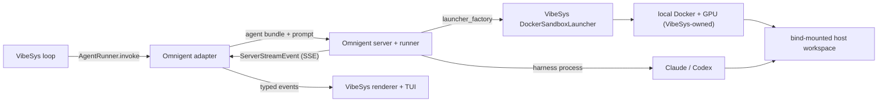

# Omnigent evaluation: replacing AgentShim and agent sandboxing

This report answers issue #239: can VibeSys retire the maintainer-owned
`agentshim` library and delegate CLI-agent operation plus agent-execution
sandboxing to [Omnigent](https://github.com/omnigent-ai/omnigent)? **Conclusion:
retain AgentShim as the default (option 3), with a demonstrated, de-risked path
to partial adoption (option 2) rather than a dead end.** The missing container
provider — the objection that looked fatal — is a bounded adapter, and a
runnable spike proves it. What holds adoption back today is provider coverage on
the shipped release, three capabilities that remain unproven, and dependency
risk, not an architectural wall.

## Evidence and method

Omnigent source claims are read at `omnigent-ai/omnigent` `main` on 2026-07-24,
commits `78b37f2` and `4bc38b9`. Behavioral claims come from a spike run against
the current PyPI release `omnigent==0.6.0` (published 2026-07-21) in a Python
3.12 virtualenv, driving a real Docker daemon; the spike is committed under
`experiments/omnigent-docker-spike/`. VibeSys baseline claims are read from this
repository at `894e7f8`.

No agent turn was executed: the spike exercises the sandbox-launcher contract,
not a harness. This host has no GPU and no provider credentials were used, so
GPU passthrough and a full credentialed turn are out of scope and are listed
under `Open items`. Absence claims ("no container provider") mean no such code
exists in the checkout, not that the capability is unattainable.

## What the spike demonstrated

Omnigent ships no Docker execution provider, but it documents an embedding seam
for exactly this case. `experiments/omnigent-docker-spike/` implements a
`DockerSandboxLauncher` against Omnigent's real `SandboxLauncher` ABC and runs
it against a live daemon. Ten checks pass:

- the launcher is a concrete `SandboxLauncher` — the ABC has only three abstract
  methods (`prepare`, `provision`, `run`);
- `ManagedSandboxConfig(launcher_factory=lambda: DockerSandboxLauncher(...))`
  accepts it, matching Omnigent's own module-docstring recipe in
  `omnigent/server/managed_hosts.py`, with no registry patch and no fork;
- `provision` creates a real container, `run` execs in it, `terminate` removes
  it;
- the live host workspace is bind-mounted in, and writes inside the container
  propagate back to the host — so the agent edits the real workspace, as the
  `AgentRunner` contract requires (`src/vibesys/agents/base.py:64-67`);
- `materialize_workspace` is overridden to resolve to the bind mount instead of
  Omnigent's default `git clone`;
- GPU, `--device`, and `--shm-size` arguments thread into the `docker run` argv.

The adapter is three files: `spec.py` and `container.py` own the resource
vocabulary and container lifecycle with zero Omnigent import; `omnigent_launcher.py`
is the single module that imports `omnigent`. That is the intended shape from
the issue's protocol step 4 — a "small stable adapter" — and it means churn in
the alpha ABC touches one file, and abandoning the effort deletes one file.

The spike does not run an agent. Omnigent's model runs a full `omnigent host`
process inside the container that dials back to the server, so a real turn also
needs the `omnigent` wheel baked into the agent image, a reachable server, a
harness binary, and credentials — none exercised here.

## Ownership boundary

The boundary adoption would create, and the two seams the spike leaves open:



Omnigent would own:

- per-harness CLI command construction and spawn environment;
- output parsing and normalization into one typed event union;
- session identity, durable history, and resume;
- per-session MCP server declaration and injection;
- per-turn token accounting;
- cooperative interrupt and session teardown.

VibeSys would still own:

- the `AgentRunner` contract and structured-response parsing
  (`src/vibesys/agents/base.py`, `src/vibesys/agent_runner.py`);
- the container lifecycle, image, GPU, devices, and mounts — now behind a
  `DockerSandboxLauncher` (`experiments/omnigent-docker-spike/`,
  `libs/vs-sandbox/src/vs_sandbox/docker_sandbox.py`);
- OS-level host confinement of the agent process
  (`libs/vs-sandbox/src/vs_sandbox/host_sandbox.py`);
- the five typed progress events its renderer and TUI consume
  (`src/vibesys/server/events.py`);
- per-invocation timeout and workload resource policy;
- supervision of the additional server, runner, and host-daemon processes.

## Current-versus-proposed ownership

| Responsibility | Today | Under Omnigent | Verdict |
| --- | --- | --- | --- |
| CLI command construction | Per provider in `src/vibesys/_agent_cli/{claude,codex,gemini,opencode}.py` | `executor.harness` in the agent bundle plus per-harness spawn-env builders | Delegable for Claude and Codex; Gemini and OpenCode have no path on the `0.6.0` release |
| Output parsing, event normalization | agentshim `*GenerationSession` classes parse each provider's JSON stream | One `Executor` ABC and a typed `ServerStreamEvent` union (`omnigent/server/schemas.py`) | Delegable and strictly richer, over SSE |
| Session drivers and lifecycle | One subprocess per invoke, no server (`src/vibesys/_agent_cli/cli_agent.py`) | Session on a FastAPI/SQLite server, executed by a separate runner bound via `PATCH /v1/sessions/{id}` | Delegable at the cost of two to three extra processes |
| Host confinement | `WorkspaceSandbox.wrap(argv)` with declared read/write resources (`libs/vs-sandbox/src/vs_sandbox/host_sandbox.py`) | Omnigent owns the spawn, so no argv-wrap seam exists for an embedder; policy must be re-expressed as spec fields | Retain and re-express; mapping unverified |
| MCP injection and restore | Per-provider config files plus an atomic merge and three-way restore engine (`src/vibesys/_agent_cli/base.py:88-201`) | Per-session bundle; Claude receives `--mcp-config` inline and nothing is written into the workspace | Delegable, and a genuine win |
| Session continuation | In-process `session_id` cache per kind; Claude and Codex only (`src/vibesys/agents/cli_runner.py:342-352`) | Durable session id; `get` then `bind_runner` then `post_event`; native harnesses expose resume | Delegable and better |
| Progress events | agentshim session to four `AgentLogger` hooks to five typed events (`src/vibesys/agents/callbacks.py:395-424`) | `GET /v1/sessions/{id}/stream` (SSE); reachable from the container over the launcher tunnel | Delegable |
| Timeouts | One per-invoke value, `config.agent.cli_timeout` | Operator and environment knobs; no per-request parameter | Retain a translation layer |
| Cancellation | None wired — `CommandHandle.terminate()` is unreachable | `interrupt` (cooperative), `stop_session`, `DELETE` | Delegable; a net gain, not a requirement |
| Usage accounting | Untyped dict off the final event, written to `usage.jsonl` (`src/vibesys/agents/cli_runner.py:508-548`) | Per-turn tokens on the public completion event; per-turn `cost_usd` documented as `None` in the common case | Delegable with degradation |
| Cleanup | Registry retains ownership until `docker rm -f` confirms (`libs/vs-sandbox/src/vs_sandbox/docker_sandbox.py`) | Provider `terminate()`; under the VibeSys launcher, VibeSys keeps its own `docker rm -f` guarantee | Retain; the launcher preserves it |
| Dependency management | `agentshim>=0.5.0` plus a `[tool.uv.sources]` git pin (`pyproject.toml:12`, `:106`) | Three lockstep `==`-pinned packages at `>=3.12`, with Node, tmux, and bubblewrap prerequisites | Materially worse; a fast-moving alpha for a dormant owned library |

## Compatibility

Provider by execution environment, against the shipped `0.6.0` release. "Docker"
here means the VibeSys `DockerSandboxLauncher` the spike demonstrates. VibeSys
supports all four providers on host and in local Docker today
(`src/vibesys/agents/cli_docker.py:13-27`).

| Provider | Host | Local Docker (via VibeSys launcher) | Modal |
| --- | --- | --- | --- |
| Codex | Supported — `codex` harness | Supported: launcher demonstrated; full turn unproven | Provider exists but fixed at 2 vCPU / 4 GiB, no GPU or volumes |
| Claude | Supported — `claude-sdk` (alias `claude`); cleanest MCP story | As Codex | As Codex |
| Gemini | No harness on `0.6.0` — not in the `--harness` set; `main` reaches it only as a user-configured `acp:gemini-cli` with cold-only resume | No path | No path |
| OpenCode | No harness on `0.6.0` — not in the `--harness` set; `main` adds `opencode-native`, requiring tmux and bubblewrap | No path | No path |

Capability by support level.

| Capability | Support | Evidence |
| --- | --- | --- |
| Structured final response | Parity — absent on both sides | No response-format field on the session request schemas; VibeSys already appends a schema hint (`src/vibesys/agents/cli_runner.py:162-171`) |
| Streamed progress | Supported over SSE | `omnigent/server/schemas.py` event union; reachable from the launcher-managed container |
| Continuation and resume | Supported, better than today | `sessions.get`, `bind_runner`, `post_event`; `-r/--resume`, `-c/--continue`, `--fork` |
| Timeout | Partial — operator and environment knobs, no per-request parameter | Harness scaffold turn timeouts; the SDK client timeout is accepted and unused |
| Cancellation | Supported; a net gain | Cooperative `interrupt` plus `stop_session`; VibeSys wires neither |
| MCP isolation | Supported, better than today | Per-session bundle; Claude receives inline `--mcp-config`; Codex receives a private `CODEX_HOME` |
| Credential isolation | Comparable | Keyring-backed provider config; stdio MCP subprocesses inherit the runner environment minus a deny-list |
| Usage accounting | Partial | Per-turn tokens are public; per-turn `cost_usd` is `None` in the common case; the SDK dataclass drops the cache buckets |
| Workspace mounts | Supported via the launcher | `materialize_workspace` override resolves to a bind mount (spike, verified) |
| GPU and device selection | Owned by VibeSys via the launcher | Resource args thread into `docker run` (spike, argv-verified); executing on a GPU and mid-run reselect are unproven |
| Cleanup | Preserved by the VibeSys launcher | `terminate` delegates to `docker rm -f`; the vs-sandbox ownership guarantee is retained |

## Maintenance surface

Classification is against the counterfactual full replacement. `delete` means
removable outright; `delegate` means the responsibility moves to Omnigent and
the file goes away; `retain` means VibeSys owns it under either decision.

| Module | Lines | Class | Note |
| --- | --- | --- | --- |
| `src/vibesys/_agent_cli/base.py` | 239 | retain | `MCPServerSpec` is loop-facing; the restore engine delegates only on the bundle path |
| `src/vibesys/_agent_cli/cli_agent.py` | 147 | delete | The only file binding agentshim session, executor, and env primitives |
| `src/vibesys/_agent_cli/codex.py` | 173 | delegate | To `harness: codex` |
| `src/vibesys/_agent_cli/claude.py` | 117 | delegate | To `harness: claude-sdk` |
| `src/vibesys/_agent_cli/gemini.py` | 104 | retain for now | No `0.6.0` harness; delegating loses the provider |
| `src/vibesys/_agent_cli/opencode.py` | 103 | retain for now | No `0.6.0` harness; delegating loses the provider |
| `src/vibesys/agents/cli_runner.py` | 548 | retain, rewrite | Roughly 63 lines of executor wiring are replaced; the rest is provider-neutral |
| `src/vibesys/agents/docker_executor.py` | 182 | delegate | Replaced by the `DockerSandboxLauncher`; the exec path moves under Omnigent |
| `src/vibesys/agents/modal_executor.py` | 181 | deleted in this PR | Unreachable agent-Modal executor; `cli_modal_sandboxed` was only ever `False` |
| `src/vibesys/agents/cli_docker.py` | 234 | retain | Provider install scripts and auth paths |
| `src/vibesys/agents/host_resource_declarations.py` | 177 | retain, re-express | Would become sandbox spec fields; mapping unverified |
| `src/vibesys/agents/callbacks.py` | 497 | retain | No agentshim import; its four hooks are the adapter target |
| `libs/vs-sandbox/src/vs_sandbox/docker_sandbox.py` | 698 | retain | Container lifecycle behind the launcher; still VibeSys-owned |
| `libs/vs-sandbox/src/vs_sandbox/host_sandbox.py` | 415 | retain, re-express | No embedder wrap seam under Omnigent |
| `libs/vs-sandbox/src/vs_sandbox/modal_sandbox.py` | 899 | retain (model-serving) | Alive: `src/vibesys/backends/cuda/__init__.py:118` instantiates `ModalSandbox` for the out-of-scope model-serving path |

Totals. `src/vibesys/_agent_cli/` is 884 lines and `src/vibesys/agents/` is
2,546. Full replacement removes on the order of 1,000-1,250 in-repo lines,
of which 181 are already-dead code deletable today without Omnigent. Against
that it must add the Omnigent runner adapter, agent-bundle generation, an event
translator, the `DockerSandboxLauncher` (about 200 lines as spiked, before
GPU-reselect and image plumbing), and supervision for the server, runner, and
host daemon. The in-repo surface is roughly flat to slightly larger, and the
container work is real code VibeSys writes and owns, not code it sheds.

The stronger argument for migration is the out-of-tree surface, and it is weaker
than it looks. `vic-lsh/agentshim` at the pinned revision is 3,736 library lines
plus 4,518 test lines. Roughly 1,861 library lines are never executed by VibeSys
— the Copilot provider, the `CodingAgent` facade, the provider registry, the
sandbox hooks, the LLM client. VibeSys consumes the per-provider stream parsers,
the executor protocol, and the event-handler surface. The library has not
released since 2026-05-29, and the pinned commit is byte-identical to the
published `agentshim==0.5.0` sdist on a branch already merged upstream. Its
carrying cost today is near zero, and vendoring the executed subset retires the
fork more cheaply than adopting Omnigent.

## Open items and residual risk

The container objection is resolved; these are what remain, in priority order.

- **Provider coverage on the shipped release.** `0.6.0` has no `gemini` and no
  `opencode` harness — two of VibeSys's four providers. `main` reaches Gemini
  only as a user-configured `acp:gemini-cli` (cold-only resume, no effort
  control) and adds `opencode-native` (needs tmux and bubblewrap). Adoption
  today narrows the provider matrix.
- **The full turn is unproven.** The spike stops at the launcher. A real turn
  needs the `omnigent` wheel in the agent image, a reachable server, a harness
  binary, and credentials, and it runs a full `omnigent host` inside every
  container — heavier than VibeSys's one-subprocess path and unmeasured.
- **GPU passthrough and mid-run reselect.** Resource args reach the `docker run`
  argv, but nothing ran on a GPU here, and `provision(name: str) -> str` carries
  no per-session resource argument, so VibeSys's stop / change-device / restart
  / replay reselect becomes terminate + re-provision — genuine rework against
  the grain of the contract.
- **Dependency risk, which no amount of VibeSys reimplementation removes.**
  Omnigent is a six-week-old alpha (`0.6.0` shipped, `0.7.0.dev0` on `main`),
  roughly 37 commits a day, six minors in six weeks with "Breaking changes"
  sections between them, no written stability or deprecation policy, and a
  published SDK whose headline examples target a removed route. Building against
  the internal `SandboxLauncher` ABC is a bet on the project's trajectory.

Explicitly not blockers: the `requires-python = ">=3.12"` floor is real (it
breaks a shared lock against VibeSys's `>=3.11` and the 3.11 CI leg) but a
subprocess or separate-venv integration sidesteps it, as the spike does; the
absence of schema-constrained final output is parity, not a regression; per-
session MCP isolation, durable resume, cancellation, and per-turn token
accounting are genuine wins.

## Operational and security assessment

**Process model.** Every path terminates at an HTTP server. A session lives on a
FastAPI/uvicorn server backed by SQLite with Alembic migrations, executed by a
separate runner that connects over a WebSocket tunnel; harnesses are subprocesses
serving a FastAPI subset over a Unix socket. The default `omni run` leaves a
persistent server and host daemon on a loopback port with state under
`~/.omnigent`; only `--no-session` reaps everything. VibeSys today spawns one
subprocess per invocation.

**Host.** The most plausible adoption path. Cost: supervising two or three extra
processes per run, and losing the `argv` wrap seam host confinement depends on —
policy must be re-expressed as spec fields, and Omnigent's native-harness paths
disable sandboxing.

**Local Docker.** Now viable through the VibeSys `DockerSandboxLauncher`. The
container runs `omnigent host` and reaches the server over the tunnel, so
streamed progress is available (unlike the plain `omni run -p` stdout path). The
cost is a heavier agent image (Python 3.12, the wheel, tmux and bubblewrap for
the harnesses that need them) and container-to-server reachability. No Docker
socket is exposed to Omnigent — the launcher, not Omnigent, drives the daemon.

**Modal.** The Omnigent launcher provisions at fixed CPU and memory with no GPU,
volumes, or region control, which does not match VibeSys's usage. VibeSys's own
CLI-agent Modal path is already dead code.

**Credentials and telemetry.** Provider secrets live in a keyring-backed config
with a restricted-permission fallback; agent-spec MCP servers stay inside the
session bundle and never touch harness config files — better isolation than
VibeSys's install-and-restore. Caveats: stdio MCP subprocesses inherit the
runner environment minus a deny-list, and Omnigent's onboarding does edit
user-global harness config for some providers, including `~/.codex/config.toml`.
Anonymized usage telemetry is on by default and must be opted out of explicitly.

## Required upstream changes and contribution path

The launcher spike removes the need for Omnigent to ship a container provider,
but a clean adoption still wants a per-session resource argument on the
provisioning contract (so mid-run reselect is expressible without terminate +
re-provision), first-class Gemini and OpenCode harnesses, and a written API
stability policy. External pull requests are accepted with DCO sign-off and a
security-scan gate, but the repo is six weeks old with several hundred open pull
requests and no stability policy, so landing cross-cutting changes and then
depending on them is a multi-quarter bet.

## Reproducing this evaluation

The launcher spike:

```bash
cd experiments/omnigent-docker-spike
uv venv --python 3.12 .venv-omni && . .venv-omni/bin/activate
uv pip install omnigent && docker pull python:3.12-bookworm
python smoke.py            # 10/10 against the real ABC + real Docker
```

The source-level claims re-derive from the tarball at
`gh api repos/omnigent-ai/omnigent/tarball/main`: `grep -n requires-python
pyproject.toml`; `grep -rn '_LAUNCHERS' omnigent/onboarding/sandboxes/__init__.py`
(no `docker.py`); `grep -rni 'gpu\|nvidia' omnigent/`; and `omni run --help` for
the shipped `--harness` set. VibeSys baseline numbers are `wc -l` over the paths
in the inventory.

## Decision and re-evaluation triggers

**Retain AgentShim as the default now; treat partial adoption as an open,
de-risked option, not a closed one.** The container gap that framed the earlier
"impossible" reading is a bounded, demonstrated adapter. Adoption is nonetheless
not justified on the `0.6.0` release: it drops two providers, three capabilities
are unproven, and the dependency is a fast-moving alpha with no stability policy.

Pursue partial adoption when all three hold:

- Omnigent ships first-class `gemini` and `opencode` harnesses (or `main`'s ACP
  and native paths reach a release VibeSys is willing to pin);
- a full-turn spike — `omnigent` wheel in the agent image, server reachable,
  Claude or Codex completing a turn against a bind-mounted workspace with the
  five VibeSys events flowing — passes;
- a written API-stability and deprecation policy exists, or VibeSys accepts the
  churn because the Omnigent contact surface stays confined to the isolated
  adapter this spike establishes.

The first adoption increment, when triggered, is host-path Claude and Codex
behind the isolated `OmnigentAgentRunner`, keeping `vs-sandbox` and `agentshim`
for GPU-Docker and for Gemini and OpenCode until their gaps close.

## Follow-up work

Done in this PR, as the cheapest wins the experiment produced and independent of
the Omnigent decision:

- Dropped the `agentshim` git-source override; the dependency now resolves from
  PyPI `agentshim==0.5.0` (byte-identical to the pinned commit, which sat on a
  branch already merged upstream).
- Deleted the unreachable agent-Modal executor path
  (`src/vibesys/agents/modal_executor.py` and its wiring in `cli_runner.py`,
  `build_agent_runner`, `context.py`, and `RunEnvironmentView`), plus its tests.
  `libs/vs-sandbox/.../modal_sandbox.py` is deliberately kept — it is alive on
  the out-of-scope model-serving path (`src/vibesys/backends/cuda/__init__.py`).

Still proposed, not yet filed:

- Promote the launcher spike to a full-turn spike behind a feature-flagged
  `OmnigentAgentRunner`, on the experiment branch, gated on the triggers above.
- Vendor the executed subset of `agentshim` (~1,875 lines, almost all the four
  provider stream parsers) into `src/vibesys/_agent_cli/` and retire the
  external repository, bringing its per-provider parser tests across; add a
  `LICENSE` to `vic-lsh/agentshim` first, as none exists there.
- Replace the Codex rollout-eviction substring match at
  `src/vibesys/agents/cli_runner.py:77` with a typed error.
- Widen or document the `"cli"` backend-string comparisons at
  `src/vibesys/sandbox/run_environment.py:844` and `:859`.

A future adoption must not require a VibeSys fork of Omnigent, a second
sandboxing stack alongside `vs-sandbox`, or changes to the `AgentRunner`
contract. The spike is built to honor the first: the entire Omnigent contact
surface is one injectable module. If a later increment cannot keep it that
small, the integration boundary is in the wrong place, and the question to
settle first is which side owns container lifecycle and device policy.
