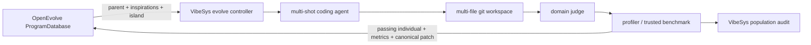

# OpenEvolve search-policy adapter

VibeSys can use the search policy from OpenEvolve 0.3.1 without copying its
implementation:

```bash
./vs --outer-loop evolve \
  --search-policy openevolve \
  --input examples/data-structures/queue-spsc
```

The Python dependency is pinned to `openevolve==0.3.1`. The adapter imports
`DatabaseConfig`, `Program`, and `ProgramDatabase` directly from that package.
Refreshing the integration is an ordinary dependency update plus compatibility
tests; no vendored or submodule source needs to be synchronized.

## Ownership boundary



OpenEvolve owns:

- MAP-Elites cells using its built-in code complexity and diversity features;
- exploration/exploitation/weighted parent selection;
- inspiration sampling;
- bounded population and elite archive maintenance;
- island assignment and migration; and
- persistence in `logs/openevolve/`.

VibeSys owns:

- bootstrap, generations, and candidate concurrency;
- the coding-agent mutation (including its multiple tool/LLM turns);
- domain/modality prompts and environment hooks;
- multi-file checkout, edits, snapshots, and commits;
- correctness judging and trusted profiling; and
- the complete `population.json` audit, including failed candidates.

Only judge-passing candidates enter OpenEvolve. Failed candidates remain in the
VibeSys population so later bootstrap prompts can learn from their feedback,
but they cannot become parents.

The adapter persists its exact database configuration, active and historically
admitted program IDs, island lineage, primary fitness definition, and isolated
sampling RNG state. A resumed run automatically continues with OpenEvolve when
that state is present. Explicitly changing an OpenEvolve database setting or
fitness objective on resume is rejected because upstream island, MAP-Elites,
and archive structures are not safely rebuilt in place.

Full database states live in immutable snapshot directories selected by an
atomically replaced `CURRENT` pointer. Candidate admissions create a new full
snapshot; ordinary parent selection updates only a small checkpoint containing
the snapshot ID, current island, and RNG state. Resume therefore observes one
coherent database version without rewriting every stored patch per mutation.

## Multi-file representation

OpenEvolve's `Program` contract has one `code` string. The adapter supplies a
canonical git patch from the experiment's initial workspace commit to the
candidate commit. This gives OpenEvolve meaningful complexity, edit-distance,
and duplicate signals across a multi-file candidate without flattening the
workspace into a fake source file. Program metadata stores the durable VibeSys
individual ID and commit. Migrated OpenEvolve programs retain that metadata, so
selection always resolves back to the correct VibeSys tree.

Runtime output under the workspace's `logs/` directory is excluded from this
patch. Profiler counters, benchmark JSON, timestamps, and `perf.data` therefore
cannot distort OpenEvolve's code-complexity and diversity features.

## Metrics and multi-objective runs

OpenEvolve 0.3.1 ranks programs by `combined_score`. For a scalar VibeSys run,
the adapter sets it to `perf_metric`. In Pareto mode it uses the signed primary
objective (negating minimize objectives) as OpenEvolve's scalar fitness while
preserving the full metric dictionary and Pareto frontier in VibeSys.

This means OpenEvolve's archive is not itself a Pareto archive. Use the final
VibeSys frontier for multi-objective reporting; use OpenEvolve for diversity,
islands, migration, and primary-objective search pressure.
