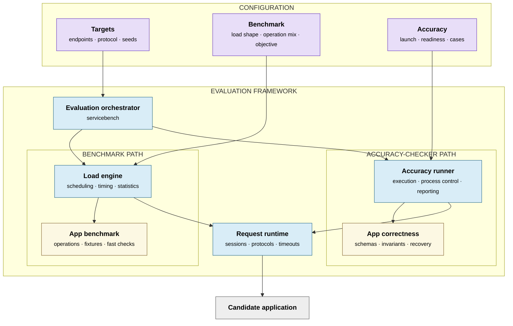
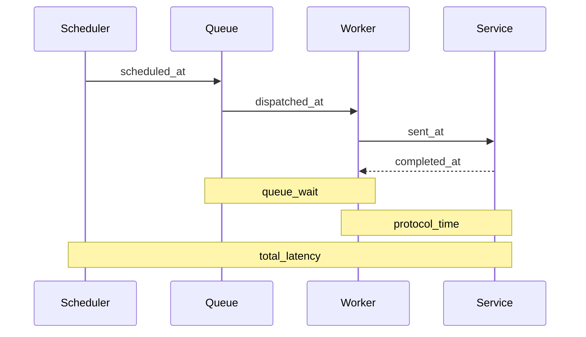

# Reusable Microservice Evaluator Design

## Architecture



Blue nodes are reusable framework code. Purple nodes are declarative inputs.
Yellow nodes are implemented for each application. Gray is the external system
under test. Arrows mean "invokes or sends requests through"; they do not express
Go import direction.

The benchmark path measures performance under a declared workload. The
accuracy path independently qualifies application behavior. Both use the same
request runtime so connection policy, protocol encoding, timeouts, readiness,
and preflight behavior cannot drift between modes. The candidate remains a
black box: only its configured protocol endpoints are observable, and its
language, process topology, storage, and internal data model are unrestricted.

### Configuration

Configuration is data, not a framework extension point:

| Input | Contents |
| --- | --- |
| Targets | Target names and addresses, protocol and session policy, request timeout, workload and fixture seeds, and typed application options |
| Benchmark | Operation names and weights, open- or closed-loop load, rate, concurrency, warmup, duration, repetitions, objective, and validity constraints |
| Accuracy | Case bounds, startup timeout, launch command, working and state directories, and restart environment |

Unknown workload fields and invalid combinations fail before either mode runs.
Candidate launch settings are accuracy-run inputs, not application semantics.

### Stable ownership boundary

The framework owns scheduling, transport, lifecycle containment, generic
validation mechanics, cleanup bookkeeping, property enforcement, measurement,
and reporting. Adding an application must not require changes to those
components. It should require only:

1. a benchmark implementation of `api.Application` under `apps/<name>`;
2. an independent correctness implementation of `api.AccuracyApplication`
   under `accuracyapps/<name>`;
3. optional mode-neutral helpers under `appsupport/<name>`; and
4. explicit registrations in the `servicebench` wiring layer plus workload
   configuration.

The benchmark implementation owns fixture setup and cleanup, randomized
operation plans, request payloads, and fast per-operation acceptance checks. It
must reject responses that would make the performance metric meaningless, but
it is not the qualification oracle. The accuracy implementation owns exact
schemas, entity relationships, state transitions, read-your-write behavior,
index invalidation, deletion, isolation, and recovery properties.

The two implementations may share public endpoint topology, canonical request
encoding, authentication, readiness and preflight plans, and input/fuzz
grammars. They must not share expected entity catalogs, state-transition
outcomes, or semantic pass/fail functions. Otherwise one application bug could
silently bless both qualification and scoring. Cross-mode tests should assert
that intentionally shared traffic remains identical without coupling the two
semantic oracles.

Adding a protocol follows the same rule: implement `api.Driver` and
`api.Client`, register the driver in the wiring layer, and leave the scheduler,
accuracy runner, and applications protocol-neutral.

The dependency rule is:

```text
cmd/servicebench -> concrete applications, drivers, and reusable runners
engine -> api interfaces, probing, registry, and transport
accuracy runner -> api interfaces, probing, registry, sampling, and transport
benchmark application -> api plus optional mode-neutral app support
accuracy application -> api, generic accuracy primitives, and optional app support
transport and drivers -> api protocol contracts only
statistics and results -> common observations only
```

Application code must not schedule workers or calculate headline metrics. A
driver must not know application operation names. Reusable runners must not
branch on an application or protocol name. Concrete selection belongs only in
the composition layer and registries.

### Fail-closed lifecycle

Managed crash recovery fails closed unless the candidate can run in a dedicated
Bubblewrap PID namespace. Process groups and sampled descendant PIDs are not a
containment boundary: a daemon can change sessions before sampling, and a bare
PID can be reused. Terminating the namespace init instead gives the kernel
ownership of all descendants, including immediate double-forks.

## Timing



For open-loop workloads, total latency begins at the scheduled arrival. Client
queueing therefore remains visible under overload. Semantic validation happens
after `completed_at`; it can invalidate a request but does not inflate protocol
latency. The separate `validated_at` timestamp bounds logical completion and is
used for achieved-throughput elapsed time.

The scheduler reports actual offered rate, scheduler lag, and maximum client
queue depth. A trial is invalid when the client cannot offer the configured
minimum fraction of target rate.

Closed-loop workloads use the same engine, drivers, observations, and semantic
validation, but each worker schedules its next logical operation after the
previous one completes. They are appropriate for saturation-throughput
objectives where a fixed open-loop rate would cap every successful candidate at
the same score. Their latency distributions are closed-loop saturation response
times; use an open-loop workload to characterize queueing under an offered rate.

## Extension points

`api.Driver` opens a target-specific `api.Client`. The client accepts an
`api.Invocation` with a protocol-specific payload and returns a
`api.ProtocolResult` that preserves native status while supplying common
transport fields. This draft implements HTTP. gRPC and Thrift should implement
the same contract and pass the same engine/driver tests rather than adding
protocol branches to the scheduler.

`api.Application` prepares fixtures, builds logical-operation plans, and
validates their collected results. A plan may contain one or more invocations;
the engine always issues and accounts for each invocation itself.
The declarative adapter covers ordinary HTTP operations. The Social Network
adapter demonstrates the typed escape hatch for dynamic users and setup.

Applications with mode-neutral startup requirements implement
`api.PreflightApplication`. The probing framework requires readiness coverage
for every configured target, transport-gates semantic validators, and executes
the same sequential protocol checks in benchmark and accuracy modes. Accuracy
applications additionally declare a framework-enforced minimum randomized case
volume; CLI bounds may increase it but cannot reduce it.

## Result validity

The evaluator emits one versioned summary and optional raw NDJSON observations.
Latency distributions include semantically successful requests; error counts
include every failed attempt. `primary_value` is omitted unless every trial:

- produced the samples required by the objective;
- sustained the configured minimum offered rate;
- satisfied success/error constraints; and
- completed without setup, execution, or interruption errors.

Individual trials are the independent aggregation units. The summary reports
their median, MAD, IQR, and a deterministic bootstrap interval when at least two
valid trials are available.
