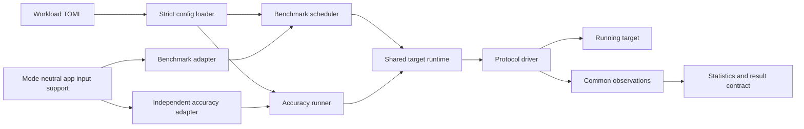
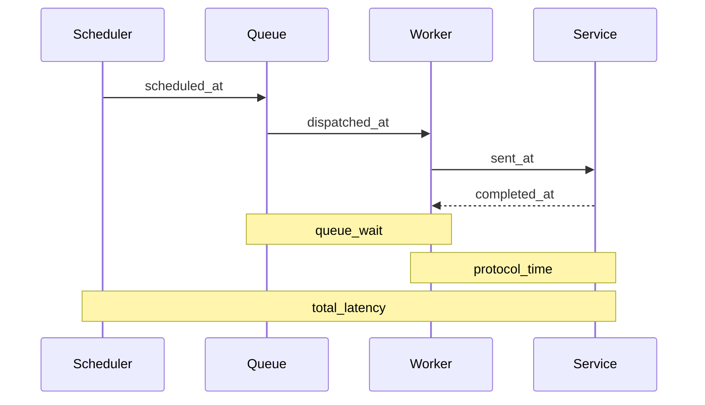

# Reusable Microservice Evaluator Design

## Ownership



The benchmark engine owns arrival scheduling, timestamp placement, trial
lifecycle, aggregation, constraint enforcement, and output. The accuracy
runner owns readiness, managed lifecycle transitions, required-property
enforcement, and correctness result reporting. Both use the same target runtime
and protocol drivers. Their application-specific semantic oracles remain
separate so one validator bug cannot silently bless both qualification and
scoring. They share only observable request encoding, authentication, and fuzz
grammars that must not reveal which evaluator mode is running; response schemas
and expected values are explicitly excluded from that shared support.

The dependency rule is:

```text
cmd -> concrete applications and drivers
engine -> api interfaces only
accuracy runner -> api interfaces and generic validation only
drivers -> api protocol payloads only
applications -> api protocol payloads only
benchmark and accuracy adapters -> mode-neutral app support, never shared oracles
stats/result -> observations only
```

Application code must not schedule workers or calculate headline metrics. A
driver must not know application operation names. The engine must not branch on
an application or protocol name.

## Timing



For open-loop workloads, total latency begins at the scheduled arrival. Client
queueing therefore remains visible under overload. Semantic validation happens
after `completed_at`; it can invalidate a request but does not inflate protocol
latency. The separate `validated_at` timestamp bounds logical completion and is
used for achieved-throughput elapsed time.

The scheduler reports actual offered rate, scheduler lag, and maximum client
queue depth. A trial is invalid when the client cannot offer the configured
minimum fraction of target rate.

Closed-loop workloads use the same engine, drivers, observations, and semantic
validation, but each worker schedules its next logical operation after the
previous one completes. They are appropriate for saturation-throughput
objectives where a fixed open-loop rate would cap every successful candidate at
the same score. Their latency distributions are closed-loop saturation response
times; use an open-loop workload to characterize queueing under an offered rate.

## Extension points

`api.Driver` opens a target-specific `api.Client`. The client accepts an
`api.Invocation` with a protocol-specific payload and returns a
`api.ProtocolResult` that preserves native status while supplying common
transport fields. This draft implements HTTP. gRPC and Thrift should implement
the same contract and pass the same engine/driver tests rather than adding
protocol branches to the scheduler.

`api.Application` prepares fixtures, builds logical-operation plans, and
validates their collected results. A plan may contain one or more invocations;
the engine always issues and accounts for each invocation itself.
The declarative adapter covers ordinary HTTP operations. The Social Network
adapter demonstrates the typed escape hatch for dynamic users and setup.

## Result validity

The evaluator emits one versioned summary and optional raw NDJSON observations.
Latency distributions include semantically successful requests; error counts
include every failed attempt. `primary_value` is omitted unless every trial:

- produced the samples required by the objective;
- sustained the configured minimum offered rate;
- satisfied success/error constraints; and
- completed without setup, execution, or interruption errors.

Individual trials are the independent aggregation units. The summary reports
their median, MAD, IQR, and a deterministic bootstrap interval when at least two
valid trials are available.
