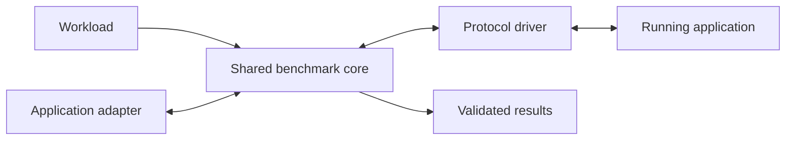
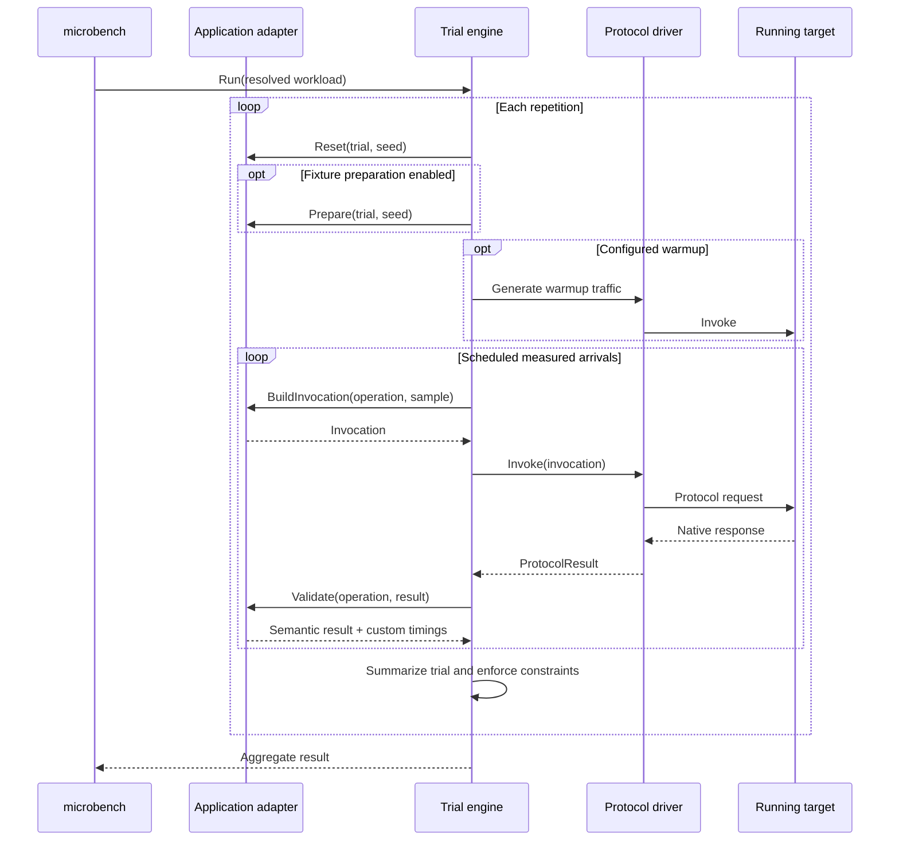
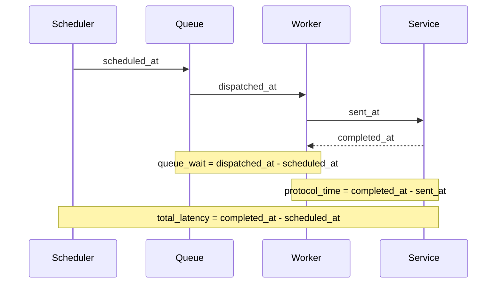

# Microservice Benchmark Evaluator

This directory contains the trusted, reusable benchmark evaluator for online
microservice applications. Scenario bundles provide a strict TOML workload and
select an application adapter; the evaluator supplies consistent load
generation, protocol execution, measurement, correctness gating, statistics,
and output across applications.

The initial implementation includes a production HTTP driver and adapters for
Train Ticket and DeathStarBench Social Network. The same core is designed to
support future gRPC and Thrift drivers without adding protocol-specific logic to
the scheduler.

## Design overview

The system separates four kinds of concern:

| Layer | Owns | Does not own |
| --- | --- | --- |
| Workload | Targets, traffic mix, load, objective, and validity constraints | Scheduling or protocol code |
| Core engine | Trial lifecycle, open-loop scheduling, timestamps, aggregation, and result validity | Application schemas or wire formats |
| Application adapter | Fixture setup, dynamic request construction, and semantic response validation | Worker scheduling or headline statistics |
| Protocol driver | Connections, serialization, transport calls, and native response metadata | Application operation meaning |



The dependency direction is deliberate:

```text
cmd -> concrete applications and drivers
engine -> api interfaces only
drivers -> api protocol payloads only
applications -> api protocol payloads only
statistics/results -> common observations only
```

The engine never branches on an application or protocol name. A new protocol
implements `api.Driver` and `api.Client`; a new application implements
`api.Application`. The command registers concrete implementations at startup,
and the workload selects them by name.

### Trial lifecycle

Each repetition is an independent aggregation unit. The application gets a
chance to reset and prepare fixtures before the engine runs an unmeasured
warmup followed by the measured phase.



The workload seed controls operation selection and adapter samples. Each trial
derives a deterministic seed, and the resolved workload is recorded as a
canonical hash in the result.

### Open-loop timing model

Requests are scheduled at fixed intervals independently of completion time.
Workers consume those arrivals through a bounded queue. This preserves overload
behavior: if the target or client cannot keep up, the delay appears in the
measurement instead of being hidden by a closed request loop.



Application validation runs after `completed_at`. It can reject a response but
does not inflate the recorded protocol latency. The engine also reports actual
offered rate, scheduler lag, and maximum queue depth so a benchmark can
distinguish target behavior from load-generator saturation.

### Correctness and result validity

Transport success is not sufficient. The application adapter validates native
status and application-level semantics—for example, an HTTP 200 containing a
Train Ticket error envelope is still a failed request.

Latency distributions contain only semantically successful requests. Error
counts contain every failed attempt. A trial is invalid when it:

- has no successful samples matching the objective;
- fails to sustain the workload's minimum offered-rate ratio;
- violates a success-rate or error-rate constraint; or
- fails during reset, setup, execution, or interruption.

An invalid run omits `primary_value`, preventing the optimization loop from
treating a fast-but-incorrect or client-limited result as an improvement.

The summary aggregates trial-level primary values rather than pooling every
request across trials. It reports median, median absolute deviation (MAD), and
interquartile range (IQR), plus a deterministic bootstrap confidence interval
when at least two valid trials are available. The optional raw NDJSON output
retains one observation per measured request for diagnosis.

## Package map

| Directory | Responsibility |
| --- | --- |
| [`api/`](api/) | Shared workload, extension, and observation contracts |
| [`apps/`](apps/) | Application-adapter extension layer |
| [`apps/declarative/`](apps/declarative/) | Declarative HTTP request and response adapter |
| [`apps/socialnetwork/`](apps/socialnetwork/) | Typed DeathStarBench Social Network adapter |
| [`cmd/`](cmd/) | Executable composition roots |
| [`cmd/microbench/`](cmd/microbench/) | Benchmark CLI |
| [`config/`](config/) | Strict TOML decoding, defaults, profiles, and canonical serialization |
| [`drivers/`](drivers/) | Protocol-driver extension layer |
| [`drivers/httpdriver/`](drivers/httpdriver/) | HTTP transport and connection policy |
| [`engine/`](engine/) | Scheduler, trial lifecycle, statistics, and results |
| [`registry/`](registry/) | Driver and application registration |

Every directory has its own README with its ownership boundary and extension
guidance.

More detailed ownership rules and measurement semantics are recorded in
[`DESIGN.md`](DESIGN.md).

## Workload model

A workload declares:

- one application adapter;
- one or more named protocol targets;
- weighted operations and optional objective tags;
- open-loop rate, duration, warmup, concurrency, timeout, seed, and repetitions;
- the primary metric and direction; and
- correctness and offered-load constraints.

Unknown TOML fields are rejected. Target session policy is explicit: the HTTP
driver supports connection `reuse` and `new_per_request`. Application-specific
configuration is accepted only by the selected adapter.

See the checked-in workloads for complete examples:

- `../../microservices/train-ticket/benchmark/workload.toml`
- `../../microservices/social-network-read-timeline/benchmark/workload.toml`

## Running the evaluator

From the repository root:

```bash
go -C examples/evaluators/microservice run ./cmd/microbench \
  --workload "$PWD/examples/microservices/train-ticket/benchmark/workload.toml" \
  --base-url http://localhost:8080 \
  --output-json /tmp/result.json \
  --output-raw /tmp/requests.ndjson
```

Validate a workload and its registered extensions without running traffic:

```bash
go -C examples/evaluators/microservice run ./cmd/microbench \
  --workload "$PWD/examples/microservices/train-ticket/benchmark/workload.toml" \
  --validate-only
```

Use `go run ./cmd/microbench --help` from this directory for target, load,
profile, fixture, and output overrides.

## Testing

```bash
go test -race ./...
go vet ./...
```

Tests use fake applications and drivers to verify that scheduling and
aggregation stay protocol-neutral, and HTTP test servers to verify request,
response, timeout, and connection-reuse behavior.
