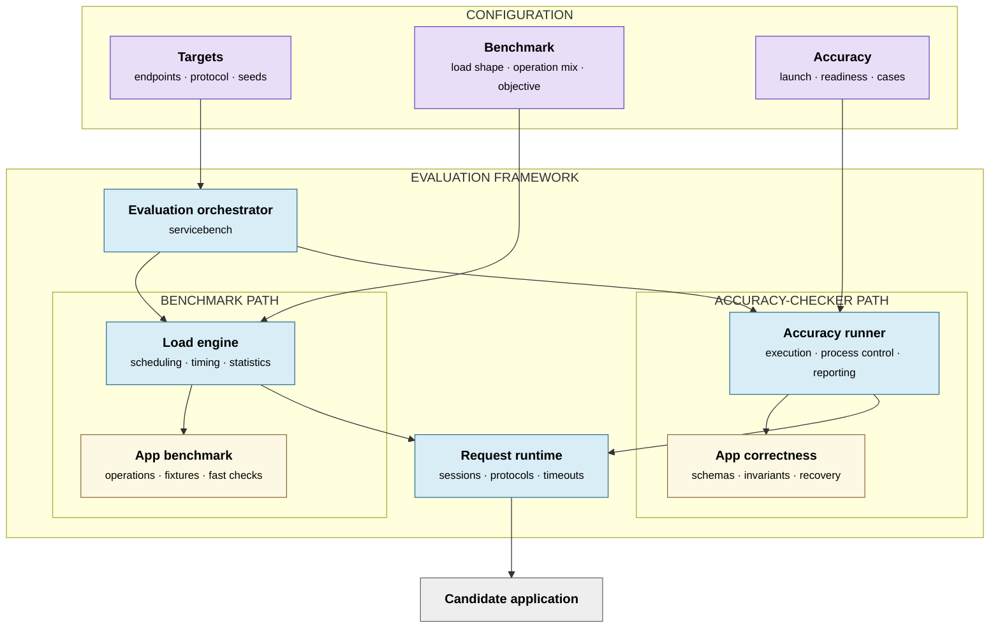
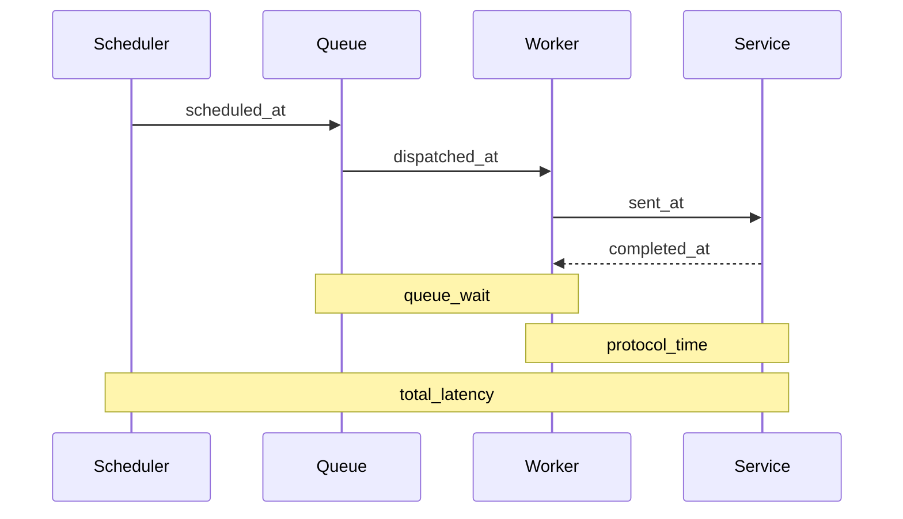

# Reusable Microservice Evaluator Design

## Architecture



Blue nodes are reusable framework code. Purple nodes are declarative inputs.
Yellow nodes are implemented for each application. Gray is the external system
under test. Arrows mean "invokes or sends requests through"; they do not express
Go import direction.

The benchmark path measures performance under a declared workload. The
accuracy path independently qualifies application behavior. Both use the same
request runtime so connection policy, protocol encoding, timeouts, readiness,
and preflight behavior cannot drift between modes. The candidate remains a
black box: only its configured protocol endpoints are observable, and its
language, process topology, storage, and internal data model are unrestricted.

### Configuration

Configuration is data, not a framework extension point:

| Input | Contents |
| --- | --- |
| Targets | Target names and addresses, protocol and session policy, request timeout, workload and fixture seeds, and typed application options |
| Benchmark | Operation names and weights, open- or closed-loop load, rate, concurrency, warmup, duration, repetitions, objective, and validity constraints |
| Accuracy | Case bounds, startup timeout, launch command, working and state directories, and restart environment |

Unknown workload fields and invalid combinations fail before either mode runs.
Candidate launch settings are accuracy-run inputs, not application semantics.

### Stable ownership boundary

The shared evaluator owns API contracts, scheduling, transport, lifecycle
containment, generic validation mechanics, cleanup bookkeeping, property
enforcement, measurement, and reporting. Application-specific correctness and
the executable that selects it belong to the task or example. Adding a task
must not require an import or registration in the generic `cmd/servicebench`
command. It should require only:

1. a benchmark implementation of `api.Application`, using a bundled adapter
   under `apps/` when one fits;
2. a task-owned independent implementation of `api.AccuracyApplication`;
3. optional mode-neutral helpers for topology, requests, or input grammars;
4. a task-owned command that calls `servicebenchcli.Run` with explicit
   `composition.Registration` values; and
5. workload configuration selecting the registered names.

`accuracyapps/` contains bundled compatibility adapters retained for existing
workloads. It is not the default home for new task-specific correctness code.

The benchmark implementation owns fixture setup and cleanup, randomized
operation plans, request payloads, and fast per-operation acceptance checks. It
must reject responses that would make the performance metric meaningless, but
it is not the qualification oracle. The accuracy implementation owns exact
schemas, entity relationships, state transitions, read-your-write behavior,
index invalidation, deletion, isolation, and recovery properties.

The two implementations may share public endpoint topology, canonical request
encoding, authentication, readiness and preflight plans, and input/fuzz
grammars. They must not share expected entity catalogs, state-transition
outcomes, or semantic pass/fail functions. Otherwise one application bug could
silently bless both qualification and scoring. Cross-mode tests should assert
that intentionally shared traffic remains identical without coupling the two
semantic oracles.

Adding a protocol follows the same rule: implement `api.Driver` and
`api.Client`, register the driver in the wiring layer, and leave the scheduler,
accuracy runner, and applications protocol-neutral.

The dependency rule is:

```text
task/example command -> task correctness, composition, and servicebenchcli
cmd/servicebench -> legacy bundled registrations and servicebenchcli
servicebenchcli -> composition, config, reusable runners, lifecycle, and reporting
composition -> api and registry only
engine -> api interfaces, probing, registry, and transport
accuracy runner -> api interfaces, probing, registry, sampling, and transport
benchmark application -> api plus optional mode-neutral app support
accuracy application -> api, generic accuracy primitives, and optional app support
transport and drivers -> api protocol contracts only
statistics and results -> common observations only
```

Application code must not schedule workers or calculate headline metrics. A
driver must not know application operation names. Reusable runners must not
branch on an application or protocol name. Concrete selection belongs only in
executable composition roots and their registry registrations. Shared runners
and generic composition helpers do not own concrete application imports.

### Accuracy event model

The generic accuracy layer represents a correctness experiment as a versioned,
replayable event program. Its events are a sequential call, a barrier-delimited
group of concurrent calls, a candidate crash, or a candidate start. Programs
contain stimuli only. Expected responses are derived independently from an
application-owned reference state machine, so persisted test input cannot bless
the candidate behavior it is meant to check.

The reference model defines the canonical result and next logical state for one
atomic application action. The same model is used for all execution shapes:

- sequential calls advance it directly;
- parallel calls are checked by searching for a legal serialization whose
  identified observations match the candidate trace and whose order respects
  invocation/completion precedence; and
- crashes apply the application's durability transition before execution
  resumes.

At a parallel barrier, the framework retains every matching successor state.
Correctness requires at least one ordering that explains both the concurrent
observations and the rest of the program. This prevents the verifier from
rejecting a valid trace merely because it selected a locally valid ordering
that conflicts with a later observation.

Lifecycle events are quiescent in the initial contract. All calls before a
crash have completed, and calls after it wait for a corresponding start. This
gives acknowledged writes an unambiguous durability meaning. Crashing with
requests in flight would require the application contract to specify ambiguous
delivery and acknowledgement outcomes and is not represented yet.

The framework owns program validation, scheduling, trace collection,
linearization search, lifecycle dispatch, and counterexample reporting. The
application owns the action language, generator, request adapter, response
normalization, reference state and transitions, observation equivalence, and
durability policy. Detailed API and replay rules are in
[`accuracy/PROGRAMS.md`](accuracy/PROGRAMS.md).

### Fail-closed lifecycle

Managed crash recovery fails closed unless the candidate can run in a dedicated
Bubblewrap PID namespace. Process groups and sampled descendant PIDs are not a
containment boundary: a daemon can change sessions before sampling, and a bare
PID can be reused. Terminating the namespace init instead gives the kernel
ownership of all descendants, including immediate double-forks.

## Timing



For open-loop workloads, total latency begins at the scheduled arrival. Client
queueing therefore remains visible under overload. Semantic validation happens
after `completed_at`; it can invalidate a request but does not inflate protocol
latency. The separate `validated_at` timestamp bounds logical completion and is
used for achieved-throughput elapsed time.

The scheduler reports actual offered rate, scheduler lag, and maximum client
queue depth. A trial is invalid when the client cannot offer the configured
minimum fraction of target rate.

Each trial also records a telemetry measurement window from its first request
send through its last protocol completion. When telemetry is configured,
`servicebench` passes all trial windows and the canonical workload identity to
a trusted external collector while the candidate is still running. The
collector returns a strict, versioned summary of service, span, and datastore
latency distributions. The optional trace graph artifact is schema version 2
and adds per-root critical-path evidence. Spans outside the measured windows,
including warmup, are excluded.

Telemetry is explanatory evidence, not a second scoring path. End-to-end
latency and throughput from the load engine remain authoritative, and a run
cannot claim an improvement from internal spans alone. Configured telemetry
fails closed on command errors, malformed reports, or zero in-window spans.
Applications own their instrumentation and export pipeline; the evaluator owns
measurement correlation, normalization, validation, and artifact attachment.

The optional `servicebench trace` command adds a separate trace-graph artifact
without changing the benchmark summary schema. It reconstructs only complete
workload-window traces, groups repeated service-call paths, and emits a bounded
visual rendering. For each eligible trace it computes a critical path with the
`wall_clock_active_leaf_v1` contract: span boundaries partition root wall time,
each interval is attributed to the active synchronous leaf that finishes
latest, and overlapping siblings are not summed. An
unambiguous RPC client/server pair retains its envelope interval, including
transport time. Async producer/consumer relationships and span links are
excluded from this synchronous path and counted as exclusions.

The graph reports representative ordered path segments and aggregate duration
and per-node contribution distributions with count, mean, p50, p95, p99, and
maximum values. The graph and benchmark summary remain separate contracts, and
critical-path evidence is diagnostic. Wiring this artifact into VibeSys loop
consumption is explicitly deferred to follow-up work.

Closed-loop workloads use the same engine, drivers, observations, and semantic
validation, but each worker schedules its next logical operation after the
previous one completes. They are appropriate for saturation-throughput
objectives where a fixed open-loop rate would cap every successful candidate at
the same score. Their latency distributions are closed-loop saturation response
times; use an open-loop workload to characterize queueing under an offered rate.

## Extension points

`api.Driver` opens a target-specific `api.Client`. The client accepts an
`api.Invocation` with a protocol-specific payload and returns a
`api.ProtocolResult` that preserves native status while supplying common
transport fields. This draft implements HTTP. gRPC and Thrift should implement
the same contract and pass the same engine/driver tests rather than adding
protocol branches to the scheduler.

`api.Application` prepares fixtures, builds logical-operation plans, and
validates their collected results. A plan may contain one or more invocations;
the engine always issues and accounts for each invocation itself.
The declarative adapter covers ordinary HTTP operations. The Social Network
adapter demonstrates the typed escape hatch for dynamic users and setup.

Applications with mode-neutral startup requirements implement
`api.PreflightApplication`. The probing framework requires readiness coverage
for every configured target, transport-gates semantic validators, and executes
the same sequential protocol checks in benchmark and accuracy modes. Accuracy
applications additionally declare a framework-enforced minimum randomized case
volume; CLI bounds may increase it but cannot reduce it.

## Result validity

The evaluator emits one versioned summary and optional raw NDJSON observations.
Latency distributions include semantically successful requests; error counts
include every failed attempt. `primary_value` is omitted unless every trial:

- produced the samples required by the objective;
- sustained the configured minimum offered rate;
- satisfied success/error constraints; and
- completed without setup, execution, or interruption errors.

Individual trials are the independent aggregation units. The summary reports
their median, MAD, IQR, and a deterministic bootstrap interval when at least two
valid trials are available.

### Reporting the measurement

`--vs-output` names the evaluator record stream specified by
`sdk/vs-evaluator/PROTOCOL.md`. The stream declares the workload's own
objective: its `metric` name, `unit`, and direction, read from the loaded
workload rather than fixed by the command. The framework therefore sees the
metric the task declared, and a task objective can name it directly instead of
scraping a generically named summary field.

The objective is the only required metric, because it is the only quantity
every accepted run produces. The latency percentiles the summary already
measures, `latency_ms.p50` and `latency_ms.p99`, are declared optional and are
reported when the run produced them, so a task can use one as a secondary axis
without a run that completed nothing failing the protocol. Objectives must be
required metrics, so an optional axis is reported, never ranked on.

The stream opens before the workload is read, so a workload that does not parse
or does not validate is reported rather than lost: an error record on its own is
a complete stream. A run without a `primary_value`, and any failure the command
reaches after that point, closes the stream with an error record naming the
reason, so a failed benchmark reaches the framework as a reported failure rather
than only as an exit status. The summary JSON stays diagnostic evidence.
